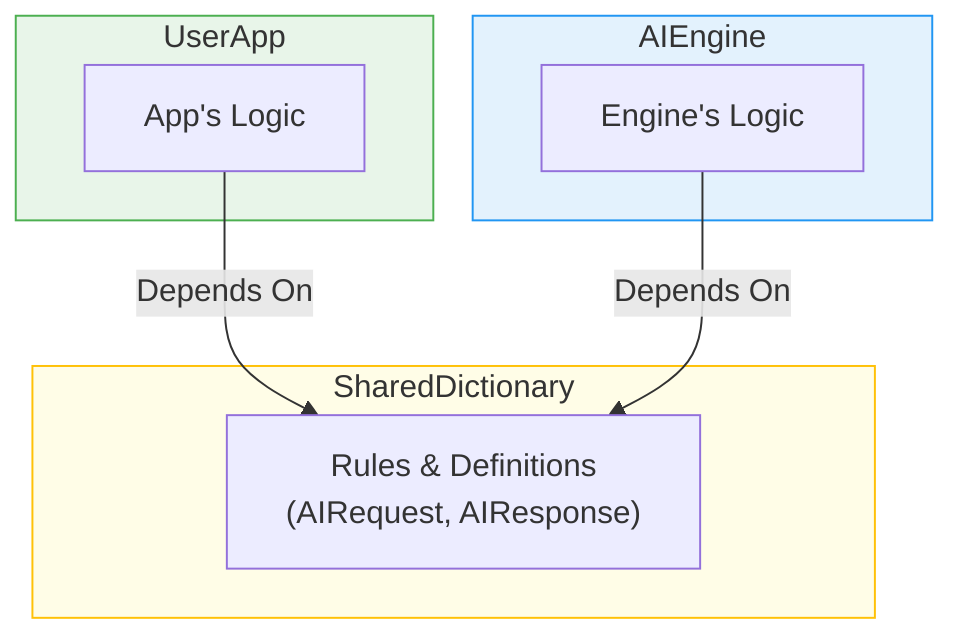
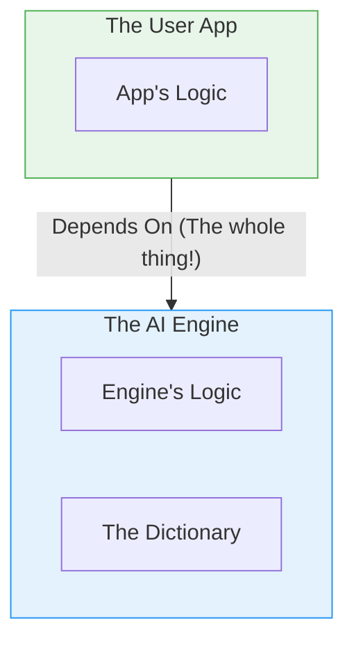

# Architecture: Why This Module Exists

This `EdgeAI` module is the most critical piece of the entire BreezeApp v2 architecture. Its purpose can be confusing at first glance, so this document explains why it must exist as a completely separate module.

## The Problem: How Do Two Separate Programs Talk?

Our system is composed of two main, independent programs:

1. **The "AI Engine" (`breeze-app-router`):** A powerful but "headless" program that does all the heavy AI work.
2. **The "User App" (`breeze-app-router-client`):** The application that users see and interact with.

These two programs need to communicate constantly, but they must remain completely separate so they can be developed and updated independently. How do we ensure they always speak the same language?

## The Solution: A Shared Dictionary

The `EdgeAI` module acts like a **shared, neutral dictionary**.

By creating this "dictionary" as a separate entity:

- The **User App** only needs to know the words and grammar in the dictionary. It doesn't need to know anything about the complex inner workings of the AI Engine.
- The **AI Engine** only needs to know how to understand and respond according to the dictionary's rules. It doesn't need to know anything about the User App's buttons or screens.

## Why Not Just Put the Dictionary Inside the AI Engine?

This is the most common question. If the AI Engine defines the API, why aren't the API files inside the engine's code?

Here's the analogy: **You wouldn't buy a whole restaurant just to get a copy of its menu.**

If we put the "dictionary" (the API contracts) inside the AI Engine, the dependency graph would look like this:

This would create huge problems:

1. **Unnecessary Weight:** To get the "menu" (the API), the User App is forced to depend on the entire "restaurant" (the AI Engine), including its kitchens, staff, and supply chains (all the heavy AI libraries and code).
2. **Tight Coupling:** If the restaurant renovates its kitchen (the AI Engine team updates an internal library), the User App might break, even though the menu didn't change.
3. **Slows Down Development:** Every small change in the User App would require rebuilding and testing against the entire, heavy AI engine.

## Conclusion: The Benefits of a Separate Contract Module

By keeping the contracts separate, we achieve three key architectural benefits that are universal to good software design:

- **Minimalism:** The User App depends only on what it absolutely needs—the small, lightweight "dictionary"—and nothing more.
- **Decoupling:** The User App and the AI Engine are completely independent. They can be developed, tested, and updated separately, as long as they both respect the rules of the shared dictionary.
- **Scalability:** We can create many different User Apps (for phones, watches, cars, etc.), and they can all talk to the same AI Engine simply by using the same shared dictionary.

This separation is the foundation of a clean, maintainable, and scalable system. 