# 🤖 Welcome to BreezeApp V2!

Ready to build the future of on-device AI on Android? You're in the right place!

BreezeApp V2 is a next-generation framework for creating powerful, modular, and extensible AI-driven experiences. It's built with a focus on type safety, modern Android practices (like Jetpack Compose and Kotlin Flows), and a great developer experience.

This project is both a **live demonstration** of best practices and a **solid foundation** for your own AI-powered apps.

## ✨ Project Vision

Our goal is to create a go-to open-source framework that makes integrating on-device AI on Android drastically simpler. We want to empower developers to innovate by providing a robust, well-documented, and easy-to-extend "AI brain" for their applications.

## 🗺️ How the Modules Fit Together

The project is built on a clear, decoupled, multi-module architecture. Here’s how the core components interact:

```mermaid
graph TD
    subgraph "Your Application"
        A["🟢 Client App<br>(breeze-app-router-client)"]
    end

    subgraph "The AI Engine"
        B["🔵 AI Router Service<br>(breeze-app-router)"]
    end

    subgraph "The Common Language"
        C["🟨 Shared Contracts<br>(shared-contracts)"]
    end

    A -- "Sends AIRequest via AIDL" --> B
    A -- "Depends on (API Models)" --> C
    B -- "Depends on (API Models)" --> C

    style A fill:#E8F5E9,stroke:#4CAF50
    style B fill:#E3F2FD,stroke:#2196F3
    style C fill:#FFFDE7,stroke:#FFC107
```

-   The **Client App** communicates with the **AI Router Service** using the data structures defined in **Shared Contracts**.
-   Both the client and the router depend on the contracts, ensuring they always speak the same language.

## 🚀 Choose Your Path: How to Get Started

We have two main paths for contributors. Where do you want to begin?

---

### 📱 I'm an App Developer...

*...and I want to use the AI Router to power my application's features.*

Excellent! Your journey starts with understanding how a client communicates with the router.

1.  **Start Here:** Begin with the **[`breeze-app-router-client/README.md`](./breeze-app-router-client/README.md)**. It's a fully-functional example app that shows you how to connect to the service, send requests, and handle responses using MVVM and Compose.
2.  **Learn the API:** Then, review the **[`shared-contracts/README.md`](./shared-contracts/README.md)** to understand the `AIRequest` and `AIResponse` models you'll be using.

---

### 🧠 I'm an AI/ML Engineer...

*...and I want to add a new model or capability to the AI Router.*

Fantastic! You are the heart of this project's extensibility. Your path is focused on creating "Runners".

1.  **Start Here:** The **[`breeze-app-router/README.md`](./breeze-app-router/README.md)** is your main entry point. It explains the core architecture of the routing engine.
2.  **Build Your First Runner:** Then, follow our detailed **[🧩 Runner Development Guide](./breeze-app-router/docs/RUNNER_DEVELOPMENT.md)**. It will walk you through creating, testing, and registering a new runner from scratch.

---

## 🤝 Join Our Community & Contribute

Whether you're fixing a bug, improving the docs, or adding a revolutionary new runner, we welcome your contributions!

-   **Contribution Guidelines:** Please read our main **[CONTRIBUTING.md](../CONTRIBUTING.md)** to get started.
-   **Have Questions?** Don't hesitate to open an issue! We're happy to help.

This revised `README` now acts as a much more effective "front door" for the project. It's visually clearer, speaks directly to its audience, and fosters a sense of welcome and community. 