# 🤖 Welcome to BreezeApp V2!

Ready to build the future of on-device AI on Android? You're in the right place!

BreezeApp V2 is a next-generation framework for creating powerful, modular, and extensible AI-driven experiences. It's built with a focus on type safety, modern Android practices, and a great developer experience.

## ✨ The Heart of the Project: The AI Router

The most important part of this project is the **`breeze-app-router`**.

Think of it as a powerful, "headless" **AI Brain** for Android. It runs as a background service, completely separate from any user interface. Its sole purpose is to manage, execute, and serve AI capabilities (like text generation, speech recognition, etc.) to any application that needs them.

By decoupling the complex AI logic from the UI, we empower app developers to add sophisticated AI features with minimal effort.

## 🔎 The Runtime View: How Client Talks to the Router

At runtime, your app (the client) sends an `AIRequest` to the router. The router processes it and responds with an `AIResponse`. This interaction is completely decoupled from UI logic.

```mermaid
graph TD
    A["📱 Client App<br/>(breeze-app-router-client)"]
    B["🧠 AI Router<br/>(breeze-app-router)"]

    A -- "Send AIRequest<br>(e.g. EdgeAI.chat/EdgeAI.tts/EdgeAI.asr)" --> B
    B -- "Return AIResponse" --> A

    style A fill:#E8F5E9,stroke:#4CAF50
    style B fill:#E3F2FD,stroke:#2196F3
```

This clean separation allows the router to remain UI-agnostic and service-oriented.

## 💼 The Dependency View: Who Depends on What?

Although the runtime interaction is between the client and the router, both modules rely on a shared contract library to exchange data safely and consistently.

```mermaid
graph TD
    edgeai["📘 EdgeAI<br/>(AIRequest, AIResponse definitions)"]
    client_app["📱 breeze-app-router-client"]
    router["🧠 breeze-app-router"]

    client_app --> edgeai
    router --> edgeai

    style client_app fill:#E8F5E9,stroke:#4CAF50
    style router fill:#E3F2FD,stroke:#2196F3
    style edgeai fill:#FFFDE7,stroke:#FFC107
```

* **`EdgeAI`** is a lightweight library module that defines the data contracts (`AIRequest`, `AIResponse`). It does not contain any logic.
* Both the client and the router depend on it to share a common data schema.

## 🚀 How to Get Started: Choose Your Role

Now that you understand the big picture, here’s how you can dive in based on your goals.

---

### 📱 I'm an App Developer...

*...and I want to **use** the AI Router in my application.*

Excellent! Your journey is about consuming the API.

1. **Start Here:** Begin with the **[breeze-app-router-client/README.md](./breeze-app-router-client/README.md)**. It's a fully-functional example app that shows you how to connect to the service and use its features.
2. **Learn the API:** Then, review the **[EdgeAI/README.md](./EdgeAI/README.md)** to understand the `AIRequest` and `AIResponse` models you'll be using.

---

### 🧠 I'm an AI/ML Engineer...

*...and I want to **extend** the AI Router with a new model.*

Fantastic! Your path is focused on implementing runners.

1. **Start Here:** The **[`breeze-app-router/README.md`](./breeze-app-router/README.md)** is your main entry point. It explains the internal architecture of the routing engine.
2. **Build Your First Runner:** Then, follow our detailed **[🧩 Runner Development Guide](./breeze-app-router/docs/RUNNER_DEVELOPMENT.md)**. It will walk you through creating, testing, and registering a new runner from scratch.

---

## 🤝 Join Our Community & Contribute

Whether you're fixing a bug, improving the docs, or adding a revolutionary new runner, we welcome your contributions!

* **Contribution Guidelines:** Please read our main **[CONTRIBUTING.md](../CONTRIBUTING.md)**.
* **Have Questions?** Don't hesitate to open an issue! We're happy to help.
