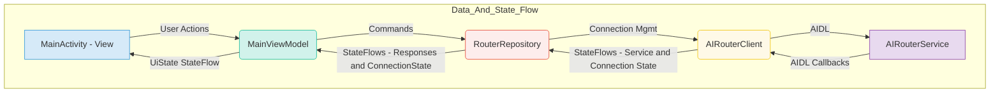

# Breeze App Router Client - A Developer's Guide & Example

This application serves as a reference implementation and a testing tool for the `breeze-app-router` service. It's designed to guide developers on how to connect their own Android applications with our AI routing service and invoke its various AI capabilities.

This client is built with modern Android practices, featuring a clean, multi-layered architecture that promotes a strong separation of concerns.

## Architecture Overview

The client's architecture follows the principles of Clean Architecture and MVVM, creating a robust and maintainable structure. The data flows in one direction, ensuring predictability and testability.



- **`MainActivity.kt` (View)**: The UI layer. Its sole responsibility is to observe `UiState` from the ViewModel and forward user actions. It has no business logic.
- **`MainViewModel.kt` (ViewModel)**: The state holder. It consumes data streams from the `RouterRepository`, transforms them into a single `UiState`, and exposes it to the View.
- **`RouterRepository.kt` (Repository)**: The single source of truth for all data. It encapsulates the `AIRouterClient`, manages the AIDL listener, and exposes clean `Flow`s for connection state and AI responses. The ViewModel depends only on this.
- **`AIRouterClient.kt` (DataSource/Client)**: The lowest-level networking class. It deals with the complexities of binding to the AIDL service, managing the connection lifecycle, and exposing the raw service state.

This layered architecture makes the app highly modular. For example, you could easily swap the `AIRouterClient` with a fake implementation for testing without touching the ViewModel or the View.

### A Note on the `AIRouterClient` Arrows

You might notice two arrows originating from the `AIRouterClient` in the diagram. They represent its two distinct responsibilities:

1. **`--> AIDL --> AIRouterService` (External Communication)**: This line signifies the client's primary job: performing the actual, cross-process communication with the external `AIRouterService` using AIDL. Think of this as the client "doing the work."

2. **`--> StateFlows --> RouterRepository` (Internal State Reporting)**: This line represents the client's secondary, but equally important, job: broadcasting its internal status (e.g., "Connecting," "Connected," "Error") to the rest of the application via a `StateFlow`. This is the client "reporting its status."

This separation is crucial. It allows the `AIRouterClient` to handle all the complex, messy details of service connections while providing a clean, simple stream of status updates for the rest of the app to react to.

## Key Integration Steps for Your App

Here's a breakdown of the essential code you'll need to integrate the `breeze-app-router` into your own application.

### 1. Add the `shared-contracts` Module

Your project must include the `shared-contracts` module, which contains the AIDL interfaces and `Parcelable` data models for communication.

Add the module to your `settings.gradle.kts`:

```kotlin
// settings.gradle.kts
include(":shared-contracts")
```

Add the dependency to your app's `build.gradle.kts`:

```kotlin
// build.gradle.kts (:app)
dependencies {
    implementation(project(":shared-contracts"))
}
```

### 2. Configure Your `AndroidManifest.xml`

Your app needs permissions and queries to discover and bind to the service:

```xml
<!-- Add to your AndroidManifest.xml -->
<uses-permission android:name="com.mtkresearch.breezeapp.permission.BIND_AI_ROUTER_SERVICE" />

<queries>
    <package android:name="com.mtkresearch.breezeapp.router" />
</queries>
```

### 3. Create the `AIRouterClient`

This class handles the raw service connection. Copy `AIRouterClient.kt` into your project. It abstracts the `ServiceConnection` callbacks into clean `StateFlow`s.

```kotlin
// AIRouterClient.kt - Manages the connection to the remote service.
class AIRouterClient(private val context: Context) {
    // ... encapsulates ServiceConnection logic ...
    val routerService: StateFlow<IAIRouterService?> = // ...
    val connectionState: StateFlow<ConnectionState> = // ...
    fun connect() { /* ... */ }
    fun disconnect() { /* ... */ }
}
```

### 4. Implement the `RouterRepository`

This repository is the centerpiece of the integration. It consumes the `AIRouterClient` and exposes clean data streams to your ViewModel.

**Key Code (`RouterRepository.kt`)**:

```kotlin
// RouterRepository.kt - The single source of truth for AI data.
class RouterRepository(
    private val client: AIRouterClient,
    private val externalScope: CoroutineScope
) {
    // Expose responses and connection state as clean flows
    val responses: SharedFlow<AIResponse> = // ...
    val connectionState: StateFlow<ConnectionState> = client.connectionState

    init {
        // Automatically register/unregister the listener when the service connects/disconnects
        externalScope.launch {
            client.routerService.collect { service ->
                service?.registerListener(serviceListener)
            }
        }
    }

    fun sendRequest(payload: RequestPayload): String {
        val request = AIRequest(payload = payload)
        // ... send message via client.routerService ...
        return request.id
    }

    private val serviceListener = object : IAIRouterListener.Stub() { /* ... */ }

    fun connect() = client.connect()
    fun disconnect() = client.disconnect()
}
```

### 5. Structure Your ViewModel

Your ViewModel should only depend on the `RouterRepository`. It collects flows and updates its `UiState`.

**Key Code (YourViewModel.kt)**:

```kotlin
class YourViewModel(application: Application) : AndroidViewModel(application) {

    private val _uiState = MutableStateFlow(UiState())
    val uiState: StateFlow<UiState> = _uiState.asStateFlow()

    private val repository: RouterRepository

    init {
        val client = AIRouterClient(application)
        repository = RouterRepository(client, viewModelScope)

        // Collect connection state from the repository
        viewModelScope.launch {
            repository.connectionState.collect { state ->
                // Update UI state (e.g., show "Connected" or "Disconnected")
            }
        }

        // Collect responses from the repository
        viewModelScope.launch {
            repository.responses.collect { response ->
                // Handle the AIResponse and update UI state
            }
        }
    }

    fun connect() = repository.connect()

    fun sendTextRequest(prompt: String, isStreaming: Boolean) {
        val payload = RequestPayload.TextChat(prompt = prompt, streaming = isStreaming)
        repository.sendRequest(payload)
    }
}
```

### 6. Observe State in Your UI

Finally, your `Activity` or `Fragment` observes the `UiState` from the ViewModel and updates the UI accordingly.

**Key Code (YourActivity.kt)**:

```kotlin
class YourActivity : AppCompatActivity() {
    private val viewModel: YourViewModel by viewModels()

    override fun onCreate(savedInstanceState: Bundle?) {
        super.onCreate(savedInstanceState)
        // ...

        // Connect button action
        binding.connectButton.setOnClickListener { 
            if (viewModel.uiState.value.isConnected) viewModel.disconnect()
            else viewModel.connect()
        }

        // Observe UI state changes
        lifecycleScope.launch {
            repeatOnLifecycle(Lifecycle.State.STARTED) {
                viewModel.uiState.collect { state ->
                    binding.connectionStatus.text = state.connectionStatus
                    // ... update other UI elements ...
                }
            }
        }
    }
}
```

## API Documentation

For complete details on all data models (`AIRequest`, `AIResponse`, `RequestPayload`, `ResponseMetadata`), please refer to the source code documentation in the `shared-contracts` module.

## Building and Running

1. Ensure you have the `breeze-app-router` (debug or release) installed on your target device/emulator.

2. Build and run this client application:
   
   ```bash
   ./gradlew :breeze-app-router-client:installDebug
   ```

3. Use the UI to connect and test AI functions. Observe how the clean architecture makes the application's behavior predictable and easy to debug.

## Troubleshooting

- **Service Connection Fails**: Verify the router service app is installed (`adb shell pm list packages | grep breezeapp.router`) and that your app has the correct permissions and `<queries>` tag in `AndroidManifest.xml`.
- **AIDL Errors**: Ensure your `shared-contracts` module is perfectly in sync with the service's version.

This client provides a clear, working example of all the core concepts. By examining its layered architecture, you can quickly learn how to robustly integrate our powerful AI router into your own projects. Welcome to the community! 