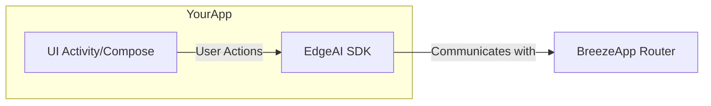

# BreezeAI Client: A demo UI app for the BreezeApp Ecosystem

This repository provides a reference implementation for integrating the [**EdgeAI SDK**](../../EdgeAI/README.md), demonstrating how to easily add powerful, on-device AI capabilities to any Android application.

## Why Use the BreezeApp Ecosystem?

As a UI developer, your goal is to create amazing user experiences. The BreezeApp ecosystem allows you to add advanced AI features like **real-time chat, voice synthesis, and speech recognition** to your app with minimal effort, without needing to be an AI expert.

- **Simple & Easy**: A clean, modern Kotlin API.
- **Powerful Features**: Access cutting-edge local AI models.
- **On-Device & Private**: All processing happens locally on the device.

---

## How It Works: The BreezeApp Ecosystem

The ecosystem consists of three key components that work together:

1. **Your App**: The application you are building, focusing on UI and user experience.
2. **EdgeAI SDK (The AI Bridge)**: A lightweight library you add to your app. It provides simple functions (`.chat()`, `.tts()`, `.asr()`) to access AI features.
3. **BreezeApp Router (The AI Engine)**: A separate, required Android application that runs the AI models. It acts as a local, on-device "AI server" that your app communicates with via the SDK.



---

## 3-Step Integration Guide

Follow these three steps to bring AI into your application.

### Step 1: Install the AI Engine (BreezeApp Router)

The `BreezeApp Router` application **must be installed** on the device or emulator for the SDK to function. This is a one-time prerequisite.

> You can verify the installation with the following adb command:
> 
> ```bash
> adb shell pm list packages | grep com.mtkresearch.breezeapp.router
> ```

### Step 2: Integrate the AI Bridge (EdgeAI SDK)

Add the SDK as a dependency to your app's `build.gradle.kts` file and initialize it. The best practice is to initialize it within a `ViewModel` to tie its lifecycle to your app's UI.

```kotlin
// 1. Add dependency in build.gradle.kts
dependencies {
    implementation(project(":EdgeAI"))
    // ... other dependencies
}

// 2. Initialize in your ViewModel
class MainViewModel(app: Application) : AndroidViewModel(app) {
    private val _isReady = MutableStateFlow(false)
    val isReady: StateFlow<Boolean> = _isReady.asStateFlow()

    init {
        viewModelScope.launch {
            try {
                EdgeAI.initializeAndWait(app)
                _isReady.value = true
            } catch (e: ServiceConnectionException) {
                // Handle cases where the AI Engine is not installed or available
                Log.e("App", "AI Engine not available: ${e.message}")
            }
        }
    }
}
```

### Step 3: Call AI Functions

Once the SDK is initialized, you can call its simple, powerful functions.

```kotlin
// In your ViewModel
viewModelScope.launch {
    // Example 1: Chat
    EdgeAI.chat(chatRequest(prompt = "Hello, AI!"))
        .collect { response -> /* Handle chat response */ }

    // Example 2: Text-to-Speech
    EdgeAI.tts(ttsRequest(input = "Hello, world!", voice = "alloy"))
        .collect { response -> /* Handle audio data */ }

    // Example 3: Speech-to-Text
    val audioBytes = getAudioData()
    EdgeAI.asr(asrRequest(audioBytes = audioBytes))
        .collect { response -> /* Handle transcription */ }
}
```

> **Note**: These are basic examples. For a complete list of all available parameters for each function, please refer to the official [**EdgeAI SDK API Documentation**](../../EdgeAI/README.md).

---

## Example: Handling UI State & Errors

A key part of integration is connecting the SDK's responses and errors to your UI. Using `StateFlow` in your `ViewModel` is the recommended approach.

```kotlin
// In MainViewModel.kt
private val _chatResponse = MutableStateFlow("")
val chatResponse: StateFlow<String> = _chatResponse.asStateFlow()

private val _error = MutableStateFlow<String?>(null)
val error: StateFlow<String?> = _error.asStateFlow()

fun runChat() {
    viewModelScope.launch {
        try {
            EdgeAI.chat(chatRequest(prompt="..."))
                .collect { response -> 
                    _chatResponse.value = response.choices.first().message?.content ?: ""
                }
        } catch (e: EdgeAIException) {
            _error.value = e.message // Expose error to the UI
        }
    }
}

// In Your Composable UI
@Composable
fun ChatScreen(viewModel: MainViewModel) {
    val responseText by viewModel.chatResponse.collectAsState()
    val errorMessage by viewModel.error.collectAsState()

    Text(text = responseText)

    if (errorMessage != null) {
        AlertDialog(
            title = { Text("An Error Occurred") },
            text = { Text(errorMessage!!) },
            onDismissRequest = { /* ... */ }
        )
    }
}
```

This reference app provides the complete, working code for these patterns. Happy coding! 