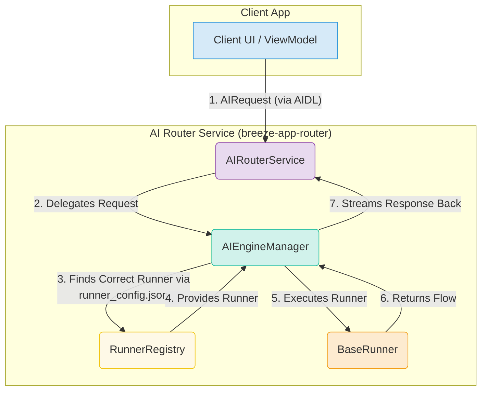

# BreezeApp AI Router

The BreezeApp AI Router is a powerful, extensible, and type-safe backend service for Android that simplifies the integration of diverse AI capabilities into your app. It manages model loading, execution, and lifecycle, providing a unified interface for all AI tasks.

## Key Features

- **🧩 Modular & Extensible**: Easily add new AI models or capabilities by creating "Runners".
- **🚀 Type-Safe API**: Uses `sealed interface` for requests (`RequestPayload`) and responses (`AIResponse`), eliminating runtime errors from incorrect data types.
- **🌊 Streaming First**: Built with Kotlin Flows for handling real-time data streams from models like LLMs.
- **⚙️ Dynamic Configuration**: Configure and prioritize runners via a simple JSON file.
- **🧠 Intelligent Routing**: Automatically selects the best runner for a given task based on priority and capabilities.
- **🧰 Built-in Mocking**: Includes mock runners for UI development and testing without needing real models.

## Architecture

The AI Router's architecture is designed for simplicity, clarity, and decoupling. It follows a clean, layered approach where each component has a single, well-defined responsibility.

### High-Level Data Flow

This diagram shows how a request from a client application flows through the router to an AI Runner and back.



### Component Roles Explained

1.  **`AIRouterService` (The Entry Point)**
    -   **What it is:** The Android Service that exposes the router to other applications via AIDL.
    -   **Its job:** To handle incoming IPC calls, enforce permissions, and be a thin wrapper around the `AIEngineManager`. It knows nothing about AI.

2.  **`AIEngineManager` (The Brain)**
    -   **What it is:** The central coordinator for all AI tasks.
    -   **Its job:** To receive a request, ask the `RunnerRegistry` for the appropriate `Runner` based on the request's capability, and then execute that runner. It manages the lifecycle of a single AI request.

3.  **`RunnerRegistry` (The Factory)**
    -   **What it is:** A registry that holds instances of all available runners.
    -   **Its job:** To select the best `Runner` for a given task based on the `runner_config.json` file and the requested capability (e.g., "TEXT_GENERATION").

4.  **`BaseRunner` (The Worker)**
    -   **What it is:** An implementation of a specific AI model (e.g., `LlamaRunner`, `MockLLMRunner`).
    -   **Its job:** To perform the actual AI inference, manage model loading/unloading, and return the results as a `Flow<AIResponse>`. This is where the "real work" happens.

This layered approach makes the system highly extensible. To add a new AI model, you only need to create a new `BaseRunner` implementation and register it in the JSON config. No other part of the architecture needs to change.

## ⚙️ Configuration Model: The Two-File System

The router's behavior is controlled by two key JSON files located in `src/main/assets/`. This separation of concerns makes the system both robust and flexible.

### 1. `runner_config.json` (Discovery & Registration)

-   **Purpose:** To act as a **manifest** of all available `BaseRunner` classes in the codebase.
-   **Analogy:** A plugin registry.
-   **Answers:** "What runners *can* be loaded?"

The `RunnerRegistry` reads this file at startup to know which runners it can instantiate. When adding a new runner class, you register it here.

```json
// runner_config.json
{
  "runners": [
    {
      "name": "breeze_llm_mock_v1",
      "class": "com.mtkresearch.breezeapp.router.data.runner.MockLLMRunner",
      "capabilities": ["LLM"],
      "priority": 100
    }
  ]
}
```

### 2. `default_config.json` (Orchestration & Behavior)

-   **Purpose:** To define **how** the discovered runners should be used and configured for specific tasks.
-   **Analogy:** The engine's control panel.
-   **Answers:** "For a given task, *which* runner should be used, and what are its parameters?"

This file uses the simple `name` from `runner_config.json` as a reference. It allows you to set default runners for capabilities (like `TEXT_GENERATION`) and provide fine-grained parameters for each runner instance.

```json
// default_config.json
{
  "runnerConfigurations": {
    "TEXT_GENERATION": {
      "defaultRunner": "breeze_llm_mock_v1",
      "runners": {
        "breeze_llm_mock_v1": {
          "type": "MOCK",
          "model": {
            "parameters": {
              "response_delay_ms": 100
            }
          }
        }
      }
    }
  }
}
```

This two-file system allows AI engineers to add new runners without worrying about system configuration, and allows app integrators to change behavior without touching the runner codebase.

## 🛠️ Development & Contribution

If you are interested in extending the router by adding new AI capabilities or supporting new models, we've prepared a detailed guide for you.

- **[🧩 Runner Development Guide](docs/RUNNER_DEVELOPMENT.md)**: Learn how to build, test, and register your own custom runners.

We welcome contributions! Please follow the guidelines in the main project `CONTRIBUTING.md`.

# 