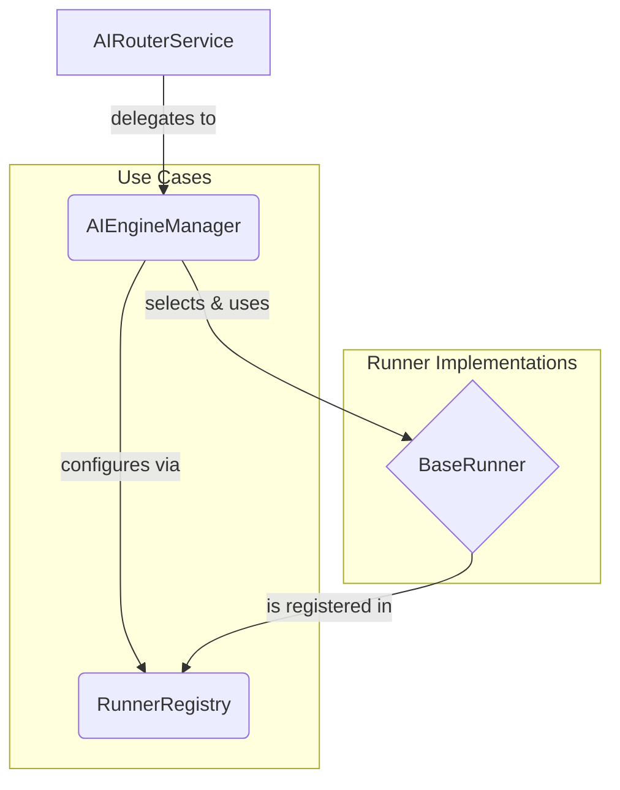

# AI Router Internal API Reference

This document provides a technical reference for the core internal APIs within the `breeze-app-router` module. It is intended for developers working on the router's internal logic and extending its capabilities.

For information on how to communicate with the service from a client app, please see the `shared-contracts` API documentation.

## Table of Contents
1.  [Core Components Overview](#core-components-overview)
2.  [Use Cases (Business Logic)](#use-cases-business-logic)
    *   `AIEngineManager`
    *   `RunnerRegistry`
3.  [Runner Contract (Interfaces)](#runner-contract-interfaces)
    *   `BaseRunner`
    *   `StreamingRunner` & `FlowStreamingRunner`
4.  [Core Data Models](#core-data-models)
    *   `InferenceRequest`
    *   `InferenceResult`
    *   `ModelConfig`
    *   `RunnerError`
    *   `CapabilityType`

---

## 1. Core Components Overview

The router's internal architecture is centered around a few key components that work together to process AI requests.



-   **`AIRouterService`**: The entry point. Receives AIDL calls and passes them to the `AIEngineManager`.
-   **`AIEngineManager`**: The central "brain". It contains the core business logic for selecting the right `BaseRunner` and executing the inference.
-   **`RunnerRegistry`**: A factory and registry for all available `BaseRunner` implementations.
-   **`BaseRunner`**: An interface that defines the contract for any AI engine (e.g., LLM, ASR). All runners, mock or real, implement this.

---

## 2. Use Cases (Business Logic)

### `AIEngineManager`
The primary Use Case class. It orchestrates the entire inference process.

**Key Responsibilities:**
-   Selecting the appropriate runner based on capability, preference, and availability.
-   Implementing a fallback strategy if a preferred runner fails.
-   Handling both standard and streaming inference requests.
-   Managing the lifecycle of active runners (loading, unloading).

**Core API:**

```kotlin
class AIEngineManager {
    // Registers a runner factory.
    fun registerRunner(name: String, factory: () -> BaseRunner)

    // Unregisters a runner.
    fun unregisterRunner(name: String)

    // Sets the default runner for a given AI capability.
    fun setDefaultRunners(mappings: Map<CapabilityType, String>)

    // Processes a standard, non-streaming inference request.
    fun process(request: InferenceRequest, capability: CapabilityType, preferredRunner: String? = null): InferenceResult

    // Processes a streaming inference request using Kotlin Flows.
    fun processStream(request: InferenceRequest, capability: CapabilityType, preferredRunner: String? = null): Flow<InferenceResult>

    // Releases resources used by all active runners.
    fun cleanup()
}
```

### `RunnerRegistry`
A singleton class that acts as a factory and registry for `BaseRunner` implementations.

**Key Responsibilities:**
-   Provides a central place to register and unregister runner factories.
-   Allows for dynamic lookup of runners by name or by the capability they support.
-   Decouples the `AIEngineManager` from concrete runner implementations.

**Core API:**

```kotlin
class RunnerRegistry {
    companion object {
        fun getInstance(): RunnerRegistry
    }

    // Registers a runner with its factory function.
    fun register(name: String, factory: RunnerFactory)

    // Unregisters a runner.
    fun unregister(name: String)

    // Creates a new instance of a named runner.
    fun createRunner(name: String): BaseRunner?

    // Finds all registered runners that support a specific capability.
    fun getRunnersForCapability(capability: CapabilityType): List<String>

    // Clears all registered runners.
    fun clear()
}
```

---

## 3. Runner Contract (Interfaces)

### `BaseRunner`
The fundamental contract for any AI engine. All runners **must** implement this interface.

**Core API:**
```kotlin
interface BaseRunner {
    // Loads the model and initializes resources.
    // Returns true on success, false on failure.
    fun load(config: ModelConfig): Boolean

    // Executes a standard inference.
    fun run(input: InferenceRequest, stream: Boolean = false): InferenceResult

    // Releases all resources used by the runner.
    fun unload()

    // Returns a list of capabilities this runner supports.
    fun getCapabilities(): List<CapabilityType>

    // Checks if the model resources are currently loaded.
    fun isLoaded(): Boolean

    // Returns metadata about the runner itself.
    fun getRunnerInfo(): RunnerInfo
}
```

### `StreamingRunner` & `FlowStreamingRunner`
Optional interfaces for runners that support streaming responses. It is highly recommended to implement `FlowStreamingRunner` for modern, coroutine-based streaming.

**Core API:**
```kotlin
// For modern, coroutine-based streaming.
interface FlowStreamingRunner : BaseRunner {
    // Executes a streaming inference and returns results as a Flow.
    fun runAsFlow(input: InferenceRequest): Flow<InferenceResult>
}

// For callback-based streaming.
interface StreamingRunner : BaseRunner {
    fun runStream(
        input: InferenceRequest,
        onResult: (InferenceResult) -> Unit,
        onComplete: () -> Unit,
        onError: (Throwable) -> Unit
    )
}
```

---

## 4. Core Data Models

These are the primary data structures passed between the `AIEngineManager` and the `BaseRunner`s.

### `InferenceRequest`
A standardized request object for all inference tasks.
```kotlin
data class InferenceRequest(
    val sessionId: String,
    val inputs: Map<String, Any>, // Input data (text, audio, image)
    val params: Map<String, Any> = emptyMap(), // Inference parameters
    val timestamp: Long = System.currentTimeMillis()
)
```
-   **`inputs`**: A map containing the core data. Use keys from `InferenceRequest.Companion` (e.g., `INPUT_TEXT`, `INPUT_IMAGE`).
-   **`params`**: A map for configuration, like `temperature` or `max_tokens`.

### `InferenceResult`
A standardized response object for all inference tasks.
```kotlin
data class InferenceResult(
    val outputs: Map<String, Any>, // The result data
    val metadata: Map<String, Any> = emptyMap(),
    val error: RunnerError? = null,
    val partial: Boolean = false // True if this is a partial result in a stream
)
```
-   **`outputs`**: A map containing the results. Use keys from `InferenceResult.Companion` (e.g., `OUTPUT_TEXT`).
-   **`error`**: If not null, the inference failed.
-   **`partial`**: Used by streaming runners to indicate more results are coming.

### `ModelConfig`
Configuration for loading a model in a runner.
```kotlin
data class ModelConfig(
    val modelName: String,
    val modelPath: String? = null,
    val files: Map<String, String> = emptyMap(), // Paths to related files (tokenizer, etc.)
    val parameters: Map<String, Any> = emptyMap() // Model-specific parameters
)
```

### `RunnerError`
A standardized error object for reporting failures within a runner.
```kotlin
data class RunnerError(
    val code: String, // e.g., "E001" for model not loaded
    val message: String,
    val recoverable: Boolean = false,
    val cause: Throwable? = null
)
```

### `CapabilityType` (Enum)
Defines the different types of AI capabilities the router can handle.
```kotlin
enum class CapabilityType {
    LLM,        // Large Language Model
    VLM,        // Vision Language Model
    ASR,        // Automatic Speech Recognition
    TTS,        // Text-to-Speech
    GUARDIAN    // Content Safety / Guardrail
}
``` 