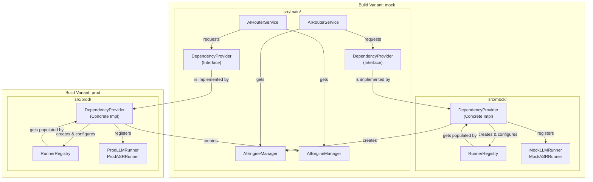

# AI Router Architecture Guide

Welcome, contributor! This guide explains the core architectural decisions behind the `breeze-app-router` module. Understanding this architecture is key to contributing effectively and maintaining the project's high standards of quality and modularity.

## Core Principle: Separation of Environments

Our primary architectural goal is to **strictly separate development/testing environments from the production environment**. This is achieved using Gradle's **Product Flavors**.

We have two main flavors:
-   **`mock`**: Used for local development, UI testing, and integration tests. It uses mock runners that simulate AI behavior without requiring real models or native dependencies.
-   **`prod`**: Used for the final production build. It includes the real, optimized AI runners (`ExecuTorch`, `ONNX`, etc.).

This separation ensures that **no mock code is ever included in the production APK**, reducing its size and attack surface, and preventing unintended behavior.

## The Source Set Strategy: `main`, `mock`, and `prod`

To implement this separation, we use a classic Gradle source set structure. This is a deliberate choice to enforce clean architecture and clear responsibilities.

```
breeze-app-router/
└── src/
    ├── main/       # Shared code for ALL flavors (interfaces, domain logic)
    ├── mock/       # Code ONLY for the 'mock' flavor (mock implementations)
    └── prod/       # Code ONLY for the 'prod' flavor (production implementations)
    └── testMock/   # Unit tests for the 'mock' flavor
```

### The Golden Rule of `main`
> The `main` source set contains the **shared contract** and **domain logic**. It **must not** know about any concrete implementation details from the `mock` or `prod` flavors. It only depends on abstractions (interfaces).

### Role of Each Source Set

1.  **`src/main/` (The Shared Contract & Domain)**
    *   **Purpose**: To define the "what" (interfaces, abstract logic) that is common to all environments.
    *   **Key Components**:
        *   `AIRouterService`: The core Android Service. Its main job is to handle AIDL and delegate to the `AIEngineManager`.
        *   `AIEngineManager`: The central **Use Case** for processing requests. It selects the right runner from the registry and executes it.
        *   `RunnerRegistry`: A singleton factory for creating and accessing runner instances.
        *   `DependencyProvider` (Interface): An abstract contract for providing dependencies. All logic in `main` depends on this interface, not a concrete type.
        *   Domain Models & Interfaces (`InferenceRequest`, `BaseRunner`, etc.): Shared data structures and contracts.

2.  **`src/mock/` (The Development Sandbox)**
    *   **Purpose**: To provide concrete implementations for the `mock` build flavor. This code is for development and testing **only**.
    *   **Key Components**:
        *   `DependencyProvider`: The concrete implementation of the `DependencyProvider` interface. It knows how to create and register all mock runners.
        *   `MockLLMRunner`, `MockASRRunner`, etc.: The fake runner implementations themselves, located in `src/mock/java/.../data/runner`.

3.  **`src/prod/` (The Production Engine Room)**
    *   **Purpose**: To provide concrete implementations for the `prod` build flavor. This is what runs on the user's device.
    *   **Key Components**:
        *   `DependencyProvider`: The production implementation of the `DependencyProvider` interface.
        *   *Future* real runners like `ExecuTorchLLMRunner` would live here in `src/prod/java/.../data/runner`.

## Dependency Injection: How It All Connects

We use a simple but powerful form of dependency injection leveraging Gradle's source sets and Java's standard `ServiceLoader` mechanism to connect these layers without creating hard dependencies in `main`.

**The Flow:**
1.  `AIRouterService` is created and needs its `AIEngineManager`.
2.  It calls `DependencyProvider.getInstance().getAIEngineManager()`.
3.  The `getInstance()` method uses `ServiceLoader` to automatically find and load the concrete `DependencyProvider` implementation that is included in the current build variant (`mock` or `prod`).
4.  The flavor-specific `DependencyProvider` is then responsible for initializing the `RunnerRegistry` with the correct set of runners (mock or prod) and then creating an `AIEngineManager` instance with that registry.
5.  `AIRouterService` receives a fully configured `AIEngineManager` and is ready to process requests, with **no knowledge** of whether the underlying runners are mock or real.

This achieves true **Inversion of Control**.

### Visualization



## How to Contribute: Adding a New Runner

This architecture makes adding new runners straightforward and safe.

### Example: Adding a `NewMockImageRunner`

1.  **Create the Runner**:
    *   Create the file in the `mock` source set: `src/mock/java/com/mtkresearch/breezeapp/router/data/runner/NewMockImageRunner.kt`.
    *   Implement the `BaseRunner` or `FlowStreamingRunner` interface.

2.  **Register the Runner**:
    *   Open `src/mock/java/com/mtkresearch/breezeapp/router/injection/DependencyProvider.kt`.
    *   Add your new runner to the `RunnerRegistry` within the `provideRunnerRegistry` method.

    ```kotlin
    // In a DependencyProvider for the mock flavor
    private fun provideRunnerRegistry(): RunnerRegistry {
        val registry = RunnerRegistry.getInstance()
        // ... existing runners
        registry.register(RunnerRegistry.RunnerRegistration(
            name = "image_mock_v1",
            factory = { NewMockImageRunner() },
            capabilities = listOf(CapabilityType.VLM) // Visual Language Model
        ))
        return registry
    }
    ```

That's it! You have added a new mock runner without touching any `main` or `prod` code. The `AIEngineManager` will automatically be able to use it.

### Example: Adding a `RealTfliteRunner` (Future)

The process is identical, but you would perform the steps in the `prod` source set.

1.  **Create the Runner**:
    *   Create the file in the `prod` source set: `src/prod/java/.../data/runner/RealTfliteRunner.kt`.
    *   Implement the `BaseRunner` interface, including the native logic.

2.  **Register the Runner**:
    *   Open `src/prod/java/.../injection/DependencyProvider.kt`.
    *   Add your new runner to the registry.

By following this pattern, we ensure the project remains clean, modular, and easy to scale. 