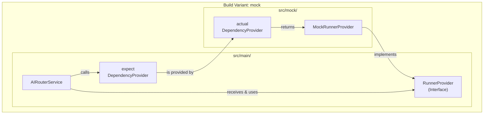

# AI Router Architecture Guide

Welcome, contributor! This guide explains the core architectural decisions behind the `breeze-app-router` module. Understanding this architecture is key to contributing effectively and maintaining the project's high standards of quality and modularity.

## Core Principle: Separation of Environments

Our primary architectural goal is to **strictly separate development/testing environments from the production environment**. This is achieved using Gradle's **Product Flavors**.

We have two main flavors:
-   **`mock`**: Used for local development, UI testing, and integration tests. It uses mock runners that simulate AI behavior without requiring real models or native dependencies.
-   **`prod`**: Used for the final production build. It includes the real, optimized AI runners (`ExecuTorch`, `ONNX`, etc.).

This separation ensures that **no mock code is ever included in the production APK**, reducing its size and attack surface, and preventing unintended behavior.

## The Source Set Strategy: `main`, `mock`, and `prod`

To implement this separation, we use a three-directory source set structure. This is a deliberate choice to enforce clean architecture and clear responsibilities.

```
breeze-app-router/
└── src/
    ├── main/   #  Shared code for ALL flavors
    ├── mock/   # Code ONLY for the 'mock' flavor
    └── prod/   # Code ONLY for the 'prod' flavor
```

### The Golden Rule of `main`
> The `main` source set contains the **shared contract** and **common logic**. It **must not** know about any concrete implementation details from the `mock` or `prod` flavors. It only depends on abstractions.

### Role of Each Source Set

1.  **`src/main/` (The Shared Contract)**
    *   **Purpose**: To define the "what" (interfaces, abstract logic) that is common to all environments.
    *   **Key Components**:
        *   `AIRouterService`: The core Android Service. Its logic is generic and stable.
        *   `AIEngineManager`: The central Use Case for processing requests. It delegates to runners.
        *   `RunnerProvider` (Interface): An abstract contract for providing runners.
        *   `expect object DependencyProvider`: An `expect` declaration that forces each flavor to provide a concrete dependency provider.
        *   Domain Models (`InferenceRequest`, `InferenceResult`, etc.): Shared data structures.

2.  **`src/mock/` (The Development Sandbox)**
    *   **Purpose**: To provide concrete implementations for the `mock` flavor. This code is for development and testing **only**.
    *   **Key Components**:
        *   `MockRunnerProvider`: The concrete implementation of `RunnerProvider` that knows how to instantiate `Mock...Runner`s.
        *   `actual object DependencyProvider`: The `actual` implementation that provides `MockRunnerProvider`.
        *   `MockLLMRunner`, `MockASRRunner`, etc.: The fake runner implementations.

3.  **`src/prod/` (The Production Engine Room)**
    *   **Purpose**: To provide concrete implementations for the `prod` flavor. This is what runs on the user's device.
    *   **Key Components**:
        *   `ProdRunnerProvider`: The concrete implementation of `RunnerProvider` that will instantiate real runners.
        *   `actual object DependencyProvider`: The `actual` implementation that provides `ProdRunnerProvider`.
        *   *Future* real runners like `ExecuTorchLLMRunner` would live here.

## Dependency Injection: How It All Connects

We use a simple but powerful form of dependency injection to connect these layers without creating hard dependencies in `main`.

**The Flow:**
1.  `AIRouterService` needs to initialize the AI engine.
2.  It calls `DependencyProvider.getRunnerProvider()`.
3.  Because of the `expect`/`actual` mechanism, the build system provides the correct `DependencyProvider` for the selected flavor (`mock` or `prod`).
4.  The flavor-specific `DependencyProvider` returns its corresponding `RunnerProvider` (`MockRunnerProvider` or `ProdRunnerProvider`).
5.  `AIRouterService` receives an object that conforms to the `RunnerProvider` interface and calls `registerRunners()`. It has **no idea** whether the runners are mock or real.

This achieves true **Inversion of Control**.

### Visualization



## How to Contribute: Adding a New Runner

This architecture makes adding new runners straightforward and safe.

### Example: Adding a `NewMockImageRunner`

1.  **Create the Runner**:
    *   Create the file in the `mock` source set: `src/mock/java/.../runner/NewMockImageRunner.kt`.
    *   Implement the `BaseRunner` interface.

2.  **Register the Runner**:
    *   Open `src/mock/java/.../injection/MockRunnerProvider.kt`.
    *   Add your new runner to the `registerRunners` method.

    ```kotlin
    // In MockRunnerProvider.kt
    override fun registerRunners(registry: RunnerRegistry) {
        // ... existing runners
        registry.register("NewMockImageRunner") { NewMockImageRunner() }
    }
    ```

That's it! You have added a new mock runner without touching any `main` or `prod` code.

### Example: Adding a `RealTfliteRunner` (Future)

1.  **Create the Runner**:
    *   Create the file in the `prod` source set: `src/prod/java/.../runner/RealTfliteRunner.kt`.
    *   Implement the `BaseRunner` interface, including the native logic.

2.  **Register the Runner**:
    *   Open `src/prod/java/.../injection/ProdRunnerProvider.kt`.
    *   Add your new runner to the `registerRunners` method.

    ```kotlin
    // In ProdRunnerProvider.kt
    override fun registerRunners(registry: RunnerRegistry) {
        // ... existing real runners
        registry.register("RealTfliteRunner") { RealTfliteRunner() }
    }
    ```

By following this pattern, we ensure the project remains clean, modular, and easy to scale. 