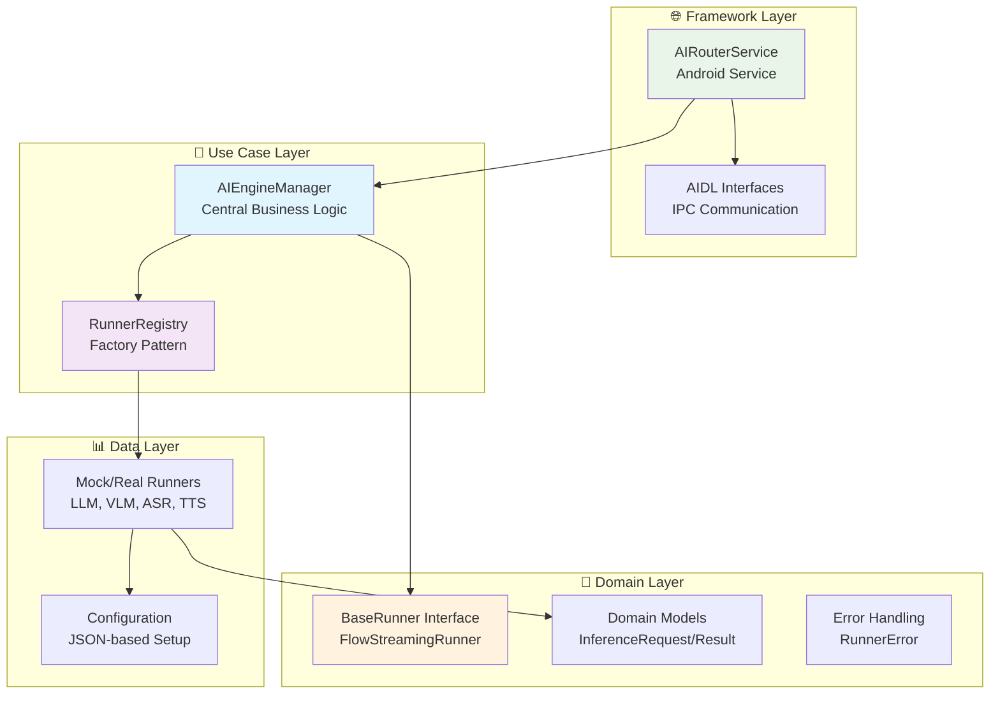
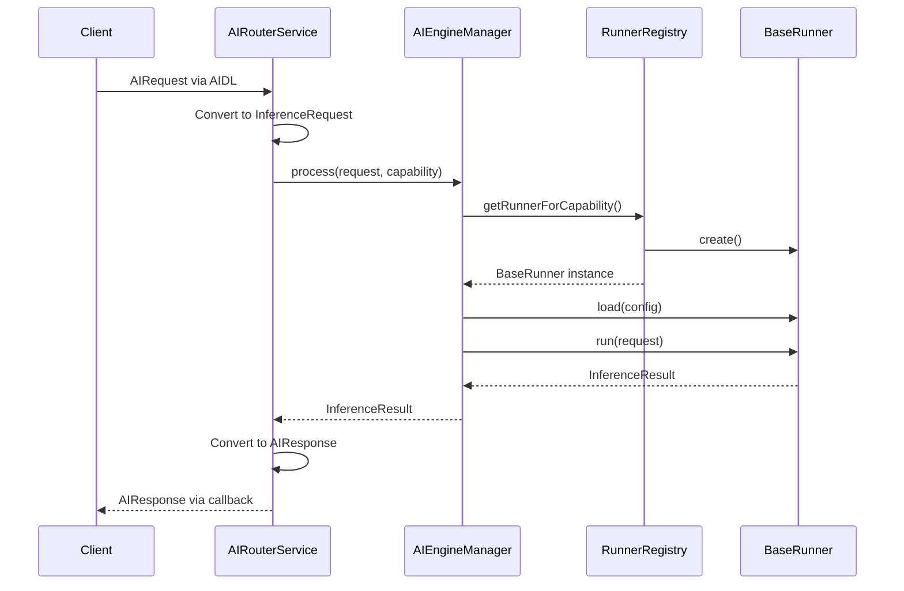

# 🏗️ Architecture Guide

This guide explains the core architectural decisions, design patterns, and principles behind the BreezeApp AI Router.

## 🎯 Design Philosophy

### Core Principle: Resilient Graceful Degradation

The AI Router is built around **graceful degradation** - ensuring your app works across all Android devices, regardless of their AI capabilities:

- **Tier 1**: High-end devices run real AI models with hardware acceleration
- **Tier 2**: Mid-range devices use CPU-only implementations  
- **Tier 3**: Low-end devices fall back to realistic mock implementations
- **Tier 4**: Offline/disconnected devices use cached responses

This approach ensures **100% feature availability** while optimizing performance for each device tier.

## 🏛️ Clean Architecture Implementation

The router strictly follows **Clean Architecture** principles with clear dependency inversion:



### 🔄 Dependency Flow

**Framework → Use Case → Domain ← Data**

- **Framework** depends on **Use Case** (but not vice versa)
- **Use Case** depends on **Domain** abstractions only  
- **Data** implements **Domain** interfaces
- **Domain** has no dependencies (pure business logic)

## 🧩 Core Components Deep Dive

### 1. AIEngineManager (Use Case)

The **central business logic** that orchestrates all AI operations:

```kotlin
class AIEngineManager(
    private val runnerRegistry: RunnerRegistry,
    private val logger: Logger
) {
    // Thread-safe runner storage
    private val activeRunners = ConcurrentHashMap<String, BaseRunner>()
    private val defaultRunners = ConcurrentHashMap<CapabilityType, String>()
    
    // Request cancellation support
    private val activeRequests = ConcurrentHashMap<String, Job>()
    
    suspend fun process(
        request: InferenceRequest, 
        capability: CapabilityType,
        preferredRunner: String? = null
    ): InferenceResult
}
```

**Key Responsibilities:**
- 🎯 **Runner Selection**: Chooses optimal runner based on capability and preference
- 🔄 **Lifecycle Management**: Loads/unloads runners as needed
- 📊 **Fallback Strategy**: Automatically retries with fallback runners
- 🧵 **Concurrency**: Thread-safe concurrent request handling
- ❌ **Error Handling**: Converts failures to structured errors

### 2. RunnerRegistry (Factory Pattern)

A **thread-safe factory** for creating and managing runner instances:

```kotlin
class RunnerRegistry(private val logger: Logger) {
    // Priority-sorted runners by capability
    private val capabilitiesMap = ConcurrentHashMap<CapabilityType, MutableList<RunnerRegistration>>()
    private val runnersByName = ConcurrentHashMap<String, RunnerRegistration>()
    private val indexLock = ReentrantReadWriteLock()
    
    fun register(registration: RunnerRegistration)
    fun getRunnerForCapability(capability: CapabilityType): BaseRunner?
    fun createRunner(name: String): BaseRunner?
}
```

**Key Features:**
- 🏭 **Factory Pattern**: Creates runner instances on demand
- 📋 **Priority Management**: Automatically selects highest-priority runners
- 🔄 **Dynamic Registration**: Supports runtime runner registration
- 🧵 **Thread Safety**: Concurrent access with read/write locks
- 📊 **Statistics**: Provides registry health and usage stats

### 3. BaseRunner Interface (Domain Contract)

The **unified contract** that all AI runners must implement:

```kotlin
interface BaseRunner {
    fun load(config: ModelConfig): Boolean
    fun run(input: InferenceRequest): InferenceResult
    fun unload()
    fun getCapabilities(): List<CapabilityType>
    fun isLoaded(): Boolean
    fun getRunnerInfo(): RunnerInfo
}

// Extended interface for streaming support
interface FlowStreamingRunner : BaseRunner {
    fun runAsFlow(input: InferenceRequest): Flow<InferenceResult>
}
```

**Design Benefits:**
- 🔌 **Pluggability**: Easy to add new AI capabilities
- 🧪 **Testability**: Mock implementations for testing
- 📏 **Consistency**: Uniform API across all AI types
- 🌊 **Streaming**: Optional streaming support via Flow

### 4. RouterConfigurator (Dependency Injection)

A **lightweight DI container** that wires up all dependencies:

```kotlin
class RouterConfigurator(context: Context) {
    val logger: Logger = AndroidLogger()
    val runnerRegistry: RunnerRegistry = RunnerRegistry(logger)
    val engineManager: AIEngineManager = AIEngineManager(runnerRegistry, logger)
    
    private val configurationManager: ConfigurationManager = 
        ConfigurationManager(context.applicationContext, logger)

    init {
        configurationManager.loadAndRegisterRunners(runnerRegistry)
    }
}
```

**Initialization Order:**
1. **Logger** - Logging infrastructure
2. **RunnerRegistry** - Factory for runners
3. **AIEngineManager** - Use case with dependencies
4. **ConfigurationManager** - Loads and registers runners from JSON

## 🔧 Configuration-Driven Architecture

### JSON-Based Runner Registration

All runners are registered via `assets/runner_config.json`:

```json
{
  "runners": [
    {
      "name": "breeze_llm_mock_v1",
      "class": "com.mtkresearch.breezeapp.router.data.runner.MockLLMRunner",
      "capabilities": ["LLM"],
      "priority": 100,
      "is_real": false
    },
    {
      "name": "breeze_llm_gpu_v1", 
      "class": "com.mtkresearch.breezeapp.router.data.runner.GPULLMRunner",
      "capabilities": ["LLM"],
      "priority": 10,
      "is_real": true
    }
  ]
}
```

**Configuration Benefits:**
- 🔄 **Dynamic**: Change runners without code changes
- 📊 **Priority-Based**: Automatic best-runner selection
- 🧪 **Environment-Aware**: Different configs for debug/release
- 🔍 **Device Detection**: Real runners check device support

### Priority-Based Selection

```kotlin
// Lower priority number = higher priority
// GPU runner (priority: 10) beats mock runner (priority: 100)
val llmRunner = registry.getRunnerForCapability(CapabilityType.LLM)
```

## 🧵 Thread Safety & Concurrency

### Coroutine-Based Design

The router uses **structured concurrency** with Kotlin Coroutines:

```kotlin
// Service scope for background work
private val serviceScope = CoroutineScope(Dispatchers.IO + serviceJob)

// Process requests asynchronously
val requestJob = serviceScope.launch {
    processAIRequest(request)
}

// Track for cancellation
activeRequests[request.id] = requestJob
```

**Benefits:**
- ⚡ **Non-blocking**: UI never freezes
- 🔄 **Cancellable**: Requests can be cancelled gracefully
- 🧵 **Structured**: Automatic cleanup on scope cancellation
- 📊 **Backpressure**: Flow-based streaming with natural backpressure

### Thread-Safe Data Structures

```kotlin
// Concurrent collections for thread safety
private val activeRunners = ConcurrentHashMap<String, BaseRunner>()
private val activeRequests = ConcurrentHashMap<String, Job>()

// Read/write locks for complex operations
private val configLock = ReentrantReadWriteLock()
```

## 🛡️ Error Handling Strategy

### Structured Error Types

```kotlin
data class RunnerError(
    val code: String,           // E404, E501, etc.
    val message: String,        // Human-readable description
    val recoverable: Boolean,   // Can retry?
    val cause: Throwable?       // Original exception
) {
    companion object {
        const val ERROR_MODEL_NOT_LOADED = "E001"
        const val ERROR_INVALID_INPUT = "E401" 
        const val ERROR_RUNTIME_EXCEPTION = "E101"
        const val ERROR_TIMEOUT = "E301"
    }
}
```

### Fallback Chain

```kotlin
private suspend fun selectAndLoadRunner(
    capability: CapabilityType,
    preferredRunner: String?
): Result<BaseRunner> {
    // 1. Try preferred runner if specified
    // 2. Try default runner for capability
    // 3. Try highest-priority available runner
    // 4. Return structured error if all fail
}
```

## 📊 Data Flow Architecture

### Request Processing Pipeline



### Streaming Data Flow

```kotlin
// Streaming uses Kotlin Flow for backpressure
fun processStream(request: InferenceRequest, capability: CapabilityType): Flow<InferenceResult> = flow {
    val runner = selectAndLoadRunner(capability).getOrThrow()
    
    if (runner is FlowStreamingRunner) {
        runner.runAsFlow(request).collect { result ->
            emit(result) // Emits to client via Flow
        }
    }
}
```

## 🏭 Factory Pattern Implementation

### Runner Factory Interface

```kotlin
fun interface RunnerFactory {
    fun create(): BaseRunner
}

// Usage in registry
val factory: RunnerFactory = { MockLLMRunner() }
registry.register("mock_llm", factory, priority = 100)
```

### Reflection-Based Factories

```kotlin
// Configuration manager creates factories from class names
private fun createFactoryFromClassName(className: String): RunnerFactory {
    val runnerClass = Class.forName(className)
    return RunnerFactory {
        runnerClass.getConstructor().newInstance() as BaseRunner
    }
}
```

## 🧪 Mock-First Testing Strategy

### Realistic Mock Implementations

Each AI capability has a **realistic mock** that:
- ✅ Simulates actual AI behavior patterns
- ✅ Includes configurable delays and responses
- ✅ Supports streaming where applicable
- ✅ Handles edge cases and errors

```kotlin
class MockLLMRunner : BaseRunner, FlowStreamingRunner {
    override fun runAsFlow(input: InferenceRequest): Flow<InferenceResult> = flow {
        val fullResponse = generateResponse(input.inputs[INPUT_TEXT] as String)
        val words = fullResponse.split(" ")
        
        // Stream word by word with delays
        words.forEachIndexed { index, word ->
            delay(50) // Simulate typing delay
            val partial = words.take(index + 1).joinToString(" ")
            emit(InferenceResult.textOutput(partial, partial = index < words.size - 1))
        }
    }
}
```

### Test Pyramid

```
    🔺 E2E Tests
   🔺🔺 Integration Tests  
  🔺🔺🔺 Unit Tests
```

- **Unit Tests**: Individual components (RunnerRegistry, AIEngineManager)
- **Integration Tests**: Component interactions  
- **E2E Tests**: Full client-service interaction

## 🔄 Lifecycle Management

### Service Lifecycle

```kotlin
class AIRouterService : Service() {
    override fun onCreate() {
        // Initialize dependency graph
        val configurator = RouterConfigurator(applicationContext)
        this.engineManager = configurator.engineManager
    }
    
    override fun onDestroy() {
        // Cleanup all resources
        engineManager.cleanup()
        serviceJob.cancel()
    }
}
```

### Runner Lifecycle

```kotlin
// Lazy loading - runners only loaded when needed
private fun getOrCreateRunner(name: String): BaseRunner? {
    return activeRunners[name] ?: createAndCacheRunner(name)
}

// Cleanup unloads all runners
fun cleanup() {
    activeRunners.values.forEach { it.unload() }
    activeRunners.clear()
}
```

## 📏 SOLID Principles in Practice

### Single Responsibility Principle
- `AIEngineManager`: Request processing logic only
- `RunnerRegistry`: Factory and registry only  
- `BaseRunner`: AI execution contract only

### Open/Closed Principle
```kotlin
// Open for extension (new runners)
class CustomVisionRunner : BaseRunner { ... }

// Closed for modification (core logic unchanged)
registry.register("custom_vision", ::CustomVisionRunner)
```

### Liskov Substitution Principle
```kotlin
// Any BaseRunner can be substituted
val runner: BaseRunner = registry.getRunnerForCapability(LLM)
// Works with MockLLMRunner, GPULLMRunner, CPULLMRunner, etc.
```

### Interface Segregation Principle
```kotlin
// Separate interfaces for different capabilities
interface BaseRunner { ... }           // Core functionality
interface FlowStreamingRunner { ... }   // Streaming-specific
interface ConfigurableRunner { ... }    // Configuration-specific
```

### Dependency Inversion Principle
```kotlin
// High-level AIEngineManager depends on abstraction
class AIEngineManager(
    private val runnerRegistry: RunnerRegistry, // Not concrete implementation
    private val logger: Logger                   // Not android.util.Log
)
```

## 🚀 Performance Optimizations

### Runner Caching
- **Lazy Loading**: Runners only created when needed
- **Instance Reuse**: Same runner serves multiple requests
- **Smart Unloading**: LRU eviction for memory management

### Request Batching
```kotlin
// Future enhancement: batch compatible requests
fun processBatch(requests: List<InferenceRequest>): Flow<InferenceResult>
```

### Memory Management
```kotlin
// Weak references for large models
private val modelCache = WeakHashMap<String, Model>()

// Explicit cleanup on low memory
override fun onTrimMemory(level: Int) {
    if (level >= TRIM_MEMORY_MODERATE) {
        engineManager.cleanup()
    }
}
```

## 🔮 Future Extensions

### Plugin Architecture
```kotlin
// Future: Dynamic plugin loading
interface RunnerPlugin {
    fun getRunnerFactories(): Map<String, RunnerFactory>
    fun getCapabilities(): List<CapabilityType>
}
```

### Distributed Processing
```kotlin
// Future: Remote runner support
interface RemoteRunner : BaseRunner {
    fun getEndpoint(): String
    fun authenticate(credentials: Credentials)
}
```

---

This architecture provides a **solid foundation** for building AI-powered Android applications with **excellent maintainability**, **testability**, and **extensibility**.

## 📚 Next Reading

- **[Integration Guide](./INTEGRATION_GUIDE.md)** - Advanced client integration patterns
- **[Runner Development](./RUNNER_DEVELOPMENT.md)** - Creating custom AI runners  
- **[Configuration Guide](./CONFIGURATION_GUIDE.md)** - Advanced configuration options 