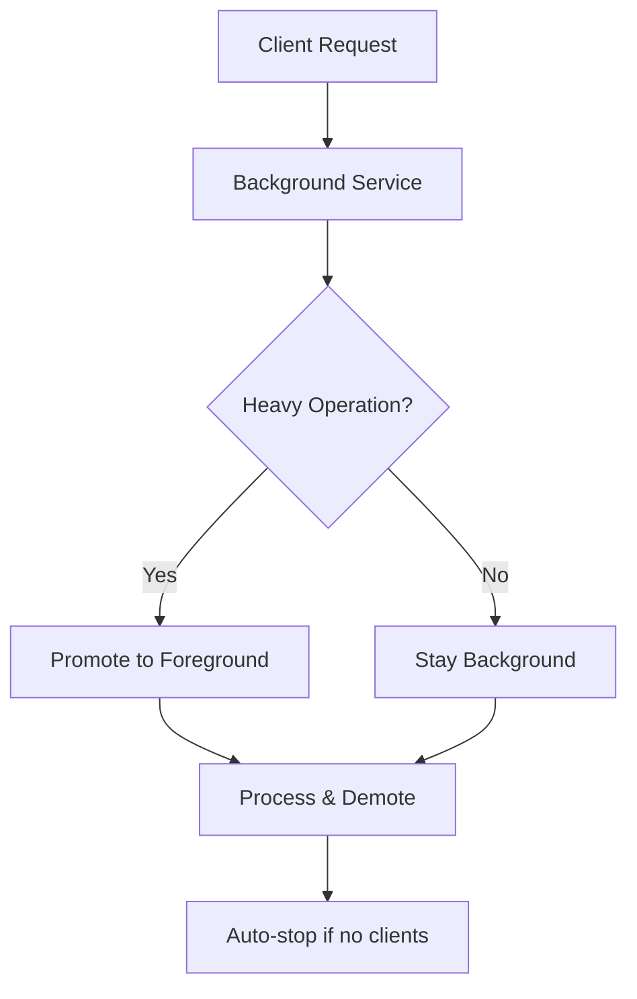
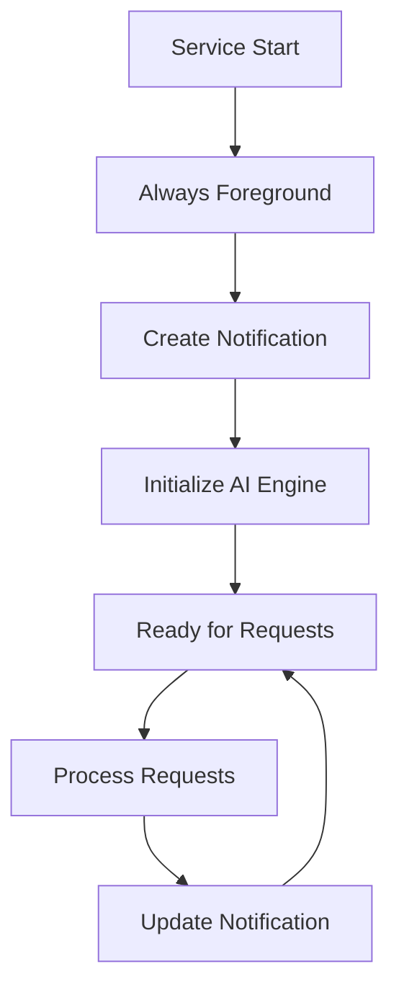

# BreezeApp Router: Foreground Service Architecture Upgrade Plan

## 📋 Overview

This document outlines the architectural upgrade plan to convert the BreezeApp Router from a hybrid background/foreground service to a **full foreground service**. This change aims to provide cleaner architecture, better reliability, and improved open source adoption.

## 🎯 Goals

- **Architectural Clarity**: Single, predictable service behavior
- **System Reliability**: Protection from aggressive system kills
- **Open Source Friendliness**: Clean, understandable reference implementation
- **User Transparency**: Always-visible AI service status
- **Developer Experience**: Simplified contribution and maintenance

## 📊 Current vs Target Architecture

### Current Architecture (Background Service)


**Issues:**
- Complex state management
- Unpredictable service lifecycle
- Risk of system kills during operations
- Difficult to document and understand

### Target Architecture (Foreground Service)


**Benefits:**
- Predictable behavior
- Always protected from kills
- Clear user communication
- Simple state management

## 🏗️ Implementation Plan

### Phase 1: Service Core Conversion

#### 1.1 Update Service Declaration
**File:** `breeze-app-router/src/main/AndroidManifest.xml`

```xml
<service
    android:name=".AIRouterService"
    android:enabled="true"
    android:exported="true"
    android:foregroundServiceType="dataProcessing"
    android:stopWithTask="false"
    android:permission="com.mtkresearch.breezeapp.permission.BIND_AI_ROUTER_SERVICE">
    <intent-filter>
        <action android:name="com.mtkresearch.breezeapp.router.AIRouterService" />
    </intent-filter>
</service>
```

#### 1.2 Add Required Permissions
```xml
<uses-permission android:name="android.permission.POST_NOTIFICATIONS" />
<uses-permission android:name="android.permission.FOREGROUND_SERVICE" />
<uses-permission android:name="android.permission.FOREGROUND_SERVICE_DATA_PROCESSING" />
```

#### 1.3 Update Service Lifecycle
**File:** `breeze-app-router/src/main/java/com/mtkresearch/breezeapp/router/AIRouterService.kt`

```kotlin
class AIRouterService : Service() {
    companion object {
        private const val NOTIFICATION_ID = 1001
        private const val CHANNEL_ID = "ai_router_service"
    }
    
    override fun onCreate() {
        super.onCreate()
        createNotificationChannel()
        startForeground(NOTIFICATION_ID, createReadyNotification())
        initializeComponents()
    }
    
    override fun onStartCommand(intent: Intent?, flags: Int, startId: Int): Int {
        return START_STICKY // Always restart if killed
    }
}
```

### Phase 2: Notification System Implementation

#### 2.1 Service State Model
**File:** `breeze-app-router/src/main/java/com/mtkresearch/breezeapp/router/domain/model/ServiceState.kt`

```kotlin
sealed class ServiceState {
    object Ready : ServiceState() {
        override fun getDisplayText() = "AI Router Ready"
        override fun getIcon() = R.drawable.ic_smart_toy
    }
    
    data class Processing(val activeRequests: Int) : ServiceState() {
        override fun getDisplayText() = "Processing $activeRequests AI request${if (activeRequests > 1) "s" else ""}"
        override fun getIcon() = R.drawable.ic_refresh
    }
    
    data class Downloading(
        val modelName: String, 
        val progress: Int,
        val totalSize: String? = null
    ) : ServiceState() {
        override fun getDisplayText() = "Downloading $modelName: $progress%"
        override fun getIcon() = R.drawable.ic_download
    }
    
    data class Error(
        val message: String,
        val isRecoverable: Boolean = true
    ) : ServiceState() {
        override fun getDisplayText() = "AI Router Error: $message"
        override fun getIcon() = R.drawable.ic_error
    }
    
    abstract fun getDisplayText(): String
    abstract fun getIcon(): Int
}
```

#### 2.2 Notification Manager
**File:** `breeze-app-router/src/main/java/com/mtkresearch/breezeapp/router/notification/ServiceNotificationManager.kt`

```kotlin
class ServiceNotificationManager(private val context: Context) {
    
    fun createNotificationChannel() {
        val channel = NotificationChannel(
            CHANNEL_ID,
            "AI Router Service",
            NotificationManager.IMPORTANCE_LOW
        ).apply {
            description = "Shows AI Router service status and progress"
            setShowBadge(false)
        }
        
        val notificationManager = context.getSystemService(NotificationManager::class.java)
        notificationManager.createNotificationChannel(channel)
    }
    
    fun createNotification(state: ServiceState): Notification {
        return NotificationCompat.Builder(context, CHANNEL_ID)
            .setContentTitle("BreezeApp AI Router")
            .setContentText(state.getDisplayText())
            .setSmallIcon(state.getIcon())
            .setOngoing(true)
            .setCategory(NotificationCompat.CATEGORY_SERVICE)
            .setProgress(
                if (state is ServiceState.Downloading) 100 else 0,
                if (state is ServiceState.Downloading) state.progress else 0,
                state is ServiceState.Processing
            )
            .build()
    }
}
```

### Phase 3: Status Management Integration

#### 3.1 Router Status Manager
**File:** `breeze-app-router/src/main/java/com/mtkresearch/breezeapp/router/status/RouterStatusManager.kt`

```kotlin
class RouterStatusManager(
    private val notificationManager: ServiceNotificationManager,
    private val service: Service
) {
    private val _currentState = MutableStateFlow<ServiceState>(ServiceState.Ready)
    val currentState: StateFlow<ServiceState> = _currentState.asStateFlow()
    
    fun updateState(newState: ServiceState) {
        _currentState.value = newState
        updateNotification(newState)
    }
    
    private fun updateNotification(state: ServiceState) {
        val notification = notificationManager.createNotification(state)
        val notificationManagerSystem = service.getSystemService(NotificationManager::class.java)
        notificationManagerSystem.notify(NOTIFICATION_ID, notification)
    }
}
```

#### 3.2 Integration Points
Update existing components to report status:

```kotlin
// In AIEngineManager
class AIEngineManager(private val statusManager: RouterStatusManager) {
    
    suspend fun process(request: InferenceRequest): InferenceResult {
        statusManager.updateState(ServiceState.Processing(getActiveRequestCount()))
        try {
            val result = performInference(request)
            statusManager.updateState(ServiceState.Ready)
            return result
        } catch (e: Exception) {
            statusManager.updateState(ServiceState.Error(e.message ?: "Unknown error"))
            throw e
        }
    }
}

// In ModelManager
class ModelManager(private val statusManager: RouterStatusManager) {
    
    suspend fun downloadModel(modelName: String) {
        downloadFlow(modelName)
            .collect { progress ->
                statusManager.updateState(
                    ServiceState.Downloading(modelName, progress.percentage)
                )
            }
    }
}
```

## 🔄 Migration Strategy

### Step 1: Preparation (Week 1)
- [ ] Create new notification system components
- [ ] Implement ServiceState model
- [ ] Create RouterStatusManager
- [ ] Add required permissions to manifest

### Step 2: Core Service Update (Week 1)
- [ ] Update AIRouterService to always start foreground
- [ ] Remove hybrid promotion/demotion logic
- [ ] Update service lifecycle methods
- [ ] Change START_NOT_STICKY to START_STICKY

### Step 3: Integration (Week 2)
- [ ] Integrate status reporting in AIEngineManager
- [ ] Add progress reporting to ModelManager
- [ ] Update error handling to use status system
- [ ] Remove old client counting logic

### Step 4: Testing & Validation (Week 2)
- [ ] Test service persistence across system pressure
- [ ] Validate notification updates
- [ ] Test client wake-up scenarios
- [ ] Performance testing

### Step 5: Documentation Update (Week 3)
- [ ] Update README.md with foreground service info
- [ ] Update API documentation
- [ ] Create user guide for notification management
- [ ] Update contribution guidelines

## 📱 User Experience Impact

### Before (Background Service)
- Invisible service operation
- Unpredictable availability
- No progress visibility
- Potential service kills

### After (Foreground Service)
- Always-visible status
- Guaranteed availability
- Real-time progress updates
- Protected from system kills

### Notification Examples
```
🤖 BreezeApp AI Router
   AI Router Ready

🔄 BreezeApp AI Router
   Processing 2 AI requests

⬇️ BreezeApp AI Router
   Downloading Llama-3.2-1B: 67%

❌ BreezeApp AI Router
   AI Router Error: Model not found
```

## 🧪 Testing Strategy

### Unit Tests
- [ ] ServiceState model tests
- [ ] RouterStatusManager state transitions
- [ ] Notification content generation

### Integration Tests
- [ ] Service foreground promotion on startup
- [ ] Status updates during operations
- [ ] Client binding to foreground service
- [ ] Service persistence under memory pressure

### User Acceptance Tests
- [ ] Notification visibility and clarity
- [ ] Progress reporting accuracy
- [ ] Error state communication
- [ ] Service availability for client apps

## 📊 Success Metrics

### Technical Metrics
- **Service Uptime**: >99% availability during active use
- **Memory Usage**: Stable memory consumption
- **Battery Impact**: Minimal battery drain increase
- **Performance**: No regression in AI operation speed

### Developer Experience Metrics
- **Code Complexity**: Reduced cyclomatic complexity
- **Documentation Clarity**: Improved contributor onboarding time
- **Bug Reports**: Reduced service-related issues
- **Community Adoption**: Increased fork/star activity

## 🚀 Future Enhancements

### Phase 4: Advanced Notifications (Future)
- Rich notification with action buttons
- Expandable notification with detailed progress
- Notification grouping for multiple operations

### Phase 5: User Controls (Future)
- Settings for notification preferences
- Service management UI
- Performance monitoring dashboard

## 📝 Breaking Changes

### For Client Apps
- **None**: AIDL interface remains unchanged
- **Benefit**: More reliable service availability

### For Contributors
- **Simplified Architecture**: Easier to understand and modify
- **Clear State Management**: Single source of truth for service status

## 🔗 Related Documents

- [Router Status Notification Design](./ROUTER_STATUS_NOTIFICATION_DESIGN.md)
- [Runner Development Guide](./RUNNER_DEVELOPMENT.md)
- [Architecture Overview](../README.md)

---

**Status**: 📋 Planning Phase  
**Owner**: Architecture Team  
**Timeline**: 3 weeks  
**Priority**: High  

**Last Updated**: December 2024  
**Next Review**: After Phase 1 completion