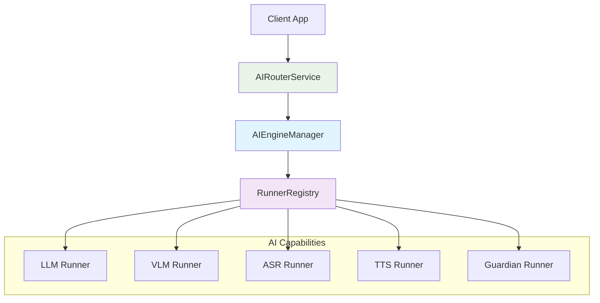

# BreezeApp AI Router Documentation

> **🚀 Welcome to the BreezeApp AI Router!**  
> A powerful, extensible AI service router for Android that provides unified access to multiple AI capabilities with graceful degradation and mock-first testing.

## 📋 Quick Navigation

| Document | Purpose | Target Audience |
|----------|---------|-----------------|
| [🚀 Getting Started](./GETTING_STARTED.md) | Quick setup and first steps | New developers |
| [🏗️ Architecture Guide](./ARCHITECTURE_GUIDE.md) | Core design and patterns | Architects & maintainers |
| [🔌 Integration Guide](./INTEGRATION_GUIDE.md) | Client integration | App developers |
| [🧩 Runner Development](./RUNNER_DEVELOPMENT.md) | Creating custom runners | AI engineers |
| [⚙️ Configuration Guide](./CONFIGURATION_GUIDE.md) | Setup and customization | DevOps & config |

## 🌟 What is AI Router?

The AI Router is a **centralized service** that bridges your Android app to multiple AI capabilities:

- **🧠 LLM**: Large Language Models for text generation
- **👁️ VLM**: Vision-Language Models for image analysis  
- **🎤 ASR**: Automatic Speech Recognition
- **🔊 TTS**: Text-to-Speech synthesis
- **🛡️ Guardian**: Content safety and moderation

### 🎯 Key Benefits

✅ **Unified API**: Single interface for all AI capabilities  
✅ **Graceful Degradation**: Automatic fallback to mock runners on unsupported devices  
✅ **Mock-First**: Built-in testing with realistic mock implementations  
✅ **Extensible**: Easy to add new AI capabilities and models  
✅ **Production Ready**: Thread-safe, error handling, streaming support  

## 🏛️ Architecture Overview



### 🔄 Request Flow

1. **Client** sends request via AIDL interface
2. **Service** validates and routes to `AIEngineManager`
3. **Manager** selects appropriate runner from `RunnerRegistry`
4. **Runner** processes request and returns results
5. **Service** converts and sends response back to client

## 🚀 Quick Start

### 1. Add Dependency
```kotlin
// In your app's build.gradle.kts
implementation(project(":BreezeApp_v2:shared-contracts"))
```

### 2. Basic Usage
```kotlin
// Bind to the service
val intent = Intent("com.mtkresearch.breezeapp.router.AIRouterService")
intent.setPackage("com.mtkresearch.breezeapp.router")
bindService(intent, serviceConnection, Context.BIND_AUTO_CREATE)

// Send a request
val request = AIRequest(
    id = "request-123",
    sessionId = "session-456", 
    text = "Hello, AI!",
    timestamp = System.currentTimeMillis(),
    options = mapOf("request_type" to "text_generation")
)
aiRouterService.sendMessage(request)
```

### 3. Handle Responses
```kotlin
private val listener = object : IAIRouterListener.Stub() {
    override fun onResponse(response: AIResponse) {
        Log.d(TAG, "AI Response: ${response.text}")
    }
    
    override fun onError(requestId: String, error: String) {
        Log.e(TAG, "AI Error: $error")
    }
}
```

## 🧩 Core Components

### AIEngineManager (Use Case)
The central business logic that:
- Selects appropriate runners based on capability
- Manages runner lifecycle and caching
- Implements fallback strategies
- Handles request cancellation

### RunnerRegistry (Factory)
The runner factory that:
- Registers available AI runners
- Creates runner instances on demand
- Manages priority-based selection
- Supports dynamic runner registration

### BaseRunner (Interface)
The contract that all AI runners must implement:
```kotlin
interface BaseRunner {
    fun load(config: ModelConfig): Boolean
    fun run(input: InferenceRequest): InferenceResult
    fun unload()
    fun getCapabilities(): List<CapabilityType>
    fun isLoaded(): Boolean
    fun getRunnerInfo(): RunnerInfo
}
```

## 🔧 Configuration

Runners are configured via `assets/runner_config.json`:

```json
{
  "runners": [
    {
      "name": "breeze_llm_mock_v1",
      "class": "com.mtkresearch.breezeapp.router.data.runner.MockLLMRunner", 
      "capabilities": ["LLM"],
      "priority": 100,
      "is_real": false
    }
  ]
}
```

## 🧪 Testing Strategy

The router uses a **mock-first approach**:

1. **Mock Runners**: Realistic implementations for testing
2. **Gradual Replacement**: Replace mocks with real implementations
3. **Graceful Degradation**: Automatic fallback on unsupported devices
4. **Comprehensive Tests**: Unit tests for all core components

## 🤝 Contributing

We welcome contributions! Please see:

- [🔌 Runner Development Guide](./RUNNER_DEVELOPMENT.md) - Adding new AI capabilities
- [🏗️ Architecture Guide](./ARCHITECTURE_GUIDE.md) - Understanding the design
- [Contributing Guidelines](../../CONTRIBUTING.md) - Development workflow

## 📞 Support

- **Issues**: [GitHub Issues](../../../issues)
- **Discussions**: [GitHub Discussions](../../../discussions)
- **Documentation**: This folder contains comprehensive guides

---

> **🎯 Next Steps**: Check out the [Getting Started Guide](./GETTING_STARTED.md) to begin development! 