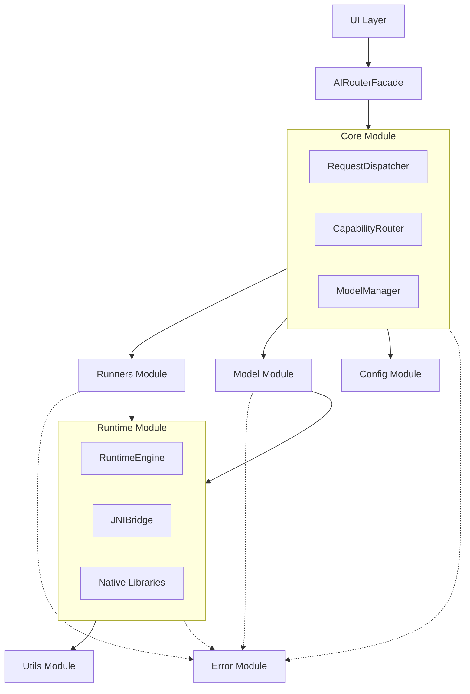

# 📱 Android 專案結構

## 🎯 目標與範圍

本文件詳細說明 AI Router 在 Android 專案中的檔案組織架構，包含模組劃分、相依關係管理、建置配置等實作層面的指導原則。為開發團隊提供清晰的程式碼組織結構和開發規範。

## 📁 完整目錄結構

```textile
ai-router/
├── core/                        # 🔧 核心邏輯模組 (主程式)
│   ├── AIRouterFacade.kt        # Router 入口 (UI 對接層)
│   ├── RequestDispatcher.kt     # 管理 request 串流 / thread / callback
│   ├── CapabilityRouter.kt      # Capability 與 Runner 的對應邏輯
│   ├── RunnerRegistry.kt        # Runner 註冊與查找表
│   ├── ModelManager.kt          # 模型管理主邏輯（調用 Loader / Downloader / Registry）
│   ├── ModelSelector.kt         # 根據裝置狀況選擇最合適的模型
│   ├── ModelScope.kt            # 管理模型是否共用、refCount 等邏輯
│   └── UsageTracker.kt          # 執行紀錄與統計數據
│
├── runners/                    # 🚀 各 AI 能力對應的 Runner 實作
│   ├── llm/
│   │   ├── LLMRunner.kt
│   │   ├── GpuLLMRunner.kt
│   │   └── CpuLLMRunner.kt
│   ├── asr/
│   │   ├── ASRRunner.kt
│   │   ├── SherpaASRRunner.kt
│   │   └── WhisperASRRunner.kt
│   ├── tts/
│   │   ├── TTSRunner.kt
│   │   ├── SherpaTTSRunner.kt
│   │   └── AndroidTTSRunner.kt
│   └── base/
│       ├── BaseRunner.kt        # 共用抽象類別或介面
│       ├── StreamingRunner.kt   # Streaming 能力介面
│       └── RunnerSpec.kt        # Runner 規格定義
│
├── model/                      # 📦 模型相關工具
│   ├── ModelDownloader.kt      # 模型下載邏輯
│   ├── ModelLoader.kt          # 模型載入與初始化
│   ├── ModelRegistry.kt        # 可用模型 metadata
│   ├── ModelValidator.kt       # 模型檔案驗證
│   └── cache/
│       ├── ModelCache.kt       # 模型快取管理
│       └── CachePolicy.kt      # 快取策略配置
│
├── runtime/                    # ⚙️ 推論引擎與 JNI 底層接軌
│   ├── RuntimeEngine.kt        # 推論引擎統一介面
│   ├── JNIBridge.kt           # JNI 橋接層
│   ├── backends/
│   │   ├── OnnxBackend.kt     # ONNX Runtime 後端
│   │   ├── PTEBackend.kt      # PyTorch Executorch 後端
│   │   └── TFLiteBackend.kt   # TensorFlow Lite 後端
│   └── native/
│       ├── libexecu.so        # Executorch native library
│       ├── libasr.so          # ASR native library
│       └── libtts.so          # TTS native library
│
├── config/                     # ⚙️ YAML 或 JSON 設定與資源
│   ├── schemas/
│   │   ├── model_config_schema.json    # 模型配置 JSON Schema
│   │   └── capability_schema.json     # 能力配置 Schema
│   ├── defaults/
│   │   ├── model_manifest.yaml        # 預設模型清單
│   │   ├── capability_map.yaml        # Capability 與 runner 對應配置
│   │   └── runtime_config.yaml        # Runtime 預設配置
│   └── validators/
│       ├── ConfigValidator.kt         # 配置檔案驗證器
│       └── SchemaValidator.kt         # Schema 驗證工具
│
├── error/                      # 🚨 錯誤處理與容錯機制
│   ├── ErrorCodes.kt          # 統一錯誤碼定義
│   ├── AIRouterError.kt       # 錯誤資料類別
│   ├── ErrorHandler.kt        # 錯誤處理邏輯
│   ├── FallbackManager.kt     # Fallback 策略管理
│   └── RecoveryStrategies.kt  # 自動恢復策略
│
├── utils/                      # 🛠️ 工具類別與輔助功能
│   ├── DeviceUtils.kt         # 設備資訊與能力檢測
│   ├── FileUtils.kt           # 檔案操作工具
│   ├── LogUtils.kt            # 日誌工具
│   ├── NetworkUtils.kt        # 網路狀態檢查
│   └── PermissionUtils.kt     # 權限檢查工具
│
├── test/                       # 🧪 單元測試與測試情境模擬
│   ├── unit/
│   │   ├── ModelManagerTest.kt
│   │   ├── DispatcherTest.kt
│   │   └── CapabilityRouterTest.kt
│   ├── integration/
│   │   ├── EndToEndTest.kt
│   │   └── PerformanceTest.kt
│   └── fixtures/
│       ├── MockModels.kt
│       └── TestData.kt
│
├── docs/                       # 📘 開發者文件與API說明
│   ├── api/
│   │   ├── AIRouterFacade.md
│   │   └── RunnerInterface.md
│   ├── guides/
│   │   ├── integration_guide.md
│   │   └── troubleshooting.md
│   └── examples/
│       ├── basic_usage.kt
│       └── advanced_usage.kt
│
├── build.gradle.kts            # 🏗️ Gradle 建置設定
├── proguard-rules.pro          # 混淆規則
├── manifest.xml                # Android 權限與組件聲明
└── README.md                   # 🔰 模組說明文件
```

## 🧩 模組相依關係

### 核心依賴層次



### Gradle 模組配置

```kotlin
// settings.gradle.kts
include(":ai-router:core")
include(":ai-router:runners")
include(":ai-router:model")
include(":ai-router:runtime")
include(":ai-router:config")
include(":ai-router:error")
include(":ai-router:utils")
```

## 🔧 Build 配置設定

### 主模組 build.gradle.kts

```kotlin
plugins {
    id("com.android.library")
    id("org.jetbrains.kotlin.android")
    id("kotlinx-serialization")
    id("kotlin-kapt")
}

android {
    namespace = "com.breezeapp.airouter"
    compileSdk = 34

    defaultConfig {
        minSdk = 26
        targetSdk = 34
        testInstrumentationRunner = "androidx.test.runner.AndroidJUnitRunner"
        consumerProguardFiles("consumer-rules.pro")
        
        // Native library configuration
        ndk {
            abiFilters += listOf("arm64-v8a", "armeabi-v7a")
        }
        
        externalNativeBuild {
            cmake {
                cppFlags += listOf("-std=c++17")
                arguments += listOf(
                    "-DANDROID_STL=c++_shared",
                    "-DBUILD_TESTING=OFF"
                )
            }
        }
    }

    buildTypes {
        release {
            isMinifyEnabled = false
            proguardFiles(
                getDefaultProguardFile("proguard-android-optimize.txt"),
                "proguard-rules.pro"
            )
        }
        debug {
            isDebuggable = true
            // Enable native debugging
            isJniDebuggable = true
        }
    }

    externalNativeBuild {
        cmake {
            path = file("src/main/cpp/CMakeLists.txt")
            version = "3.22.1"
        }
    }

    compileOptions {
        sourceCompatibility = JavaVersion.VERSION_17
        targetCompatibility = JavaVersion.VERSION_17
    }

    kotlinOptions {
        jvmTarget = "17"
    }
}

dependencies {
    // Kotlin Coroutines
    implementation("org.jetbrains.kotlinx:kotlinx-coroutines-android:1.7.3")
    
    // JSON Serialization
    implementation("org.jetbrains.kotlinx:kotlinx-serialization-json:1.6.0")
    
    // Network & HTTP
    implementation("com.squareup.okhttp3:okhttp:4.12.0")
    implementation("com.squareup.retrofit2:retrofit:2.9.0")
    
    // Logging
    implementation("com.jakewharton.timber:timber:5.0.1")
    
    // Dependency Injection (Optional)
    implementation("io.insert-koin:koin-android:3.5.0")
    
    // Testing
    testImplementation("junit:junit:4.13.2")
    testImplementation("org.mockito:mockito-core:5.7.0")
    testImplementation("org.jetbrains.kotlinx:kotlinx-coroutines-test:1.7.3")
    
    androidTestImplementation("androidx.test.ext:junit:1.1.5")
    androidTestImplementation("androidx.test.espresso:espresso-core:3.5.1")
}
```

### Native Library CMakeLists.txt

```cmake
cmake_minimum_required(VERSION 3.22.1)
project("airouter")

# Enable C++17
set(CMAKE_CXX_STANDARD 17)
set(CMAKE_CXX_STANDARD_REQUIRED ON)

# Find packages
find_package(PkgConfig REQUIRED)
find_library(log-lib log)

# Source files
set(SOURCES
    src/main/cpp/jni_bridge.cpp
    src/main/cpp/runtime_engine.cpp
    src/main/cpp/onnx_backend.cpp
    src/main/cpp/pte_backend.cpp
)

# Create shared library
add_library(airouter SHARED ${SOURCES})

# Link libraries
target_link_libraries(airouter
    ${log-lib}
    # Add other native dependencies here
)

# Include directories
target_include_directories(airouter PRIVATE
    src/main/cpp/include
    # External library headers
)
```

## 📦 資源檔案組織

### Assets 結構

```textile
src/main/assets/
├── models/
│   ├── manifests/
│   │   ├── llm_models.json
│   │   ├── asr_models.json
│   │   └── tts_models.json
│   └── configs/
│       ├── default_model_config.json
│       └── fallback_config.json
├── schemas/
│   ├── model_config.schema.json
│   └── capability_mapping.schema.json
└── configs/
    ├── runtime_settings.yaml
    └── error_mappings.json
```

### Resources 檔案

```textile
src/main/res/
├── values/
│   ├── strings.xml           # 錯誤訊息字串
│   ├── integers.xml          # 預設配置數值
│   └── arrays.xml            # 支援的模型格式清單
├── raw/
│   └── default_config.json   # 預設配置檔案
└── xml/
    ├── network_security_config.xml
    └── backup_rules.xml
```

## 🔐 權限與安全配置

### AndroidManifest.xml

```xml
<manifest xmlns:android="http://schemas.android.com/apk/res/android">
    
    <!-- Network permissions for model downloading -->
    <uses-permission android:name="android.permission.INTERNET" />
    <uses-permission android:name="android.permission.ACCESS_NETWORK_STATE" />
    
    <!-- Storage permissions for model caching -->
    <uses-permission android:name="android.permission.WRITE_EXTERNAL_STORAGE" 
                     android:maxSdkVersion="28" />
    
    <!-- Audio permissions for ASR/TTS -->
    <uses-permission android:name="android.permission.RECORD_AUDIO" />
    <uses-permission android:name="android.permission.MODIFY_AUDIO_SETTINGS" />
    
    <!-- Hardware features -->
    <uses-feature 
        android:name="android.hardware.microphone"
        android:required="false" />
    
    <application
        android:networkSecurityConfig="@xml/network_security_config"
        android:allowBackup="true"
        android:fullBackupContent="@xml/backup_rules">
        
        <!-- Background service for AI processing -->
        <service
            android:name=".core.AIRouterService"
            android:exported="false"
            android:process=":ai_router" />
            
    </application>
</manifest>
```

### Proguard 規則

```proguard
# AI Router Core Classes
-keep class com.breezeapp.airouter.core.** { *; }
-keep class com.breezeapp.airouter.runners.** { *; }

# Native method classes
-keepclasseswithmembernames class * {
    native <methods>;
}

# Model configuration classes
-keep class com.breezeapp.airouter.model.ModelConfig { *; }
-keep class com.breezeapp.airouter.config.** { *; }

# Error handling classes
-keep class com.breezeapp.airouter.error.AIRouterError { *; }

# Serialization classes
-keepattributes *Annotation*, InnerClasses
-dontnote kotlinx.serialization.SerializationKt
-keep,includedescriptorclasses class com.breezeapp.airouter.**$$serializer { *; }

# Coroutines
-keepnames class kotlinx.coroutines.internal.MainDispatcherFactory {}
-keepnames class kotlinx.coroutines.CoroutineExceptionHandler {}
```

## 🔗 模組整合指南

### 在主應用中整合 AI Router

```kotlin
// Application 類別中初始化
class BreezeApplication : Application() {
    override fun onCreate() {
        super.onCreate()
        
        // 初始化 AI Router
        AIRouter.initialize(
            context = this,
            config = AIRouterConfig.Builder()
                .setModelCacheDir(File(cacheDir, "ai_models"))
                .setMaxConcurrentRequests(3)
                .setLogLevel(LogLevel.DEBUG)
                .build()
        )
    }
}
```

### Gradle 依賴設定

```kotlin
// app/build.gradle.kts
dependencies {
    implementation(project(":ai-router:core"))
    implementation(project(":ai-router:runners"))
    implementation(project(":ai-router:model"))
    
    // Optional: specific runner implementations
    implementation(project(":ai-router:runners:llm"))
    implementation(project(":ai-router:runners:asr"))
}
```

## 🚀 開發環境設置

### 本地開發配置

1. **NDK 版本**: 建議使用 NDK 25.2.9519653
2. **CMake 版本**: 3.22.1 或更新版本
3. **Kotlin 版本**: 1.9.0 或更新版本
4. **Gradle 版本**: 8.2 或更新版本

### 建置腳本範例

```bash
#!/bin/bash
# build_ai_router.sh

echo "Building AI Router Module..."

# Clean previous builds
./gradlew clean

# Build all modules
./gradlew :ai-router:core:build
./gradlew :ai-router:runners:build
./gradlew :ai-router:model:build
./gradlew :ai-router:runtime:build

# Run tests
./gradlew :ai-router:test

# Generate documentation
./gradlew dokkaHtml

echo "Build completed successfully!"
```

## 📊 性能監控與除錯

### 日誌配置

```kotlin
// LogConfig.kt
object LogConfig {
    fun setupLogging() {
        if (BuildConfig.DEBUG) {
            Timber.plant(Timber.DebugTree())
        } else {
            Timber.plant(ProductionTree())
        }
    }
}

class ProductionTree : Timber.Tree() {
    override fun log(priority: Int, tag: String?, message: String, t: Throwable?) {
        if (priority >= Log.WARN) {
            // 上報到 Crashlytics 或其他分析服務
            FirebaseCrashlytics.getInstance().log("$tag: $message")
        }
    }
}
```

## 🔗 相關章節

- **核心組件**: [核心組件設計](./core-components.md) - 各模組的詳細設計說明
- **資料流程**: [資料流程設計](./data-flow.md) - 組件間的資料傳遞機制
- **執行緒模型**: [執行緒模型](./threading-model.md) - 並發處理架構
- **建置指南**: [建置與部署](../07-Implementation/build-deployment.md) - 完整建置流程

## 💡 最佳實務建議

### 🎯 模組化原則
- **單一職責**: 每個模組專注於特定功能領域
- **低耦合**: 最小化模組間的直接依賴
- **高內聚**: 相關功能組織在同一模組內

### 🔧 開發效率
- **統一介面**: 使用一致的 API 設計模式
- **自動化測試**: 為每個模組建立完整的測試套件
- **文件同步**: 程式碼變更同時更新相關文件

### ⚡ 性能優化
- **延遲載入**: 按需載入昂貴的資源
- **記憶體管理**: 及時釋放不需要的模型和資源
- **多執行緒**: 合理利用多核心處理能力

---

📍 **返回**: [Architecture 首頁](./README.md) | **下一篇**: [核心組件設計](./core-components.md) 