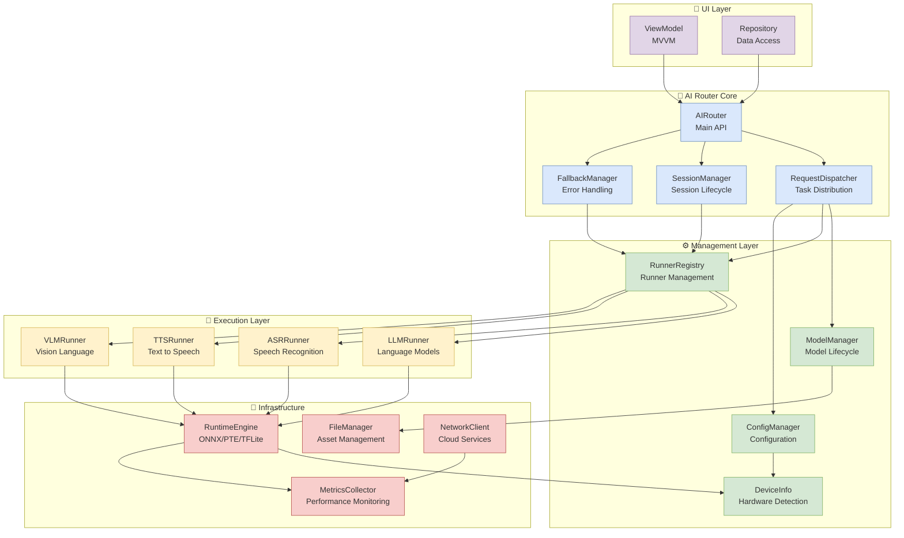
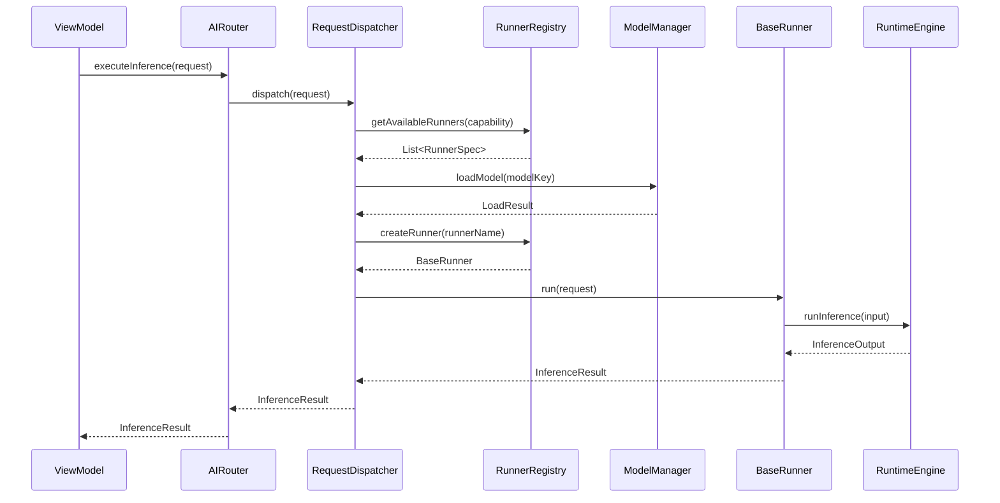
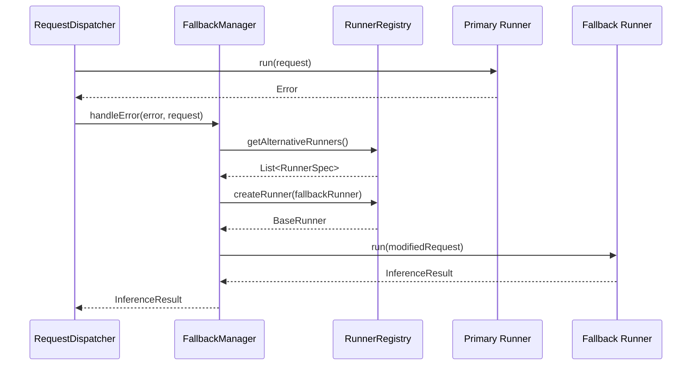

# 🕸️ AI Router 模組依賴關係

## 🎯 概覽

本文件說明 BreezeApp AI Router 模組的整體依賴關係，包含模組間的介面定義、資料流向與初始化順序。這個架構設計優先考慮模組間的低耦合性與高內聚性，讓各功能模組能夠獨立測試與部署。

### 核心設計原則

- **🔄 依賴反轉**: 高層模組不依賴低層模組，兩者都依賴抽象
- **🧩 介面隔離**: 每個模組只依賴它需要的介面
- **📦 單一職責**: 每個模組專注於單一職責範圍
- **🔌 插件化設計**: 支援 Runner 的動態註冊與切換
- **🎛️ 可配置性**: 透過設定檔控制依賴關係與優先級

## 🗺️ 整體架構圖

### 模組依賴關係



## 📋 模組詳細說明

### 🤖 核心模組 (AI Router Core)

#### AIRouter - 主要 API 介面
```kotlin
interface AIRouter {
    suspend fun createSession(config: SessionConfig): Session
    suspend fun executeInference(request: InferenceRequest): InferenceResult
    fun getAvailableCapabilities(): List<CapabilityType>
    fun getSystemStatus(): SystemStatus
}
```

**依賴關係:**
- **依賴**: `RequestDispatcher`, `SessionManager`, `FallbackManager`
- **被依賴**: UI Layer (`ViewModel`, `Repository`)

#### RequestDispatcher - 任務派發器
```kotlin
interface RequestDispatcher {
    suspend fun dispatch(request: InferenceRequest): InferenceResult
    fun selectOptimalRunner(capability: CapabilityType): RunnerSpec
    fun checkResourceAvailability(): ResourceStatus
}
```

**依賴關係:**
- **依賴**: `ModelManager`, `RunnerRegistry`, `ConfigManager`
- **被依賴**: `AIRouter`

#### SessionManager - 會話管理器
```kotlin
interface SessionManager {
    suspend fun createSession(config: SessionConfig): Session
    suspend fun destroySession(sessionId: String)
    fun getActiveSession(sessionId: String): Session?
    fun getAllActiveSessions(): List<Session>
}
```

**依賴關係:**
- **依賴**: `RunnerRegistry`
- **被依賴**: `AIRouter`

### ⚙️ 管理層 (Management Layer)

#### ModelManager - 模型生命週期管理
```kotlin
interface ModelManager {
    suspend fun loadModel(modelKey: String, config: ModelConfig): LoadResult
    suspend fun unloadModel(modelKey: String)
    fun getLoadedModels(): List<ModelInfo>
    fun getModelConfig(modelKey: String): ModelConfig?
}
```

**依賴關係:**
- **依賴**: `FileManager`
- **被依賴**: `RequestDispatcher`

#### RunnerRegistry - Runner 註冊與管理
```kotlin
interface RunnerRegistry {
    fun registerRunner(runnerSpec: RunnerSpec, factory: RunnerFactory)
    fun getAvailableRunners(capability: CapabilityType): List<RunnerSpec>
    fun createRunner(runnerName: String): BaseRunner
    fun isRunnerSupported(runnerName: String): Boolean
}
```

**依賴關係:**
- **依賴**: All Runner implementations
- **被依賴**: `RequestDispatcher`, `SessionManager`, `FallbackManager`

#### ConfigManager - 配置管理
```kotlin
interface ConfigManager {
    fun getConfig(key: String): ConfigValue?
    fun setConfig(key: String, value: ConfigValue)
    fun getRunnerConfig(runnerName: String): RunnerConfig?
    fun getDeviceOptimizedConfig(): DeviceConfig
}
```

**依賴關係:**
- **依賴**: `DeviceInfo`
- **被依賴**: `RequestDispatcher`

### 🏃 執行層 (Execution Layer)

所有 Runner 實作都繼承自 `BaseRunner` 介面：

```kotlin
abstract class BaseRunner {
    abstract suspend fun load(config: ModelConfig): Boolean
    abstract suspend fun run(request: InferenceRequest): InferenceResult
    abstract suspend fun unload()
    abstract fun isThreadSafe(): Boolean
    abstract fun getSupportedCapabilities(): List<CapabilityType>
}
```

**依賴關係:**
- **依賴**: `RuntimeEngine`
- **被依賴**: `RunnerRegistry`

### 🔧 基礎設施層 (Infrastructure)

#### RuntimeEngine - 推論引擎
```kotlin
interface RuntimeEngine {
    suspend fun initialize(config: EngineConfig): Boolean
    suspend fun loadModel(modelPath: String, options: LoadOptions): ModelHandle
    suspend fun runInference(handle: ModelHandle, input: InferenceInput): InferenceOutput
    suspend fun unloadModel(handle: ModelHandle)
}
```

**依賴關係:**
- **依賴**: `DeviceInfo`, `MetricsCollector`
- **被依賴**: All Runner implementations

## 🔄 初始化順序

### 啟動時的依賴初始化

```kotlin
class AIRouterInitializer {
    suspend fun initialize(context: Context): AIRouter {
        // 1. 基礎設施層初始化
        val deviceInfo = DeviceInfo(context)
        val metricsCollector = MetricsCollector()
        val fileManager = FileManager(context)
        val networkClient = NetworkClient()
        
        // 2. 推論引擎初始化
        val runtimeEngine = RuntimeEngine().apply {
            initialize(EngineConfig.fromDevice(deviceInfo))
        }
        
        // 3. 管理層初始化
        val configManager = ConfigManager(deviceInfo)
        val modelManager = ModelManager(fileManager)
        val runnerRegistry = RunnerRegistry()
        
        // 4. 註冊 Runners
        registerRunners(runnerRegistry, runtimeEngine)
        
        // 5. 核心層初始化
        val dispatcher = RequestDispatcher(
            modelManager, runnerRegistry, configManager
        )
        val sessionManager = SessionManager(runnerRegistry)
        val fallbackManager = FallbackManager(
            deviceInfo, networkClient
        )
        
        // 6. 主 API 初始化
        return AIRouterImpl(
            dispatcher, sessionManager, fallbackManager
        )
    }
    
    private fun registerRunners(
        registry: RunnerRegistry,
        engine: RuntimeEngine
    ) {
        // LLM Runners
        registry.registerRunner(
            LLMRunnerSpec("GpuOnnxLLMRunner"),
            { GpuOnnxLLMRunner(engine) }
        )
        registry.registerRunner(
            LLMRunnerSpec("CpuExecutorchLLMRunner"),
            { CpuExecutorchLLMRunner(engine) }
        )
        
        // ASR Runners
        registry.registerRunner(
            ASRRunnerSpec("SherpaASRRunner"),
            { SherpaASRRunner(engine) }
        )
        
        // TTS Runners
        registry.registerRunner(
            TTSRunnerSpec("SherpaTTSRunner"),
            { SherpaTTSRunner(engine) }
        )
        
        // VLM Runners
        registry.registerRunner(
            VLMRunnerSpec("QwenVLRunner"),
            { QwenVLRunner(engine) }
        )
    }
}
```

## 📊 資料流向分析

### 典型推論請求的資料流



### 錯誤與 Fallback 流



## 🔧 配置管理

### 依賴注入配置

```kotlin
@Module
class AIRouterModule {
    
    @Provides
    @Singleton
    fun provideDeviceInfo(@ApplicationContext context: Context): DeviceInfo {
        return DeviceInfo(context)
    }
    
    @Provides
    @Singleton
    fun provideRuntimeEngine(deviceInfo: DeviceInfo): RuntimeEngine {
        return RuntimeEngineImpl(deviceInfo)
    }
    
    @Provides
    @Singleton
    fun provideRunnerRegistry(engine: RuntimeEngine): RunnerRegistry {
        return RunnerRegistryImpl().apply {
            registerDefaultRunners(engine)
        }
    }
    
    @Provides
    @Singleton
    fun provideAIRouter(
        dispatcher: RequestDispatcher,
        sessionManager: SessionManager,
        fallbackManager: FallbackManager
    ): AIRouter {
        return AIRouterImpl(dispatcher, sessionManager, fallbackManager)
    }
}
```

### 設定檔管理

```json
{
  "ai_router_config": {
    "default_runners": {
      "LLM": "GpuOnnxLLMRunner",
      "ASR": "SherpaASRRunner",
      "TTS": "SherpaTTSRunner",
      "VLM": "QwenVLRunner"
    },
    "fallback_chains": {
      "LLM": ["GpuOnnxLLMRunner", "CpuExecutorchLLMRunner", "ApiLLMRunner"],
      "ASR": ["SherpaASRRunner", "AndroidSpeechRunner", "RemoteWhisperRunner"]
    },
    "performance_limits": {
      "max_concurrent_requests": 4,
      "max_model_memory_mb": 2048,
      "request_timeout_ms": 30000
    },
    "device_optimization": {
      "enable_gpu_acceleration": true,
      "enable_npu_acceleration": true,
      "prefer_quantized_models": true
    }
  }
}
```

## 🧪 依賴測試策略

### 模組隔離測試

```kotlin
@Test
class RunnerRegistryTest {
    private lateinit var registry: RunnerRegistry
    private val mockEngine = mockk<RuntimeEngine>()
    
    @Before
    fun setup() {
        registry = RunnerRegistryImpl()
    }
    
    @Test
    fun `should register and create runner successfully`() {
        // Given
        val runnerSpec = LLMRunnerSpec("TestRunner")
        val runnerFactory: RunnerFactory = { TestLLMRunner(mockEngine) }
        
        // When
        registry.registerRunner(runnerSpec, runnerFactory)
        val runner = registry.createRunner("TestRunner")
        
        // Then
        assertThat(runner).isInstanceOf(TestLLMRunner::class.java)
    }
    
    @Test
    fun `should return available runners for capability`() {
        // Given
        registry.registerRunner(
            LLMRunnerSpec("Runner1"),
            { TestLLMRunner(mockEngine) }
        )
        registry.registerRunner(
            ASRRunnerSpec("Runner2"),
            { TestASRRunner(mockEngine) }
        )
        
        // When
        val llmRunners = registry.getAvailableRunners(CapabilityType.LLM)
        
        // Then
        assertThat(llmRunners).hasSize(1)
        assertThat(llmRunners[0].name).isEqualTo("Runner1")
    }
}
```

### 整合測試

```kotlin
@Test
class AIRouterIntegrationTest {
    private lateinit var aiRouter: AIRouter
    
    @Before
    fun setup() {
        aiRouter = AIRouterInitializer().initialize(
            InstrumentationRegistry.getInstrumentation().targetContext
        )
    }
    
    @Test
    fun `should complete inference request successfully`() = runBlocking {
        // Given
        val request = InferenceRequest(
            sessionId = "test-session",
            capability = CapabilityType.LLM,
            input = TextInput("Hello, world!"),
            config = InferenceConfig.default()
        )
        
        // When
        val result = aiRouter.executeInference(request)
        
        // Then
        assertThat(result).isInstanceOf(TextResult::class.java)
        assertThat((result as TextResult).text).isNotEmpty()
    }
}
```

## 🎯 效能考量

### 記憶體管理

| 模組 | 預估記憶體使用 | 最佳化策略 |
|------|---------------|------------|
| **RuntimeEngine** | 500MB - 2GB | 模型共享、懶載入 |
| **ModelManager** | 50MB - 200MB | LRU 快取、定期清理 |
| **RunnerRegistry** | 10MB - 50MB | 物件池、弱引用 |
| **SessionManager** | 5MB - 20MB | 會話過期機制 |

### 初始化時間

```kotlin
class PerformanceProfiler {
    fun profileInitialization(): InitializationMetrics {
        val startTime = System.nanoTime()
        
        val metrics = mutableMapOf<String, Long>()
        
        // 測量各模組初始化時間
        metrics["DeviceInfo"] = measureTime {
            DeviceInfo(context)
        }
        
        metrics["RuntimeEngine"] = measureTime {
            RuntimeEngine().initialize(config)
        }
        
        metrics["RunnerRegistry"] = measureTime {
            RunnerRegistry().apply { registerDefaultRunners() }
        }
        
        val totalTime = System.nanoTime() - startTime
        return InitializationMetrics(metrics, totalTime)
    }
}
```

## 🔗 相關文件

- **系統架構**: [專案概覽](../00-Overview/project-overview.md) - 整體系統設計
- **介面設計**: [Runner 統一介面](../02-Interfaces/runner-interface.md) - Runner 介面規範
- **模型管理**: [模型範圍策略](../03-Models/model-scope.md) - 模型生命週期
- **執行時期**: [Dispatcher 工作流程](../04-Runtime/dispatcher-workflow.md) - 任務派發實作
- **錯誤處理**: [Fallback 策略](../05-Error-Handling/fallback-strategies.md) - 錯誤處理流程

## 💡 最佳實務建議

### ✅ 推薦做法

- **介面優先**: 定義清晰的介面契約，降低模組耦合
- **依賴注入**: 使用 DI 框架管理依賴關係
- **懶載入**: 只在需要時初始化重量級組件
- **資源池**: 複用昂貴的資源（如模型、連線）
- **監控追蹤**: 記錄模組間的互動與效能指標

### 🚫 避免的問題

- **循環依賴**: 透過介面抽象避免模組間的循環依賴
- **緊耦合**: 避免直接依賴具體實作類別
- **記憶體洩漏**: 確保適當釋放資源與移除監聽器
- **阻塞初始化**: 避免在主執行緒進行耗時的初始化
- **硬編碼依賴**: 透過配置檔管理依賴關係

---

📍 **返回**: [Architecture 首頁](./README.md) | **下一篇**: [Android 專案結構](./android-structure.md) 