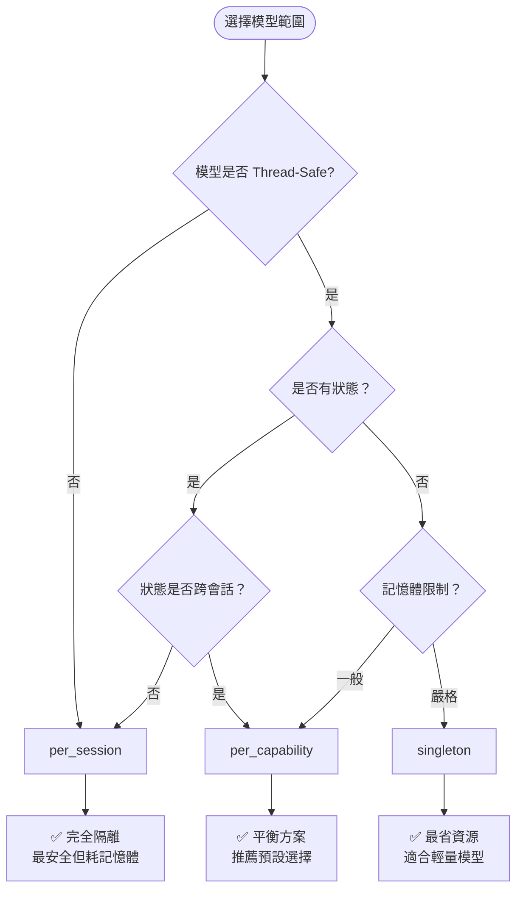

# 🔄 模型範圍與共享策略

## 🎯 設計目標

本文件說明 AI Router 中「模型是否共用」的設計策略，協助實作者在多任務、多能力、多 Session 並存的情境下，明確選擇模型的管理方式。目標是在效能、記憶體使用和執行緒安全之間找到最佳平衡。

### 核心目標

- **🔗 多能力共享**: 支援多個 capability 同時使用模型（如 LLM + VLM 共用 encoder）
- **🔄 彈性切換**: 支援同一能力下多模型動態切換（如 ASR 可用 Sherpa 本地或雲端）
- **💾 資源優化**: 減少記憶體與載入開銷，避免重複建構相同模型
- **🧵 執行緒安全**: 支援 Session thread 安全與引用計數機制
- **⚡ 效能平衡**: 在共享效益與隔離安全性之間取得平衡

## 📊 模型共用範圍類型

### Scope 層級定義

| Scope 類型 | 生命週期 | 記憶體佔用 | 執行緒安全要求 | 適用場景 |
|------------|----------|------------|----------------|----------|
| `singleton` | 應用程式全域 | 最低 | 高 | 輕量模型、共用元件 |
| `per_capability` | 能力級別 | 中等 | 中等 | 一般推論模型 |
| `per_session` | 會話級別 | 最高 | 低 | 狀態敏感模型 |

### 詳細說明

#### 🌐 Singleton 範圍
```kotlin
// 全域唯一實例，由 ModelManager 維護，所有 Runner 共用
// 適用：Tokenizer、Embedding 模型、小型工具模型
```

**特點**:
- ✅ 記憶體使用最少
- ✅ 載入時間最短（僅載入一次）
- ⚠️ 需要完全的執行緒安全
- ⚠️ 狀態變更影響所有使用者

**使用場景**:
- Tokenizer 共享
- 詞嵌入模型
- 小型分類器

#### 🎯 Per-Capability 範圍（預設）
```kotlin
// 每個 Capability 拿到獨立實例，例如 LLM/ASR/TTS 各自保有一份
// 適用：大部分推論模型
```

**特點**:
- ✅ 在共享和隔離間平衡
- ✅ 能力間不互相干擾
- ✅ 記憶體使用合理
- ⚠️ 仍需考慮 session 間安全性

**使用場景**:
- 標準 LLM 模型
- ASR/TTS 主要模型
- VLM 推論模型

#### 🔒 Per-Session 範圍
```kotlin
// 每個推論 Session 創建一份，例如即時對話時保有隔離
// 適用：狀態敏感或非執行緒安全模型
```

**特點**:
- ✅ 完全隔離，最安全
- ✅ 支援狀態保持
- ❌ 記憶體使用最多
- ❌ 載入開銷最大

**使用場景**:
- 串流語音處理
- 有狀態的對話模型
- 非執行緒安全的原生程式庫

## 🔧 配置與實作

### 設定方式

#### 在模型設定檔中指定

```json
{
  "name": "breeze-llm-3b",
  "format": "onnx",
  "runner": "GpuOnnxLLMRunner",
  "scope": "per_capability",
  "files": {
    "weights": "model.onnx",
    "tokenizer": "tokenizer.bin"
  }
}
```

#### 程式碼中動態設定

```kotlin
val config = ModelConfig(
    name = "sherpa-asr",
    format = "onnx", 
    runner = "SherpaASRRunner",
    scope = "per_session", // 因為 Sherpa 不是 thread-safe
    files = mapOf("model" to "sherpa.onnx")
)
```

### ModelManager 實作範例

```kotlin
class ModelManager {
    private val singletonModels = mutableMapOf<String, Any>()
    private val capabilityModels = mutableMapOf<String, MutableMap<CapabilityType, Any>>()
    private val sessionModels = mutableMapOf<String, MutableMap<String, Any>>()
    
    fun loadModel(config: ModelConfig, sessionId: String? = null): Any {
        return when (config.scope) {
            "singleton" -> loadSingletonModel(config)
            "per_capability" -> loadCapabilityModel(config)
            "per_session" -> loadSessionModel(config, sessionId!!)
            else -> throw IllegalArgumentException("Unknown scope: ${config.scope}")
        }
    }
    
    private fun loadSingletonModel(config: ModelConfig): Any {
        return singletonModels.getOrPut(config.name) {
            ModelLoader.load(config).also {
                Timber.d("Loaded singleton model: ${config.name}")
            }
        }
    }
    
    private fun loadCapabilityModel(config: ModelConfig): Any {
        val capabilityMap = capabilityModels.getOrPut(config.name) { mutableMapOf() }
        val capability = getCapabilityFromConfig(config)
        
        return capabilityMap.getOrPut(capability) {
            ModelLoader.load(config).also {
                Timber.d("Loaded capability model: ${config.name} for $capability")
            }
        }
    }
    
    private fun loadSessionModel(config: ModelConfig, sessionId: String): Any {
        val sessionMap = sessionModels.getOrPut(sessionId) { mutableMapOf() }
        
        return sessionMap.getOrPut(config.name) {
            ModelLoader.load(config).also {
                Timber.d("Loaded session model: ${config.name} for session $sessionId")
            }
        }
    }
}
```

## 🧵 執行緒安全性考量

### 安全性等級對照

| Runner 類型 | Thread-Safe | 建議 Scope | 說明 |
|-------------|-------------|------------|------|
| `GpuOnnxLLMRunner` | ✅ | `per_capability` | GPU 推論通常有內建同步 |
| `SherpaASRRunner` | ❌ | `per_session` | 串流處理狀態敏感 |
| `AndroidTTSRunner` | ✅ | `singleton` | 系統 API 自帶保護 |
| `ApiLLMRunner` | ✅ | `per_capability` | HTTP 請求天然並發安全 |

### 執行緒安全實作範例

```kotlin
class ThreadSafeModelWrapper(
    private val model: Any,
    private val isThreadSafe: Boolean
) {
    private val mutex = Mutex()
    
    suspend fun <T> execute(operation: suspend (Any) -> T): T {
        return if (isThreadSafe) {
            operation(model)
        } else {
            mutex.withLock {
                operation(model)
            }
        }
    }
}

class ModelScopeManager {
    fun wrapModel(model: Any, metadata: RunnerMetadata): ThreadSafeModelWrapper {
        return ThreadSafeModelWrapper(model, metadata.isThreadSafe)
    }
}
```

## 📈 引用計數與生命週期管理

### 引用計數實作

```kotlin
class ReferenceCountedModel(
    val model: Any,
    val config: ModelConfig
) {
    private val referenceCount = AtomicInteger(0)
    private val createdAt = System.currentTimeMillis()
    private var lastUsedAt = AtomicLong(createdAt)
    
    fun acquire(): Boolean {
        lastUsedAt.set(System.currentTimeMillis())
        return referenceCount.incrementAndGet() > 0
    }
    
    fun release(): Int {
        val count = referenceCount.decrementAndGet()
        if (count == 0) {
            scheduleCleanup()
        }
        return count
    }
    
    fun isExpired(timeoutMs: Long): Boolean {
        return referenceCount.get() == 0 && 
               (System.currentTimeMillis() - lastUsedAt.get()) > timeoutMs
    }
    
    private fun scheduleCleanup() {
        // 延遲清理，避免頻繁載入卸載
        Timer().schedule(object : TimerTask() {
            override fun run() {
                if (referenceCount.get() == 0) {
                    ModelLoader.unload(model)
                    Timber.d("Cleaned up model: ${config.name}")
                }
            }
        }, CLEANUP_DELAY_MS)
    }
    
    companion object {
        private const val CLEANUP_DELAY_MS = 30_000L // 30 秒延遲
    }
}
```

### 自動清理機制

```kotlin
class ModelLifecycleManager {
    private val models = mutableMapOf<String, ReferenceCountedModel>()
    private val cleanupTimer = Timer("ModelCleanup", true)
    
    init {
        // 每分鐘檢查一次過期模型
        cleanupTimer.scheduleAtFixedRate(object : TimerTask() {
            override fun run() {
                cleanupExpiredModels()
            }
        }, 60_000L, 60_000L)
    }
    
    private fun cleanupExpiredModels() {
        val expired = models.filter { (_, model) ->
            model.isExpired(EXPIRY_TIMEOUT_MS)
        }
        
        expired.forEach { (key, model) ->
            models.remove(key)
            ModelLoader.unload(model.model)
            Timber.d("Auto-cleaned expired model: $key")
        }
    }
    
    companion object {
        private const val EXPIRY_TIMEOUT_MS = 5 * 60 * 1000L // 5 分鐘
    }
}
```

## 🎨 實際應用範例

### 範例 1: 多模態對話應用

```kotlin
// LLM 和 TTS 共用 tokenizer，但各自保有推論模型
val tokenizerConfig = ModelConfig(
    name = "common-tokenizer",
    scope = "singleton",  // 所有能力共用
    // ...
)

val llmConfig = ModelConfig(
    name = "conversation-llm",
    scope = "per_capability",  // LLM 專用
    // ...
)

val ttsConfig = ModelConfig(
    name = "voice-synthesis",
    scope = "per_capability",  // TTS 專用
    // ...
)
```

### 範例 2: 即時語音處理

```kotlin
// ASR 需要維持串流狀態，每個會話獨立
val asrConfig = ModelConfig(
    name = "realtime-asr",
    scope = "per_session",  // 每個語音會話獨立
    // ...
)

// 會話管理
class VoiceSessionManager {
    fun startVoiceSession(sessionId: String): ASRSession {
        val model = modelManager.loadModel(asrConfig, sessionId)
        return ASRSession(sessionId, model)
    }
    
    fun endVoiceSession(sessionId: String) {
        modelManager.releaseModel(asrConfig.name, sessionId)
    }
}
```

### 範例 3: 批次處理場景

```kotlin
// 批次處理時可以使用 singleton 提高效率
val batchConfig = ModelConfig(
    name = "batch-processor",
    scope = "singleton",
    // ...
)

class BatchProcessor {
    suspend fun processBatch(items: List<ProcessingItem>): List<Result> {
        val model = modelManager.loadModel(batchConfig)
        
        return items.mapAsync { item ->
            // 由於是 singleton，所有並發任務共用同一模型
            model.process(item)
        }
    }
}
```

## 📊 效能影響分析

### 記憶體使用比較

| 場景 | Singleton | Per-Capability | Per-Session |
|------|-----------|----------------|-------------|
| **1 能力, 1 會話** | 1x | 1x | 1x |
| **3 能力, 1 會話** | 1x | 3x | 3x |
| **1 能力, 5 會話** | 1x | 1x | 5x |
| **3 能力, 5 會話** | 1x | 3x | 15x |

### 載入時間比較

```kotlin
// 效能測試範例
class ScopePerformanceTest {
    @Test
    fun compareLoadingTimes() {
        val configs = listOf("singleton", "per_capability", "per_session")
        
        configs.forEach { scope ->
            val startTime = System.currentTimeMillis()
            repeat(10) {
                val config = testConfig.copy(scope = scope)
                modelManager.loadModel(config, "session_$it")
            }
            val endTime = System.currentTimeMillis()
            
            Timber.d("$scope loading time: ${endTime - startTime}ms")
        }
    }
}
```

## 🎯 選擇策略指南

### 決策樹



### 最佳實務建議

#### 🏆 推薦配置

| 模型類型 | 建議 Scope | 理由 |
|----------|------------|------|
| **Tokenizer** | `singleton` | 無狀態、輕量、高頻使用 |
| **LLM 推論模型** | `per_capability` | 平衡效能與隔離性 |
| **ASR 串流模型** | `per_session` | 狀態敏感、執行緒不安全 |
| **TTS 合成模型** | `per_capability` | 通常無狀態、可並發 |
| **VLM 模型** | `per_capability` | 模型較大、需適度隔離 |
| **分類器** | `singleton` | 輕量、無狀態、高復用 |

#### 🚫 避免的反模式

- **過度使用 per_session**: 導致記憶體爆炸
- **強制使用 singleton**: 忽略執行緒安全性
- **混合 scope 策略**: 同一模型在不同地方使用不同 scope
- **忽略清理機制**: 導致記憶體洩漏

## 🔗 與其他模組的整合

### RunnerRegistry 整合

```kotlin
// Runner 註冊時聲明其 thread safety
class SherpaASRRunner : BaseRunner {
    companion object {
        val METADATA = RunnerMetadata(
            // ...
            isThreadSafe = false,
            recommendedScope = "per_session"
        )
    }
}
```

### Dispatcher 整合

```kotlin
class RequestDispatcher {
    fun selectScope(config: ModelConfig, runnerMetadata: RunnerMetadata): String {
        return when {
            config.scope != null -> config.scope  // 明確指定
            !runnerMetadata.isThreadSafe -> "per_session"  // 強制隔離
            runnerMetadata.isStateful -> "per_capability"  // 適度隔離
            runnerMetadata.isLightweight -> "singleton"  // 共享輕量模型
            else -> "per_capability"  // 預設值
        }
    }
}
```

## 🔗 相關章節

- **模型配置**: [模型配置規範](./model-config-specification.md) - scope 設定語法
- **Runner 規格**: [Runner 詳細規格](../02-Interfaces/runner-specifications.md) - thread safety 定義
- **錯誤處理**: [錯誤碼定義](../05-Error-Handling/error-codes.md) - 資源相關錯誤
- **效能調優**: [效能最佳化指南](../04-Runtime/performance-optimization.md) - 記憶體優化策略

## 💡 進階議題

### 動態 Scope 調整

```kotlin
class AdaptiveScopeManager {
    fun adjustScope(modelName: String, metrics: PerformanceMetrics) {
        when {
            metrics.memoryPressure > 0.8 -> {
                // 記憶體壓力大，改用更嚴格的範圍
                downgradeScope(modelName)
            }
            metrics.concurrentUsers < 2 -> {
                // 併發使用者少，可以考慮共享
                upgradeScope(modelName)
            }
        }
    }
}
```

### 跨程序模型共享

```kotlin
// 進階：支援跨程序的模型共享（如 Service 架構）
class CrossProcessModelManager {
    fun shareModelAcrossProcesses(modelName: String): SharedModelHandle {
        // 透過 Binder 或 shared memory 實作
        return SharedModelHandle(modelName)
    }
}
```

---

📍 **返回**: [Models 首頁](./README.md) | **相關**: [模型配置規範](./model-config-specification.md) 