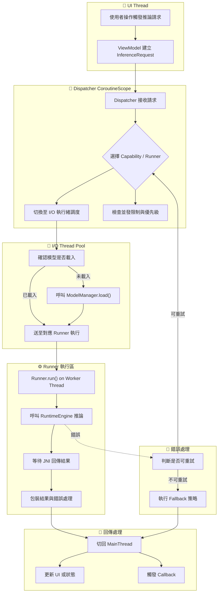

# 🧵 Dispatcher 任務派發與執行緒管理

## 🎯 設計目標

本文件說明 BreezeApp AI Router 中推論任務的多執行緒與 Coroutine 管理策略，確保高效能、響應式的 AI 推論執行，同時避免阻塞主執行緒和資源競爭問題。

### 核心原則

- **🚫 避免 UI 阻塞**: 所有推論操作移至背景執行緒
- **⚡ 異步優先**: 使用 Kotlin Coroutines 進行異步處理
- **🔄 資源共享**: 智慧管理模型載入與 session 隔離
- **🧵 執行緒安全**: 確保 Runner 的並發安全性
- **📊 效能監控**: 提供執行時間與資源使用追蹤

## 🗺️ 整體執行流程

### 主要執行階段



## 🔧 Kotlin Coroutine 實作

### 核心 Dispatcher 架構

```kotlin
class RequestDispatcher(
    private val modelManager: ModelManager,
    private val runnerRegistry: RunnerRegistry,
    private val fallbackPolicy: FallbackPolicy
) {
    // 使用專用的 CoroutineScope 進行任務管理
    private val dispatcherScope = CoroutineScope(
        SupervisorJob() + Dispatchers.Default + CoroutineName("AIRouterDispatcher")
    )
    
    // 並發限制管理
    private val concurrentLimiter = Semaphore(MAX_CONCURRENT_REQUESTS)
    private val modelLoadingSemaphore = Semaphore(MAX_CONCURRENT_MODEL_LOADING)
    
    fun dispatchRequest(
        request: InferenceRequest,
        onResult: (InferenceResult) -> Unit,
        onError: (Throwable) -> Unit
    ): Job {
        return dispatcherScope.launch {
            try {
                concurrentLimiter.withPermit {
                    val result = executeRequest(request)
                    withContext(Dispatchers.Main) {
                        onResult(result)
                    }
                }
            } catch (e: Exception) {
                Timber.e(e, "Failed to execute request: ${request.sessionId}")
                withContext(Dispatchers.Main) {
                    onError(e)
                }
            }
        }
    }
    
    private suspend fun executeRequest(request: InferenceRequest): InferenceResult {
        return withContext(Dispatchers.IO) {
            val runner = selectOptimalRunner(request)
            
            // 確保模型已載入
            modelLoadingSemaphore.withPermit {
                ensureModelLoaded(runner, request)
            }
            
            // 執行推論
            executeWithRunner(runner, request)
        }
    }
    
    companion object {
        private const val MAX_CONCURRENT_REQUESTS = 4
        private const val MAX_CONCURRENT_MODEL_LOADING = 2
    }
}
```

### 智慧 Runner 選擇

```kotlin
private suspend fun selectOptimalRunner(request: InferenceRequest): RunnerSpec {
    val candidates = runnerRegistry.getAvailableRunners(request.capability)
        .filter { it.isCompatible(deviceInfo) }
        .filter { it.canHandleRequest(request) }
    
    // 根據目前負載選擇最佳 Runner
    return candidates
        .sortedWith(compareBy<RunnerSpec> { 
            getCurrentLoad(it.name) 
        }.thenByDescending { 
            it.priority 
        })
        .firstOrNull() 
        ?: throw NoSuitableRunnerException(request.capability)
}

private fun getCurrentLoad(runnerName: String): Float {
    return runnerLoadTracker.getCurrentLoad(runnerName)
}
```

### 模型載入管理

```kotlin
private suspend fun ensureModelLoaded(
    runnerSpec: RunnerSpec, 
    request: InferenceRequest
): BaseRunner {
    val cacheKey = "${runnerSpec.name}:${request.modelKey}"
    
    return runnerCache.get(cacheKey) ?: run {
        Timber.d("Loading model for runner: ${runnerSpec.name}")
        
        val config = modelManager.getModelConfig(request.modelKey)
        val runner = runnerRegistry.createRunner(runnerSpec.name)
        
        // 模型載入可能耗時，使用 I/O dispatcher
        withContext(Dispatchers.IO) {
            val loadSuccess = runner.load(config)
            if (!loadSuccess) {
                throw ModelLoadException("Failed to load model: ${request.modelKey}")
            }
        }
        
        runnerCache.put(cacheKey, runner)
        runner
    }
}
```

## 🧩 執行緒安全策略

### Runner 執行緒安全處理

```kotlin
class ThreadSafeRunnerExecutor {
    private val runnerLocks = mutableMapOf<String, Mutex>()
    
    suspend fun executeWithRunner(
        runner: BaseRunner,
        request: InferenceRequest
    ): InferenceResult {
        return if (runner.isThreadSafe()) {
            // Thread-safe runner 可以直接執行
            runner.run(request)
        } else {
            // 非 thread-safe runner 需要同步執行
            val lock = runnerLocks.getOrPut(runner.name) { Mutex() }
            lock.withLock {
                runner.run(request)
            }
        }
    }
}
```

### 執行緒池配置

```kotlin
object DispatcherConfiguration {
    // 針對不同類型的操作使用不同的執行緒池
    val ModelLoadingDispatcher = Dispatchers.IO.limitedParallelism(2)
    val InferenceDispatcher = Dispatchers.Default.limitedParallelism(4)
    val FileIODispatcher = Dispatchers.IO.limitedParallelism(3)
    
    // 自定義執行緒池用於 CPU 密集的推論任務
    val CPUIntensiveDispatcher = Executors.newFixedThreadPool(
        max(1, Runtime.getRuntime().availableProcessors() - 1)
    ).asCoroutineDispatcher()
}
```

## 📊 並發控制與資源管理

### 並發限制策略

```kotlin
class ConcurrencyManager {
    // 全域並發限制
    private val globalSemaphore = Semaphore(8)
    
    // 各能力專用的並發限制
    private val capabilitySemaphores = mapOf(
        CapabilityType.LLM to Semaphore(3),
        CapabilityType.ASR to Semaphore(2),
        CapabilityType.TTS to Semaphore(2),
        CapabilityType.VLM to Semaphore(1)  // VLM 比較耗資源
    )
    
    suspend fun <T> executeWithLimit(
        capability: CapabilityType,
        operation: suspend () -> T
    ): T {
        return globalSemaphore.withPermit {
            capabilitySemaphores[capability]?.withPermit {
                operation()
            } ?: operation()
        }
    }
}
```

### 記憶體壓力監控

```kotlin
class MemoryPressureMonitor {
    private val memoryThreshold = 0.8f // 80% 記憶體使用率警戒線
    
    fun shouldRejectNewRequests(): Boolean {
        val memoryInfo = ActivityManager.getMemoryInfo()
        val usageRatio = 1.0f - (memoryInfo.availMem.toFloat() / memoryInfo.totalMem)
        
        return usageRatio > memoryThreshold
    }
    
    fun requestMemoryCleanup() {
        // 觸發模型清理
        modelManager.cleanupUnusedModels()
        
        // 強制垃圾回收
        System.gc()
    }
}
```

## ⚡ 效能最佳化策略

### 智慧預載入

```kotlin
class SmartPreloader {
    private val usagePatterns = mutableMapOf<String, UsagePattern>()
    
    fun trackUsage(capability: CapabilityType, modelKey: String) {
        val key = "$capability:$modelKey"
        usagePatterns[key] = usagePatterns[key]?.let {
            it.copy(
                usageCount = it.usageCount + 1,
                lastUsed = System.currentTimeMillis()
            )
        } ?: UsagePattern(1, System.currentTimeMillis())
        
        // 觸發預測性載入
        schedulePreloadIfNeeded(key)
    }
    
    private fun schedulePreloadIfNeeded(key: String) {
        val pattern = usagePatterns[key] ?: return
        
        if (pattern.usageCount > 3 && pattern.timeSinceLastUse() < TimeUnit.HOURS.toMillis(1)) {
            // 高頻使用的模型進行預載入
            preloadModelAsync(key)
        }
    }
}

data class UsagePattern(
    val usageCount: Int,
    val lastUsed: Long
) {
    fun timeSinceLastUse(): Long = System.currentTimeMillis() - lastUsed
}
```

### 批次處理最佳化

```kotlin
class BatchProcessor {
    private val batchQueue = Channel<InferenceRequest>(capacity = Channel.UNLIMITED)
    private val batchSize = 8
    private val batchTimeout = 50L // ms
    
    init {
        // 啟動批次處理協程
        dispatcherScope.launch {
            processBatches()
        }
    }
    
    private suspend fun processBatches() {
        while (true) {
            val batch = collectBatch()
            if (batch.isNotEmpty()) {
                processBatchConcurrently(batch)
            }
        }
    }
    
    private suspend fun collectBatch(): List<InferenceRequest> {
        val batch = mutableListOf<InferenceRequest>()
        
        // 等待第一個請求
        batch.add(batchQueue.receive())
        
        // 收集更多請求直到達到批次大小或超時
        withTimeoutOrNull(batchTimeout) {
            repeat(batchSize - 1) {
                batch.add(batchQueue.receive())
            }
        }
        
        return batch
    }
}
```

## 🔄 Streaming 與即時處理

### 串流處理支援

```kotlin
class StreamingDispatcher {
    fun dispatchStreamingRequest(
        request: StreamingInferenceRequest,
        onChunk: (InferenceChunk) -> Unit,
        onComplete: () -> Unit,
        onError: (Throwable) -> Unit
    ): Job {
        return dispatcherScope.launch {
            try {
                val runner = selectStreamingRunner(request)
                
                runner.runStream(
                    request,
                    onResult = { chunk ->
                        // 確保在主執行緒回調
                        dispatcherScope.launch(Dispatchers.Main) {
                            onChunk(chunk)
                        }
                    },
                    onComplete = {
                        dispatcherScope.launch(Dispatchers.Main) {
                            onComplete()
                        }
                    },
                    onError = { error ->
                        dispatcherScope.launch(Dispatchers.Main) {
                            onError(error)
                        }
                    }
                )
            } catch (e: Exception) {
                onError(e)
            }
        }
    }
}
```

### 即時語音處理範例

```kotlin
class RealtimeASRDispatcher {
    private val audioBuffer = Channel<AudioChunk>(capacity = 32)
    
    fun startRealtimeProcessing(
        sessionId: String,
        onTranscript: (String) -> Unit
    ): Job {
        return dispatcherScope.launch {
            val asrRunner = getASRRunner()
            
            // 啟動音頻處理循環
            for (audioChunk in audioBuffer) {
                launch {
                    try {
                        val result = asrRunner.processAudioChunk(audioChunk)
                        if (result.isNotEmpty()) {
                            withContext(Dispatchers.Main) {
                                onTranscript(result)
                            }
                        }
                    } catch (e: Exception) {
                        Timber.e(e, "ASR processing failed")
                    }
                }
            }
        }
    }
    
    fun feedAudio(audioData: ByteArray) {
        audioBuffer.trySend(AudioChunk(audioData, System.currentTimeMillis()))
    }
}
```

## 🚨 錯誤處理與降級策略

### Fallback 執行機制

```kotlin
class FallbackDispatcher {
    suspend fun executeWithFallback(
        request: InferenceRequest,
        maxRetries: Int = 3
    ): InferenceResult {
        val fallbackChain = fallbackPolicy.getFallbackChain(request.capability)
        
        for ((index, runnerSpec) in fallbackChain.withIndex()) {
            try {
                return executeWithRunner(runnerSpec, request)
            } catch (e: Exception) {
                Timber.w(e, "Runner ${runnerSpec.name} failed, attempt ${index + 1}")
                
                // 最後一個選項也失敗，重新拋出錯誤
                if (index == fallbackChain.size - 1) {
                    throw FallbackExhaustedException("All fallback options failed", e)
                }
                
                // 短暫延遲再嘗試下一個選項
                delay(100L * (index + 1))
            }
        }
        
        throw IllegalStateException("Empty fallback chain")
    }
}
```

### 超時與取消處理

```kotlin
class TimeoutManager {
    private val activeTasks = mutableMapOf<String, Job>()
    
    fun executeWithTimeout(
        request: InferenceRequest,
        timeoutMs: Long = 30_000L
    ): InferenceResult {
        return withTimeout(timeoutMs) {
            val taskId = UUID.randomUUID().toString()
            val job = currentCoroutineContext()[Job]
            
            activeTasks[taskId] = job!!
            
            try {
                executeRequest(request)
            } finally {
                activeTasks.remove(taskId)
            }
        }
    }
    
    fun cancelAllActiveTasks() {
        activeTasks.values.forEach { it.cancel() }
        activeTasks.clear()
    }
}
```

## 📈 監控與效能指標

### 執行時間追蹤

```kotlin
class PerformanceTracker {
    private val metrics = mutableMapOf<String, MutableList<ExecutionMetrics>>()
    
    suspend fun <T> trackExecution(
        operation: String,
        block: suspend () -> T
    ): T {
        val startTime = System.nanoTime()
        val startMemory = getUsedMemory()
        
        return try {
            block()
        } finally {
            val endTime = System.nanoTime()
            val endMemory = getUsedMemory()
            
            val executionTime = (endTime - startTime) / 1_000_000L // ms
            val memoryDelta = endMemory - startMemory
            
            recordMetrics(operation, ExecutionMetrics(
                executionTimeMs = executionTime,
                memoryDeltaMB = memoryDelta,
                timestamp = System.currentTimeMillis()
            ))
        }
    }
    
    fun getAverageExecutionTime(operation: String): Double {
        return metrics[operation]?.map { it.executionTimeMs }?.average() ?: 0.0
    }
}

data class ExecutionMetrics(
    val executionTimeMs: Long,
    val memoryDeltaMB: Long,
    val timestamp: Long
)
```

## 🎛️ 調校與設定建議

### 執行緒池大小調校

| 裝置類型 | CPU Cores | 建議配置 |
|----------|-----------|----------|
| **低階裝置** | 4 cores | IO: 2, Default: 2, Inference: 1 |
| **中階裝置** | 6-8 cores | IO: 3, Default: 4, Inference: 2 |
| **高階裝置** | 8+ cores | IO: 4, Default: 6, Inference: 3 |

### 並發限制設定

```kotlin
object DispatcherTuning {
    fun getOptimalConfiguration(deviceInfo: DeviceInfo): DispatcherConfig {
        return when {
            deviceInfo.totalMemoryMB < 4096 -> DispatcherConfig(
                maxConcurrentRequests = 2,
                maxConcurrentModelLoading = 1,
                batchSize = 4
            )
            deviceInfo.totalMemoryMB < 8192 -> DispatcherConfig(
                maxConcurrentRequests = 4,
                maxConcurrentModelLoading = 2,
                batchSize = 8
            )
            else -> DispatcherConfig(
                maxConcurrentRequests = 6,
                maxConcurrentModelLoading = 3,
                batchSize = 12
            )
        }
    }
}
```

## 🔗 相關章節

- **Runner 介面**: [Runner 統一介面](../02-Interfaces/runner-interface.md) - Runner 執行規範
- **錯誤處理**: [錯誤碼定義](../05-Error-Handling/error-codes.md) - Fallback 相關錯誤
- **模型管理**: [模型範圍策略](../03-Models/model-scope.md) - 執行緒安全考量
- **效能最佳化**: [效能調優指南](./performance-optimization.md) - 系統效能優化

## 💡 最佳實務總結

### ✅ 推薦做法

- **異步優先**: 所有長時間操作使用 Coroutines
- **適度並發**: 根據裝置能力設定合理的並發限制
- **智慧預載**: 基於使用模式進行預測性模型載入
- **錯誤處理**: 實作完整的 Fallback 與重試機制
- **監控追蹤**: 記錄執行時間與資源使用情況

### 🚫 避免的陷阱

- **主執行緒阻塞**: 絕不在 UI 執行緒進行推論操作
- **過度並發**: 避免超出裝置能力的並發數量
- **資源洩漏**: 確保正確釋放模型與執行緒資源
- **忽略超時**: 所有推論操作都應設定合理超時
- **忽略記憶體壓力**: 在記憶體不足時應主動降級或拒絕請求

---

📍 **返回**: [Runtime 首頁](./README.md) | **下一篇**: [效能最佳化指南](./performance-optimization.md) 