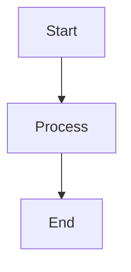

# 📊 圖表資源 (Diagrams)

## 📋 目標與範圍

本章節集中管理 AI Router 專案的所有視覺化圖表資源，包含 Mermaid 原始碼、匯出的圖片檔案以及圖表維護指南。提供統一的視覺化資產管理。

## 📁 資料夾結構

```
08-Diagrams/
├── README.md                    # 本文件
├── mermaid/                     # Mermaid 原始碼
│   ├── architecture.mmd         # 系統架構圖
│   ├── data-flow.mmd           # 資料流程圖
│   ├── error-flow.mmd          # 錯誤處理流程
│   ├── module-dependencies.mmd  # 模組依賴關係
│   ├── sequence-inference.mmd   # 推論序列圖
│   └── threading-model.mmd     # 執行緒模型圖
└── exports/                     # 匯出圖片 (PNG/SVG)
    ├── architecture.png
    ├── data-flow.png
    ├── error-flow.png
    └── ...
```

## 📊 圖表清單

### 🏗️ 架構圖表

| 圖表名稱 | Mermaid 原始碼 | 匯出檔案 | 說明 |
|---------|---------------|---------|------|
| **系統架構圖** | [architecture.mmd](./mermaid/architecture.mmd) | [architecture.png](./exports/architecture.png) | 完整的系統組件與分層 |
| **模組依賴關係** | [module-dependencies.mmd](./mermaid/module-dependencies.mmd) | [dependencies.png](./exports/dependencies.png) | 靜態依賴關係視覺化 |
| **資料流程圖** | [data-flow.mmd](./mermaid/data-flow.mmd) | [data-flow.png](./exports/data-flow.png) | 請求處理與資料傳遞 |

### 🔄 流程圖表

| 圖表名稱 | Mermaid 原始碼 | 匯出檔案 | 說明 |
|---------|---------------|---------|------|
| **推論序列圖** | [sequence-inference.mmd](./mermaid/sequence-inference.mmd) | [sequence.png](./exports/sequence.png) | 典型推論請求的完整流程 |
| **錯誤處理流程** | [error-flow.mmd](./mermaid/error-flow.mmd) | [error-flow.png](./exports/error-flow.png) | 錯誤處理與 Fallback 機制 |
| **執行緒模型** | [threading-model.mmd](./mermaid/threading-model.mmd) | [threading.png](./exports/threading.png) | 並發處理與協程管理 |

## 🛠️ 圖表維護指南

### 📝 編輯 Mermaid 圖表

1. **線上編輯器**: [Mermaid Live Editor](https://mermaid.live/)
2. **本地工具**: Mermaid CLI, VS Code 擴展
3. **預覽工具**: GitHub 原生支援 Mermaid 渲染

### 🎨 樣式指南

```mermaid
%%{init: {
  'theme': 'base',
  'themeVariables': {
    'primaryColor': '#4F46E5',
    'primaryTextColor': '#FFFFFF',
    'secondaryColor': '#E5E7EB',
    'tertiaryColor': '#F3F4F6'
  }
}}%%
```

### 📤 匯出規範

- **格式**: PNG (預設), SVG (向量圖)
- **解析度**: 300 DPI (用於文件)
- **尺寸**: 最大寬度 1200px
- **命名**: 與 .mmd 檔案名稱對應

## 🔧 使用方式

### 📖 在文件中引用

```markdown
<!-- 引用匯出的圖片 -->


<!-- 直接嵌入 Mermaid 程式碼 -->


### 🔄 更新流程

1. 修改 `mermaid/*.mmd` 原始碼
2. 使用工具匯出新的圖片到 `exports/`
3. 更新引用該圖表的文件
4. 提交 Git 變更 (包含原始碼和匯出檔案)

## 🎯 最佳實務

### ✅ 建議做法

- **保持一致性**: 使用統一的配色與字體
- **適度複雜性**: 避免單一圖表過於複雜
- **清楚標註**: 重要組件加上明確的標籤
- **版本控制**: 同時管理 .mmd 和 .png 檔案

### ❌ 避免事項

- 不要在圖表中使用過小的字體
- 避免過多的交叉連線造成混亂
- 不要使用過於鮮豔或對比不足的顏色
- 避免圖表內容與文件說明不一致

## 🔗 相關資源

### 📚 學習資源

- [Mermaid 官方文件](https://mermaid-js.github.io/mermaid/)
- [圖表設計最佳實務](https://www.mermaidchart.com/blog/)
- [系統架構圖繪製指南](https://c4model.com/)

### 🛠️ 工具推薦

- **Mermaid CLI**: 批次處理與自動化
- **VS Code Mermaid 擴展**: 即時預覽
- **GitHub Integration**: 自動渲染支援
- **Figma Mermaid Plugin**: 設計工具整合

---

📍 **返回**: [主文件](../README.md) | **相關章節**: [架構總覽](../00-Overview/) | [架構設計](../01-Architecture/) 