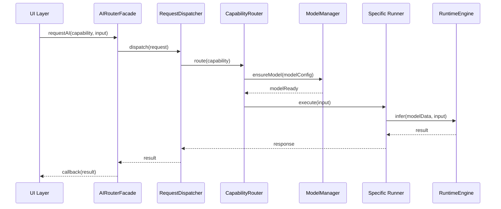

# 📖 AI Router - 專案總覽

## 🎯 目標與範圍

AI Router 是 BreezeApp 的核心模組，運行於背景 Service 並負責橋接 UI 模組與多樣化 AI 能力（LLM、VLM、ASR、TTS、Guardian 等）。

### 🌟 核心目標

1. **強健封裝 (Robust Abstraction)**
   - 提供統一且穩定的 AI 服務介面
   - 隔離底層推論引擎的複雜性
   - 確保上層應用的開發簡潔性

2. **可插拔的 Runner & Model 支援**
   - 支援動態註冊不同的 AI 能力 Runner
   - 靈活的模型配置與載入機制
   - 熱插拔式的推論引擎替換

3. **智能模型與配置管理**
   - 自動化模型下載與版本管理
   - 智能模型選擇與資源優化
   - 統一的配置格式與驗證機制

4. **可擴展 Clean Architecture**
   - 遵循 SOLID 原則的分層設計
   - 清晰的責任劃分與模組邊界
   - 易於測試與維護的程式架構

5. **擴充性與監控能力**
   - 內建使用統計與效能監控
   - 完整的錯誤處理與降級機制
   - 支援未來新 AI 能力的快速整合

## 🏗️ 系統架構概覽

### 分層設計原則

```
┌─────────────────────────────────────┐
│           UI 層 / ViewModel          │
├─────────────────────────────────────┤
│          AI Router Facade           │  ← 統一入口點
├─────────────────────────────────────┤
│    Dispatcher + CapabilityRouter    │  ← 任務調度與路由
├─────────────────────────────────────┤
│     ModelManager + RunnerRegistry   │  ← 資源與能力管理
├─────────────────────────────────────┤
│         具體 Runner 實作群組          │  ← LLM/ASR/TTS Runner
├─────────────────────────────────────┤
│        RuntimeEngine + JNI         │  ← 推論引擎抽象層
├─────────────────────────────────────┤
│          Native Libraries          │  ← 底層推論庫
└─────────────────────────────────────┘
```

### 核心組件職責

| 組件 | 主要職責 | 關鍵特性 |
|------|----------|----------|
| **AIRouterFacade** | 統一對外介面，請求分派 | 協程管理、錯誤隔離 |
| **RequestDispatcher** | 任務排程與執行管理 | 非同步執行、資源控制 |
| **CapabilityRouter** | 能力路由與 Runner 選擇 | 動態路由、負載均衡 |
| **ModelManager** | 模型生命週期管理 | 下載、載入、快取、釋放 |
| **RunnerRegistry** | Runner 註冊與查找 | 動態註冊、規格管理 |
| **BaseRunner** | 推論執行統一介面 | 標準化 API、錯誤處理 |
| **RuntimeEngine** | 推論引擎抽象層 | JNI 封裝、平台適配 |

## 🔄 核心工作流程

### 典型請求流程



## 🧩 技術選型與理由

### 語言與框架
- **Kotlin**: 主要開發語言，提供協程與類型安全
- **JNI/C++**: 底層推論引擎整合
- **Coroutines**: 非同步任務管理與並發控制

### 架構模式
- **Clean Architecture**: 清晰分層與依賴反轉
- **Repository Pattern**: 模型與配置資料管理
- **Strategy Pattern**: Runner 動態選擇機制
- **Observer Pattern**: 狀態變更通知機制

### 推論引擎支援
- **ONNX Runtime**: 跨平台模型執行
- **PyTorch Mobile**: 移動端優化推論
- **MediaPipe**: Google AI 框架整合
- **Custom Engines**: 廠商特定加速方案

## 📊 關鍵效能指標

### 功能指標
- **支援 AI 能力數量**: LLM, VLM, ASR, TTS, Guardian (可擴展)
- **並發請求處理**: 支援多個同時進行的推論任務
- **模型格式支援**: ONNX, PTE, TFLite, API 等多種格式

### 效能指標
- **首次載入時間**: < 3 秒 (小型模型)
- **推論響應時間**: < 500ms (常見任務)
- **記憶體使用效率**: 智能模型共用與釋放機制
- **錯誤恢復時間**: < 1 秒 (Fallback 機制)

### 穩定性指標
- **可用性目標**: 99.5% (包含 Fallback)
- **崩潰率**: < 0.1% (每千次請求)
- **記憶體洩漏**: 零容忍政策

## 🚀 發展藍圖

### Phase 1: 核心架構 ✅
- 基礎架構與介面定義
- LLM/ASR/TTS 基礎支援
- 錯誤處理與監控機制

### Phase 2: 進階功能 🔄
- VLM (視覺語言模型) 整合
- Guardian (內容安全) 機制
- 進階模型管理功能

### Phase 3: 生態擴展 📋
- 第三方 Runner 插件機制
- Cloud Hybrid 推論支援
- 更豐富的監控與分析工具

## 💡 設計哲學

### 簡單性優先
- **對使用者簡單**: 統一的 API 介面，隱藏複雜性
- **對開發者清晰**: 明確的職責劃分，易於理解和擴展
- **對維護友善**: 良好的文件與測試覆蓋

### 彈性與穩定並重
- **穩定的核心**: 核心介面保持向後相容
- **靈活的擴展**: 支援新技術與新需求的快速整合
- **漸進式演進**: 允許系統在不中斷服務的情況下升級

### 性能與資源平衡
- **智能資源管理**: 避免不必要的記憶體和計算浪費
- **適應性優化**: 根據設備能力動態調整策略
- **用戶體驗優先**: 在性能與用戶體驗間找到最佳平衡點

## 🔗 相關章節

- **下一步閱讀**: [架構圖表](./architecture-diagram.md) - 視覺化系統設計
- **深入了解**: [模組依賴](./module-dependencies.md) - 組件關係詳解
- **實作指南**: [架構設計](../01-Architecture/) - 詳細技術設計

---

📍 **返回**: [Overview 首頁](./README.md) | **主文件**: [README.md](../README.md) 