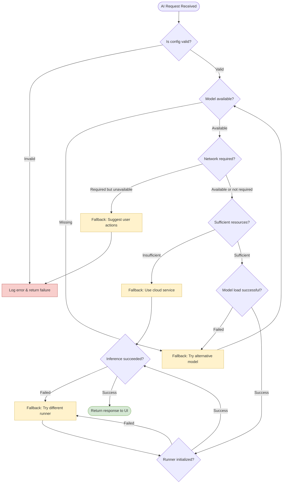

# 🛠 錯誤處理與 Fallback 策略

## 🎯 設計目標

本文件說明 AI Router 中針對推論過程可能發生的錯誤處理與 fallback 策略，包含詳細流程圖與 Android 端實作建議。目標是提高系統韌性，在資源不足、網路不穩、模型遺失等情況下給予合理的備援方案。

### 核心原則

- **🔄 優雅降級**: 在保持功能性的前提下逐步降低服務品質
- **🚫 避免崩潰**: 減少 crash 機率，改善用戶體驗與 debug 成本
- **📊 明確層級**: 提供清晰的 fallback 順序與重試次數規範
- **📱 用戶友善**: 提供有意義的錯誤訊息與建議行動
- **📈 可觀測性**: 記錄錯誤發生模式以便系統優化

## 🗺️ 錯誤處理流程圖

### 主要處理流程



## 🎚️ Fallback 層級與策略

### 層級化降級策略

```kotlin
enum class FallbackLevel(val priority: Int, val description: String) {
    NONE(0, "不需要降級，正常執行"),
    MODEL_VARIANT(1, "切換到同能力的其他模型"),
    RUNNER_ALTERNATIVE(2, "切換到不同的 Runner 實作"),
    CAPABILITY_DELEGATION(3, "委託給雲端服務"),
    GRACEFUL_DEGRADATION(4, "功能性降級"),
    USER_INTERVENTION(5, "需要用戶介入處理")
}
```

### 各能力的 Fallback 鏈

#### LLM Fallback 策略

```kotlin
val llmFallbackChain = listOf(
    FallbackStrategy(
        level = FallbackLevel.MODEL_VARIANT,
        condition = { error -> error.code in listOf("E202", "E204") },
        action = { request -> 
            request.copy(modelKey = "llm-3b-cpu") // 切換到 CPU 版本
        }
    ),
    FallbackStrategy(
        level = FallbackLevel.RUNNER_ALTERNATIVE,
        condition = { error -> error.code == "E101" },
        action = { request ->
            request.copy(runnerHint = "CpuLlamaRunner") // 切換 Runner
        }
    ),
    FallbackStrategy(
        level = FallbackLevel.CAPABILITY_DELEGATION,
        condition = { error -> error.retryable == false },
        action = { request ->
            request.copy(runnerHint = "ApiLLMRunner") // 使用雲端 API
        }
    )
)
```

#### ASR Fallback 策略

```kotlin
val asrFallbackChain = listOf(
    FallbackStrategy(
        level = FallbackLevel.MODEL_VARIANT,
        condition = { error -> error.code == "E202" },
        action = { request ->
            request.copy(modelKey = "whisper-small") // 使用較小的模型
        }
    ),
    FallbackStrategy(
        level = FallbackLevel.RUNNER_ALTERNATIVE,
        condition = { error -> error.code == "E101" },
        action = { request ->
            request.copy(runnerHint = "AndroidSpeechRunner") // 使用系統 ASR
        }
    ),
    FallbackStrategy(
        level = FallbackLevel.CAPABILITY_DELEGATION,
        condition = { _ -> networkAvailable() },
        action = { request ->
            request.copy(runnerHint = "RemoteWhisperRunner") // 雲端識別
        }
    )
)
```

## 🔧 Android 實作架構

### 核心 Fallback 管理器

```kotlin
class FallbackManager(
    private val errorAnalyzer: ErrorAnalyzer,
    private val deviceInfo: DeviceInfo,
    private val networkMonitor: NetworkMonitor
) {
    private val fallbackStrategies = mapOf(
        CapabilityType.LLM to llmFallbackChain,
        CapabilityType.ASR to asrFallbackChain,
        CapabilityType.TTS to ttsFallbackChain,
        CapabilityType.VLM to vlmFallbackChain
    )
    
    suspend fun executeWithFallback(
        request: InferenceRequest,
        maxAttempts: Int = 3
    ): InferenceResult {
        var currentRequest = request
        var lastError: AIRouterError? = null
        
        for (attempt in 1..maxAttempts) {
            try {
                return executeInference(currentRequest)
            } catch (error: AIRouterError) {
                lastError = error
                Timber.w("Inference failed, attempt $attempt: ${error.code}")
                
                // 分析錯誤並選擇 fallback 策略
                val fallbackStrategy = selectFallbackStrategy(
                    request.capability, 
                    error, 
                    attempt
                )
                
                if (fallbackStrategy != null) {
                    currentRequest = fallbackStrategy.action(currentRequest)
                    
                    // 記錄 fallback 事件
                    logFallbackEvent(request, error, fallbackStrategy)
                    
                    // 適當延遲避免快速重試
                    delay(calculateBackoffDelay(attempt))
                } else {
                    // 無可用的 fallback 策略
                    break
                }
            }
        }
        
        // 所有嘗試都失敗
        throw FallbackExhaustedException(
            "All fallback attempts failed", 
            lastError
        )
    }
    
    private fun calculateBackoffDelay(attempt: Int): Long {
        return minOf(1000L * (1L shl (attempt - 1)), 5000L) // 指數退避，最多 5 秒
    }
}
```

### 錯誤分析器

```kotlin
class ErrorAnalyzer {
    fun analyzeError(error: Throwable): AIRouterError {
        return when (error) {
            is OutOfMemoryError -> AIRouterError(
                code = "E104",
                message = "記憶體不足",
                retryable = false,
                severity = Severity.CRITICAL,
                cause = error
            )
            is TimeoutException -> AIRouterError(
                code = "E102",
                message = "推論執行逾時",
                retryable = true,
                severity = Severity.ERROR,
                cause = error
            )
            is FileNotFoundException -> AIRouterError(
                code = "E201",
                message = "模型檔案未找到",
                retryable = false,
                severity = Severity.ERROR,
                cause = error
            )
            is SocketTimeoutException -> AIRouterError(
                code = "E301",
                message = "網路連線逾時",
                retryable = true,
                severity = Severity.WARNING,
                cause = error
            )
            else -> AIRouterError(
                code = "E999",
                message = "未知錯誤: ${error.message}",
                retryable = false,
                severity = Severity.CRITICAL,
                cause = error
            )
        }
    }
    
    fun shouldRetry(error: AIRouterError, attempt: Int): Boolean {
        return error.retryable && attempt < 3 && when (error.code) {
            "E102", "E301", "E502" -> true // 超時、網路、並發衝突可重試
            "E201", "E104", "E999" -> false // 檔案不存在、OOM、未知錯誤不重試
            else -> error.retryable
        }
    }
}
```

## 📱 設備狀態檢查

### 系統資源監控

```kotlin
class DeviceResourceChecker(private val context: Context) {
    
    fun checkMemoryAvailability(): ResourceStatus {
        val activityManager = context.getSystemService(Context.ACTIVITY_SERVICE) as ActivityManager
        val memoryInfo = ActivityManager.MemoryInfo()
        activityManager.getMemoryInfo(memoryInfo)
        
        val availableMemoryMB = memoryInfo.availMem / (1024 * 1024)
        val totalMemoryMB = memoryInfo.totalMem / (1024 * 1024)
        val usageRatio = 1.0f - (availableMemoryMB.toFloat() / totalMemoryMB)
        
        return when {
            usageRatio > 0.9f -> ResourceStatus.CRITICAL
            usageRatio > 0.8f -> ResourceStatus.LIMITED
            usageRatio > 0.7f -> ResourceStatus.WARNING
            else -> ResourceStatus.SUFFICIENT
        }
    }
    
    fun checkBatteryLevel(): BatteryStatus {
        val batteryManager = context.getSystemService(Context.BATTERY_SERVICE) as BatteryManager
        val batteryLevel = batteryManager.getIntProperty(BatteryManager.BATTERY_PROPERTY_CAPACITY)
        
        return when {
            batteryLevel < 15 -> BatteryStatus.CRITICAL
            batteryLevel < 30 -> BatteryStatus.LOW
            batteryLevel < 50 -> BatteryStatus.MEDIUM
            else -> BatteryStatus.SUFFICIENT
        }
    }
    
    fun checkNetworkStatus(): NetworkStatus {
        val connectivityManager = context.getSystemService(Context.CONNECTIVITY_SERVICE) as ConnectivityManager
        val activeNetwork = connectivityManager.activeNetworkInfo
        
        return when {
            activeNetwork?.isConnected != true -> NetworkStatus.UNAVAILABLE
            activeNetwork.type == ConnectivityManager.TYPE_WIFI -> NetworkStatus.WIFI
            activeNetwork.type == ConnectivityManager.TYPE_MOBILE -> NetworkStatus.MOBILE
            else -> NetworkStatus.OTHER
        }
    }
}

enum class ResourceStatus { SUFFICIENT, WARNING, LIMITED, CRITICAL }
enum class BatteryStatus { SUFFICIENT, MEDIUM, LOW, CRITICAL }
enum class NetworkStatus { UNAVAILABLE, MOBILE, WIFI, OTHER }
```

## 🎯 智慧 Fallback 選擇

### 條件式 Fallback 策略

```kotlin
class IntelligentFallbackSelector(
    private val deviceChecker: DeviceResourceChecker,
    private val userPreferences: UserPreferences,
    private val usageAnalytics: UsageAnalytics
) {
    
    fun selectOptimalFallback(
        capability: CapabilityType,
        error: AIRouterError,
        context: InferenceContext
    ): FallbackStrategy? {
        
        val candidates = fallbackStrategies[capability] ?: return null
        
        return candidates
            .filter { it.condition(error) }
            .filter { isStrategyViable(it, context) }
            .minByOrNull { calculateStrategyCost(it, context) }
    }
    
    private fun isStrategyViable(
        strategy: FallbackStrategy,
        context: InferenceContext
    ): Boolean {
        return when (strategy.level) {
            FallbackLevel.CAPABILITY_DELEGATION -> {
                // 雲端委託需要網路連線
                deviceChecker.checkNetworkStatus() != NetworkStatus.UNAVAILABLE &&
                userPreferences.allowCloudFallback
            }
            FallbackLevel.MODEL_VARIANT -> {
                // 模型變體需要足夠記憶體
                deviceChecker.checkMemoryAvailability() != ResourceStatus.CRITICAL
            }
            FallbackLevel.RUNNER_ALTERNATIVE -> {
                // 總是可以嘗試不同的 Runner
                true
            }
            else -> true
        }
    }
    
    private fun calculateStrategyCost(
        strategy: FallbackStrategy,
        context: InferenceContext
    ): Float {
        var cost = strategy.level.priority.toFloat()
        
        // 根據設備狀態調整成本
        when (deviceChecker.checkBatteryLevel()) {
            BatteryStatus.CRITICAL, BatteryStatus.LOW -> {
                // 低電量時偏好省電的策略
                if (strategy.level == FallbackLevel.CAPABILITY_DELEGATION) {
                    cost -= 2.0f // 雲端處理更省電
                }
            }
            else -> Unit
        }
        
        when (deviceChecker.checkNetworkStatus()) {
            NetworkStatus.MOBILE -> {
                // 行動網路時增加雲端成本
                if (strategy.level == FallbackLevel.CAPABILITY_DELEGATION) {
                    cost += 1.0f
                }
            }
            NetworkStatus.UNAVAILABLE -> {
                // 無網路時雲端策略不可用
                if (strategy.level == FallbackLevel.CAPABILITY_DELEGATION) {
                    cost = Float.MAX_VALUE
                }
            }
            else -> Unit
        }
        
        return cost
    }
}
```

## 📊 錯誤統計與學習

### 錯誤模式分析

```kotlin
class ErrorPatternAnalyzer {
    private val errorHistory = mutableListOf<ErrorEvent>()
    private val maxHistorySize = 1000
    
    fun recordError(
        error: AIRouterError,
        context: InferenceContext,
        fallbackUsed: FallbackStrategy?
    ) {
        val event = ErrorEvent(
            timestamp = System.currentTimeMillis(),
            errorCode = error.code,
            capability = context.capability,
            modelKey = context.modelKey,
            deviceState = captureDeviceState(),
            fallbackStrategy = fallbackUsed?.level,
            resolved = fallbackUsed != null
        )
        
        synchronized(errorHistory) {
            errorHistory.add(event)
            if (errorHistory.size > maxHistorySize) {
                errorHistory.removeFirst()
            }
        }
        
        // 分析錯誤模式
        analyzeErrorPatterns()
    }
    
    private fun analyzeErrorPatterns() {
        val recentErrors = errorHistory.takeLast(100)
        
        // 檢查是否有重複錯誤模式
        val errorFrequency = recentErrors.groupingBy { 
            "${it.errorCode}:${it.capability}" 
        }.eachCount()
        
        errorFrequency.forEach { (pattern, count) ->
            if (count > 10) {
                Timber.w("Detected frequent error pattern: $pattern ($count occurrences)")
                // 可以觸發自動調整策略
                triggerAdaptiveStrategy(pattern)
            }
        }
    }
    
    fun getSuccessRate(capability: CapabilityType): Float {
        val recentEvents = errorHistory.filter { 
            it.capability == capability 
        }.takeLast(50)
        
        if (recentEvents.isEmpty()) return 1.0f
        
        val successCount = recentEvents.count { it.resolved }
        return successCount.toFloat() / recentEvents.size
    }
}

data class ErrorEvent(
    val timestamp: Long,
    val errorCode: String,
    val capability: CapabilityType,
    val modelKey: String,
    val deviceState: DeviceState,
    val fallbackStrategy: FallbackLevel?,
    val resolved: Boolean
)
```

## 🔔 用戶通知與回饋

### 錯誤訊息本地化

```kotlin
class ErrorMessageProvider(private val context: Context) {
    
    fun getLocalizedMessage(error: AIRouterError): UserMessage {
        val messageId = when (error.code) {
            "E201" -> R.string.error_model_not_found
            "E202" -> R.string.error_model_load_failed
            "E301" -> R.string.error_network_timeout
            "E104" -> R.string.error_memory_insufficient
            else -> R.string.error_unknown
        }
        
        val actionId = when (error.code) {
            "E301" -> R.string.action_check_network
            "E104" -> R.string.action_close_apps
            "E202" -> R.string.action_restart_app
            else -> R.string.action_try_again
        }
        
        return UserMessage(
            title = context.getString(messageId),
            action = context.getString(actionId),
            severity = error.severity
        )
    }
    
    fun generateFallbackNotification(
        originalRequest: CapabilityType,
        fallbackStrategy: FallbackStrategy
    ): String {
        return when (fallbackStrategy.level) {
            FallbackLevel.MODEL_VARIANT -> 
                context.getString(R.string.fallback_using_alternative_model)
            FallbackLevel.CAPABILITY_DELEGATION -> 
                context.getString(R.string.fallback_using_cloud_service)
            FallbackLevel.RUNNER_ALTERNATIVE -> 
                context.getString(R.string.fallback_using_different_engine)
            else -> 
                context.getString(R.string.fallback_general)
        }
    }
}

data class UserMessage(
    val title: String,
    val action: String,
    val severity: Severity
)
```

## 📈 效能影響分析

### Fallback 性能監控

```kotlin
class FallbackPerformanceMonitor {
    private val metrics = mutableMapOf<String, FallbackMetrics>()
    
    fun recordFallbackExecution(
        strategy: FallbackStrategy,
        originalLatency: Long,
        fallbackLatency: Long,
        success: Boolean
    ) {
        val key = strategy.level.name
        val currentMetrics = metrics[key] ?: FallbackMetrics()
        
        metrics[key] = currentMetrics.copy(
            totalExecutions = currentMetrics.totalExecutions + 1,
            successfulExecutions = currentMetrics.successfulExecutions + if (success) 1 else 0,
            totalLatencyMs = currentMetrics.totalLatencyMs + fallbackLatency,
            totalLatencyDelta = currentMetrics.totalLatencyDelta + (fallbackLatency - originalLatency)
        )
    }
    
    fun getFallbackEfficiency(level: FallbackLevel): FallbackEfficiency {
        val metrics = metrics[level.name] ?: return FallbackEfficiency()
        
        return FallbackEfficiency(
            successRate = metrics.successfulExecutions.toFloat() / metrics.totalExecutions,
            averageLatencyMs = metrics.totalLatencyMs / metrics.totalExecutions,
            averageLatencyIncrease = metrics.totalLatencyDelta / metrics.totalExecutions
        )
    }
}

data class FallbackMetrics(
    val totalExecutions: Int = 0,
    val successfulExecutions: Int = 0,
    val totalLatencyMs: Long = 0,
    val totalLatencyDelta: Long = 0
)

data class FallbackEfficiency(
    val successRate: Float = 0f,
    val averageLatencyMs: Long = 0,
    val averageLatencyIncrease: Long = 0
)
```

## 🔗 相關章節

- **錯誤碼定義**: [錯誤碼參考表](./error-codes.md) - 完整錯誤碼清單與處理建議
- **Runner 規格**: [Runner 詳細規格](../02-Interfaces/runner-specifications.md) - Fallback 支援能力
- **Dispatcher**: [任務派發流程](../04-Runtime/dispatcher-workflow.md) - 錯誤處理整合
- **測試策略**: [測試情境矩陣](../06-Testing/test-scenarios.md) - 錯誤情境測試

## 💡 最佳實務建議

### ✅ 推薦策略

- **分層降級**: 從模型變體→Runner 替代→雲端委託的順序
- **快速失敗**: 對於不可恢復的錯誤立即停止嘗試
- **用戶透明**: 盡可能讓 Fallback 對用戶不可見
- **性能監控**: 追蹤 Fallback 的成功率與性能影響
- **學習優化**: 根據錯誤模式動態調整策略

### 🚫 避免的陷阱

- **無限重試**: 避免陷入重試循環浪費資源
- **忽略用戶偏好**: 在使用雲端服務前確認用戶同意
- **資源耗盡**: Fallback 策略本身不應該消耗過多資源
- **錯誤掩蓋**: 不要完全隱藏底層錯誤信息
- **策略過於複雜**: 保持 Fallback 邏輯的簡潔性

---

📍 **返回**: [Error Handling 首頁](./README.md) | **相關**: [錯誤碼定義](./error-codes.md) 