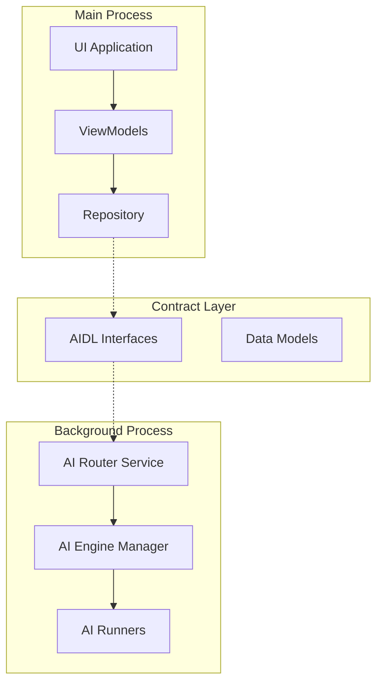

# 🚀 BreezeApp v2.0 Developer Guide

*A comprehensive guide for developers working with BreezeApp's AI Router architecture*

## 📋 Table of Contents

1. [Quick Start](#quick-start)
2. [Architecture Overview](#architecture-overview)
3. [Module Structure](#module-structure)
4. [API Usage Examples](#api-usage-examples)
5. [Testing Guide](#testing-guide)
6. [Best Practices](#best-practices)
7. [Troubleshooting](#troubleshooting)

---

## 🏃‍♂️ Quick Start {#quick-start}

### Prerequisites

- Android Studio Arctic Fox or later
- Android SDK 34+
- Kotlin 1.9+
- Gradle 8.4+

### Setup Development Environment

1. **Clone the repository:**
   ```bash
   git clone https://github.com/your-org/BreezeApp.git
   cd BreezeApp/BreezeApp_v2
   ```

2. **Build the project:**
   ```bash
   ./gradlew build
   ```

3. **Run tests:**
   ```bash
   ./gradlew test
   ./gradlew connectedAndroidTest
   ```

### Project Structure

```
BreezeApp_v2/
├── shared-contracts/          # AIDL interfaces and data models
├── breeze-app-router/         # AI Router Service (background)
├── breeze-app-ui/            # UI Application (main process)
└── docs/                     # Documentation
```

---

## 🏗️ Architecture Overview {#architecture-overview}

BreezeApp v2.0 follows a **dual-process architecture** where the UI and AI processing are completely decoupled:



### Key Benefits

- 🔒 **Process Isolation**: UI crashes don't affect AI processing
- ⚡ **Performance**: AI processing doesn't block UI
- 🔄 **Modularity**: Components can be developed independently
- 🧪 **Testability**: Easy to mock and test individual components

---

## 📁 Module Structure {#module-structure}

### shared-contracts

**Purpose**: Defines the communication contract between UI and AI Router

```
shared-contracts/
├── src/main/
│   ├── aidl/com/mtkresearch/breezeapp/shared/contracts/
│   │   ├── IAIRouterService.aidl      # Main service interface
│   │   └── IAIRouterListener.aidl     # Callback interface
│   └── java/com/mtkresearch/breezeapp/shared/contracts/model/
│       ├── Configuration.kt           # Service configuration
│       ├── AIRequest.kt              # Request data model
│       ├── AIResponse.kt             # Response data model
│       └── BinaryData.kt             # Binary attachment support
└── docs/
    └── api.md                        # Comprehensive API documentation
```

### breeze-app-router

**Purpose**: Background service that handles AI processing

```
breeze-app-router/
├── src/main/
│   ├── AndroidManifest.xml           # Service declaration & permissions
│   └── java/com/mtkresearch/breezeapp/router/
│       ├── AIRouterService.kt        # Main service implementation
│       ├── engine/                   # AI engine management (planned)
│       ├── runner/                   # AI runner implementations (planned)
│       └── config/                   # Configuration management (planned)
└── src/androidTest/
    └── java/                         # Instrumented tests
```

### breeze-app-ui (planned)

**Purpose**: User interface application

```
breeze-app-ui/
├── src/main/
│   └── java/com/mtkresearch/breezeapp/ui/
│       ├── presentation/             # UI layer (Fragments, ViewModels)
│       ├── domain/                   # Business logic (Use Cases)
│       ├── data/                     # Data layer (Repository implementations)
│       └── di/                       # Dependency injection
└── src/test/
    └── java/                         # Unit tests
```

---

## 🛠️ API Usage Examples {#api-usage-examples}

### Setting up AI Router Service

#### 1. Declare Dependencies

**In `build.gradle.kts`:**
```kotlin
dependencies {
    implementation(project(":shared-contracts"))
    // ... other dependencies
}
```

#### 2. Add Permissions

**In `AndroidManifest.xml`:**
```xml
<!-- For AI Router Service -->
<permission
    android:name="com.mtkresearch.breezeapp.permission.BIND_AI_ROUTER_SERVICE"
    android:protectionLevel="signature" />

<!-- For UI Application -->
<uses-permission android:name="com.mtkresearch.breezeapp.permission.BIND_AI_ROUTER_SERVICE" />
```

#### 3. Implement Service Connection

```kotlin
class AIRouterClient(private val context: Context) {
    private var service: IAIRouterService? = null
    
    private val serviceConnection = object : ServiceConnection {
        override fun onServiceConnected(name: ComponentName?, binder: IBinder?) {
            service = IAIRouterService.Stub.asInterface(binder)
            initializeService()
        }
        
        override fun onServiceDisconnected(name: ComponentName?) {
            service = null
        }
    }
    
    fun connect(): Boolean {
        val intent = Intent().apply {
            component = ComponentName(
                "com.mtkresearch.breezeapp.router",
                "com.mtkresearch.breezeapp.router.AIRouterService"
            )
        }
        return context.bindService(intent, serviceConnection, Context.BIND_AUTO_CREATE)
    }
}
```

### Sending Messages

#### Text Messages

```kotlin
fun sendTextMessage(text: String, sessionId: String) {
    val request = AIRequest(
        id = UUID.randomUUID().toString(),
        text = text,
        sessionId = sessionId,
        timestamp = System.currentTimeMillis(),
        options = mapOf(
            AIRequest.OptionKeys.REQUEST_TYPE to AIRequest.RequestType.TEXT_CHAT
        )
    )
    
    service?.sendMessage(request)
}
```

#### Messages with Images

```kotlin
fun sendImageAnalysisRequest(text: String, bitmap: Bitmap) {
    // Convert bitmap to byte array
    val outputStream = ByteArrayOutputStream()
    bitmap.compress(Bitmap.CompressFormat.JPEG, 90, outputStream)
    val imageBytes = outputStream.toByteArray()
    
    val imageData = BinaryData(
        type = BinaryData.ContentType.IMAGE_JPEG,
        data = imageBytes,
        metadata = mapOf(
            "width" to bitmap.width.toString(),
            "height" to bitmap.height.toString()
        )
    )
    
    val request = AIRequest(
        id = UUID.randomUUID().toString(),
        text = text,
        sessionId = "session-123",
        timestamp = System.currentTimeMillis(),
        binaryAttachments = listOf(imageData),
        options = mapOf(
            AIRequest.OptionKeys.REQUEST_TYPE to AIRequest.RequestType.IMAGE_ANALYSIS
        )
    )
    
    service?.sendMessage(request)
}
```

### Handling Responses

```kotlin
class ChatResponseListener : IAIRouterListener.Stub() {
    override fun onResponse(response: AIResponse) {
        when (response.state) {
            AIResponse.ResponseState.PROCESSING -> {
                // Show loading indicator
                showTypingIndicator()
            }
            
            AIResponse.ResponseState.STREAMING -> {
                // Update UI with partial response
                updatePartialResponse(response.text)
            }
            
            AIResponse.ResponseState.COMPLETED -> {
                // Final response received
                hideTypingIndicator()
                showFinalResponse(response.text)
                
                // Handle binary attachments if any
                response.binaryAttachments.forEach { attachment ->
                    when (attachment.type) {
                        BinaryData.ContentType.IMAGE_JPEG -> {
                            val bitmap = BitmapFactory.decodeByteArray(
                                attachment.data, 0, attachment.data.size
                            )
                            displayImage(bitmap)
                        }
                        // Handle other types...
                    }
                }
            }
            
            AIResponse.ResponseState.ERROR -> {
                hideTypingIndicator()
                showError(response.error ?: "Unknown error occurred")
            }
        }
    }
}

// Register the listener
val listener = ChatResponseListener()
service?.registerListener(listener)
```

---

## 🧪 Testing Guide {#testing-guide}

### Unit Testing Contracts

```kotlin
@Test
fun `Configuration should validate correctly`() {
    val validConfig = Configuration(
        apiVersion = 2,
        logLevel = 3,
        temperature = 0.5f,
        maxTokens = 1024
    )
    
    // Test validation logic
    assertTrue(validConfig.isValid())
}

@Test
fun `AIRequest should serialize properly`() {
    val request = AIRequest(
        id = "test-123",
        text = "Hello AI",
        sessionId = "session-456",
        timestamp = System.currentTimeMillis()
    )
    
    // Test Parcelable serialization
    val parcel = Parcel.obtain()
    request.writeToParcel(parcel, 0)
    parcel.setDataPosition(0)
    
    val deserialized = AIRequest.CREATOR.createFromParcel(parcel)
    assertEquals(request, deserialized)
    
    parcel.recycle()
}
```

### Testing Service Implementation

```kotlin
@RunWith(AndroidJUnit4::class)
class AIRouterServiceTest {
    
    @get:Rule
    val serviceRule = ServiceTestRule()
    
    @Test
    fun testServiceBinding() {
        val intent = Intent(context, AIRouterService::class.java)
        val binder = serviceRule.bindService(intent)
        
        val service = IAIRouterService.Stub.asInterface(binder)
        assertNotNull(service)
        
        val apiVersion = service.getApiVersion()
        assertTrue(apiVersion > 0)
    }
    
    @Test
    fun testMessageSending() {
        // Set up service and listener
        val service = bindToService()
        val listener = TestAIRouterListener()
        
        service.registerListener(listener)
        
        val request = AIRequest(
            id = "test-request",
            text = "Test message",
            sessionId = "test-session",
            timestamp = System.currentTimeMillis()
        )
        
        service.sendMessage(request)
        
        // Wait for response
        listener.waitForResponse(5000)
        
        val response = listener.getLastResponse()
        assertNotNull(response)
        assertEquals("test-request", response.requestId)
    }
}
```

### Integration Testing

```kotlin
@RunWith(AndroidJUnit4::class)
class AIRouterIntegrationTest {
    
    @Test
    fun testEndToEndCommunication() {
        // Test complete flow from UI to Service and back
        val client = AIRouterClient(context)
        
        assertTrue(client.connect())
        
        val responseReceived = CountDownLatch(1)
        var receivedResponse: AIResponse? = null
        
        client.setResponseListener { response ->
            receivedResponse = response
            responseReceived.countDown()
        }
        
        client.sendMessage("Hello AI", "test-session")
        
        assertTrue(responseReceived.await(10, TimeUnit.SECONDS))
        assertNotNull(receivedResponse)
    }
}
```

---

## ✨ Best Practices {#best-practices}

### 1. Error Handling

```kotlin
// ✅ Good: Comprehensive error handling
try {
    service?.sendMessage(request)
} catch (e: RemoteException) {
    Log.e(TAG, "Failed to send message to AI Router Service", e)
    // Attempt reconnection
    reconnectToService()
} catch (e: SecurityException) {
    Log.e(TAG, "Permission denied - check signature", e)
    // Handle permission error
}

// ❌ Bad: No error handling
service?.sendMessage(request)
```

### 2. Resource Management

```kotlin
// ✅ Good: Proper cleanup
override fun onDestroy() {
    try {
        service?.unregisterListener(listener)
        context.unbindService(serviceConnection)
    } catch (e: Exception) {
        Log.w(TAG, "Error during cleanup", e)
    }
    super.onDestroy()
}

// ❌ Bad: Resource leaks
override fun onDestroy() {
    super.onDestroy()
    // Forgot to unregister listener and unbind service
}
```

### 3. Threading

```kotlin
// ✅ Good: Offload heavy work
lifecycleScope.launch(Dispatchers.IO) {
    val result = service?.sendMessage(request)
    withContext(Dispatchers.Main) {
        updateUI(result)
    }
}

// ❌ Bad: Blocking main thread
val result = service?.sendMessage(request) // Blocks UI
updateUI(result)
```

### 4. Configuration Management

```kotlin
// ✅ Good: Validate configuration
fun createConfiguration(): Configuration {
    return Configuration(
        apiVersion = 2,
        logLevel = if (BuildConfig.DEBUG) 4 else 1,
        temperature = 0.7f.coerceIn(0.0f, 1.0f),
        maxTokens = 2048.coerceAtLeast(1)
    ).also { config ->
        require(config.validate().isSuccess) { "Invalid configuration" }
    }
}

// ❌ Bad: No validation
fun createConfiguration(): Configuration {
    return Configuration(
        temperature = 1.5f, // Invalid range!
        maxTokens = -100    // Invalid value!
    )
}
```

---

## 🔧 Troubleshooting {#troubleshooting}

### Common Issues

#### 1. Service Not Binding

**Symptoms**: `ServiceConnection.onServiceConnected()` never called

**Solutions**:
- Check that both apps are signed with the same certificate
- Verify permission is declared in both manifests
- Ensure service is declared with correct package name
- Check logcat for permission errors

#### 2. Remote Exception on Method Calls

**Symptoms**: `RemoteException` thrown when calling service methods

**Solutions**:
- Verify service is still alive (`binder.isBinderAlive()`)
- Implement automatic reconnection logic
- Check for transaction size limits (especially with binary data)
- Ensure proper thread handling

#### 3. Memory Issues with Binary Data

**Symptoms**: `OutOfMemoryError` or `TransactionTooLargeException`

**Solutions**:
- Compress images before sending
- Break large data into smaller chunks
- Use content URIs instead of raw bytes for large files
- Implement proper memory management

### Debug Configuration

```kotlin
// Enable debug logging
val debugConfig = Configuration(
    logLevel = 5, // VERBOSE
    additionalSettings = mapOf(
        Configuration.SettingKeys.ENABLE_LOGGING to "true",
        "debug_mode" to "true"
    )
)
```

### Performance Monitoring

```kotlin
class PerformanceMonitor {
    fun measureServiceCall(operation: String, block: () -> Unit) {
        val startTime = System.currentTimeMillis()
        try {
            block()
        } finally {
            val duration = System.currentTimeMillis() - startTime
            Log.d("PERFORMANCE", "$operation took ${duration}ms")
        }
    }
}
```

---

## 📚 Additional Resources

- **API Reference**: [`docs/api.md`](api.md)
- **Client API Specification**: [`docs/client_api_spec.md`](client_api_spec.md)
- **Refactoring Plan**: [`docs/refactoring_plan.md`](refactoring_plan.md)
- **Architecture Diagrams**: [`docs/ai_router_spec/08-Diagrams/`](ai_router_spec/08-Diagrams/)

---

**Last Updated**: 2024-12-19  
**Version**: 2.0  
**Contributors**: BreezeApp Development Team 