# BreezeApp Refactoring Plan: A Contract-First, Test-Driven Approach

**Project:** BreezeApp Refactoring
**Goal:** Successfully decouple the UI (`breeze-app-ui`) from the AI services (`breeze-app-router`) into a robust, maintainable, and scalable dual-app architecture using a clean AIDL-based IPC mechanism. All development must adhere strictly to **MVVM + Clean Architecture (Use Cases)** principles.

---

### **1. Overall Architecture & Guiding Principles**

#### **Module Boundaries**

The high-level architecture is composed of three main modules. The two applications (`breeze-app-ui` and `breeze-app-router`) are completely decoupled and only communicate through the shared `shared-contracts` module.

#### **Architectural Layers**

The application is divided into distinct layers, each with a clear responsibility. Communication flows from the UI down to the native layer and back.

**Presentation Layer (`breeze-app-ui`)**: Contains UI elements (Activities/Fragments) and ViewModels. It is responsible for displaying data and handling user interaction. It knows nothing about how data is fetched, only that it gets it from a Use Case.
**Domain Layer (`breeze-app-ui` & `shared-contracts`)**: Contains the business logic (Use Cases) and the core domain models (e.g., `AIRequest`, `AIResponse`). It defines the `Repository` interfaces that the presentation layer uses.
**Data Layer (`breeze-app-ui` & `breeze-app-router`)**: Contains the `Repository` implementations. Its job is to fetch data from one or more sources (the AI Router Service, a local database, etc.) and deliver it to the Domain layer. `AIRouterRepositoryImpl` in the UI app will handle the IPC communication.
**AI Engine Layer (`breeze-app-router`)**: The `AIRouterService` lives here. It orchestrates calls to various AI engines (LLM, VLM, ASR, etc.) based on the incoming requests from the Data Layer.
**Runtime Layer (`breeze-app-router`)**: Manages the execution backend (CPU/GPU/NPU) and model files, providing a generalized interface for the AI Engine layer.
**Native Layer (`breeze-app-router`)**: The core C++/JNI implementation of the AI models.

#### **Communication Flow (AIDL)**

The following diagram illustrates the end-to-end communication for a user request.

```mermaid
sequenceDiagram
    participant UI as UI
    participant UC as UseCase
    participant Repo as AIRouterRepo
    participant Svc as AIRouterService
    participant AIM as AIEngineMgr
    participant Eng as AIEngine

    Note over UI, UC: breeze-app-ui 模組流程
    UI->>UC: 1. ViewModel 呼叫 UseCase (e.g., SendMessage)
    UC->>Repo: 2. UseCase 呼叫 Repository
    Repo->>Svc: 3. AIDL IPC 呼叫 sendMessage()

    Note over Svc, AIM: breeze-app-router 模組流程
    Svc->>Svc: 4. onTransact 處理 IPC 請求
    Svc->>AIM: 5. 委派給 AIEngineMgr
    AIM->>Eng: 6. 執行推論
    Eng-->>AIM: 7. 回傳推論結果
    AIM-->>Svc: 8. 回傳結果
    Svc-->>Repo: 9. AIDL listener 回傳 onResponse()

    Note over UI, UC: 回傳與畫面更新流程
    Repo-->>UC: 10. Repository 發出結果 (e.g., Flow)
    UC-->>UI: 11. UseCase 傳遞結果至 ViewModel
    UI->>UI: 12. ViewModel 更新 UI 狀態
```

#### **AI Router Architecture: Extensibility & Strategy**

To ensure the `breeze-app-router` is a flexible and future-proof platform, its internal architecture will be built on the **Strategy Design Pattern**. This allows us to add, remove, or switch out AI backends (runners) without altering the core service logic.

* **Core Components:**
  
  * **AIEngineManager:** The central coordinator within the router app. It receives an `AIRequest`, determines the required function (LLM, VLM, ASR, Guardrail, etc.), and delegates the task to the currently configured `Runner`.
  * **Runner Interface (`interface Runner<REQUEST, RESPONSE>`):** A generic interface that all runners for a specific AI function will implement. This enforces a common contract.
  * **Concrete Runners:** These are the specific implementations of the `Runner` interface. For each AI function, we can have multiple, swappable runners.
    * **LLM Runners:** `ExecuTorchLLMRunner`, `LlamaCppLLMRunner`, `MediaTekLLMRunner`, etc.
    * **ASR Runners:** `SystemASRRunner`, `SherpaOnnxASRRunner`, etc.
  * **Guardrail & Future Functions:** This design makes it trivial to add new capabilities like content safety checks. We would simply define a `GuardrailRunner` and implement it, and the `AIEngineManager` would be updated to call it in the processing pipeline.

* **"Mock-First" Development Principle:**
  
  * For initial development and integration testing (**Milestones 2-4**), we will exclusively use **`MockRunner`** implementations (e.g., `MockLLMRunner`, `MockASRRunner`).
  * These mocks will simulate the behavior of a real runner (e.g., return a pre-defined text stream, simulate a delay) but have no native dependencies.
  * **Benefit:** This decouples the UI team's development from the complex, time-consuming work of implementing the native runners, allowing for parallel workstreams and a much faster path to end-to-end integration testing.

#### **Core Principles for Robustness**

To build a production-quality system, we will adhere to the following core principles throughout development:

1. **Security:** The `AIRouterService` will be protected by a `signature`-level permission. This ensures that only applications signed with our key (i.e., `breeze-app-ui`) can bind to and communicate with the service, preventing unauthorized access.
2. **Threading:** All IPC calls must be handled off the main thread to prevent UI freezes (ANRs).
   * **Client-Side (`breeze-app-ui`):** Repository calls to the service binder will be dispatched to a background thread (`Dispatchers.IO`).
   * **Service-Side (`breeze-app-router`):** Long-running inference tasks within the service will be launched in a dedicated coroutine scope to avoid blocking the binder thread pool.
3. **Error Handling & Resilience:** The connection must be resilient to failures.
   * **Connection:** The client-side repository will implement a reconnection strategy (e.g., exponential backoff) if the service connection is lost unexpectedly.
   * **Calls:** All binder calls will be wrapped in `try-catch` blocks to handle `RemoteException`.
   * **Data:** The `AIResponse` object will be designed to carry either a success payload or a structured error, making failures an explicit part of the contract.
4. **Configuration:** The service will be configured via a dedicated `initialize` method in the AIDL interface, using a `Configuration` Parcelable to pass settings. This is more robust than passing data via the `startService` Intent.

---

### **2. The New Roadmap: Milestone-Driven Development**

We will follow a "contract-first" and "service-first" approach. Each milestone represents a stable, verifiable state of the project. **We will not proceed to the next milestone until all tasks in the current one are marked as "Done" and validated.** The core principle is to build and validate the `breeze-app-router` service as a standalone component *before* developing the UI client.

---

#### **Milestone 1: The Unbreakable Contract**

* **Objective:** Create a `shared-contracts` module that is self-contained, correct, and can be built independently. This is the single source of truth for all inter-app communication.

* **Implementation & Validation Tracking:**
  
  | Task                                                                     | Status       | Validation Method                            | Unit Test            |
  |:------------------------------------------------------------------------ |:------------ |:-------------------------------------------- |:-------------------- |
  | **1.1** Initialize `shared-contracts` module as an Android Library       | ✅ `Done`    | `build.gradle.kts` review                    | N/A                  |
  | **1.2** Enable `aidl` and `kotlin-parcelize` build features              | ✅ `Done`    | `build.gradle.kts` review                    | N/A                  |
  | **1.3** Define `Configuration.kt` Parcelable for service setup           | ✅ `Done`    | Code review (242 lines, comprehensive)       | `ParcelableTest`     |
  | **1.4** Define `AIRequest.kt` Parcelable with binary data support        | ✅ `Done`    | Code review (91 lines)                       | `ParcelableTest`     |
  | **1.5** Define `AIResponse.kt` Parcelable with error-state fields        | ✅ `Done`    | Code review (131 lines)                      | `ParcelableTest`     |
  | **1.6** Define `BinaryData.kt` Parcelable for multimedia support         | ✅ `Done`    | Code review (90 lines)                       | `ParcelableTest`     |
  | **1.7** Define `IAIRouterService.aidl` with `initialize` & `sendMessage` | ✅ `Done`    | Code review (58 lines, complete interface)   | `ContractSyntaxTest` |
  | **1.8** Define `IAIRouterListener.aidl` for callbacks                    | ✅ `Done`    | Code review (15 lines)                       | `ContractSyntaxTest` |
  | **1.9** Implement comprehensive test suite                               | ✅ `Done`    | `ContractSyntaxTest` + `ParcelableTest`      | All tests pass       |
  | **1.10** **Build & Verify Module**                                       | ✅ `Done`    | `./gradlew :shared-contracts:build` succeeds | All tests pass       |
  | **1.11** Create comprehensive API documentation                          | ✅ `Done`    | `docs/api.md` (543 lines)                    | N/A                  |

---

#### **Milestone 2: The Standalone Router Service**

* **Objective:** Implement a secure, standalone `AIRouterService` in `breeze-app-router` that contains all necessary business logic, using mock runners for initial validation.

* **Implementation & Validation Tracking:**
  
  | Task                                                                        | Status       | Validation Method                                                        | Unit Test              |
  |:--------------------------------------------------------------------------- |:------------ |:------------------------------------------------------------------------ |:---------------------- |
  | **2.1** Define `signature`-level permission in `breeze-app-router` Manifest | ✅ `Done`    | Manifest review (permission declared)                                    | N/A                    |
  | **2.2** Add `:shared-contracts` dependency to `breeze-app-router`           | ✅ `Done`    | `build.gradle.kts` review                                                | N/A                    |
  | **2.3** Implement `AIRouterService.kt` with comprehensive AIDL stub         | ✅ `Done`    | Code review (196 lines, full implementation)                             | `AIRouterServiceTest`  |
  | **2.4** Enforce signature permission in service's `onBind` method           | ✅ `Done`    | Code review (permission check implemented)                               | `SecurityTest`         |
  | **2.5** Implement threading: offload inference to CoroutineScope            | ✅ `Done`    | Code review (Dispatchers.IO usage)                                       | `ThreadingTest`        |
  | **2.6** Implement robust listener management with death monitoring          | ✅ `Done`    | Code review (RemoteCallbackList usage)                                   | `ListenerTest`         |
  | **2.7** Implement comprehensive configuration validation                     | ✅ `Done`    | Code review (validateConfiguration method)                               | `ConfigValidationTest` |
  | **2.8** Implement mock response system for initial testing                  | ✅ `Done`    | Code review (mock responses in sendMessage)                              | `MockResponseTest`     |
  | **2.9** Declare service in Manifest with permission & intent filter         | ✅ `Done`    | Manifest review (service declared with permissions)                      | N/A                    |
  | **2.10** **Build & Verify App**                                             | 🔄 `Testing` | `./gradlew :breeze-app-router:assembleDebug` succeeds                    | All tests pass         |

---

#### **Milestone 3: Headless Validation via ADB**

* **Objective:** Verify the `AIRouterService` is functioning correctly in the background, using only command-line tools (`adb`), before any UI is built. This proves the router is an independent, testable component.

* **Documentation Preparation Complete:** ✅
  - Quick Start Guide created for new developers
  - Developer Guide with comprehensive API examples
  - Testing Guide with complete test strategies
  - Updated documentation index and navigation

* **Implementation & Validation Tracking:**

  | Task                                                                     | Status    | Validation Method                                                        | Unit Test                 |
  |:------------------------------------------------------------------------ |:--------- |:------------------------------------------------------------------------ |:------------------------- |
  | **3.1** Add test-only logic to `onStartCommand` in `AIRouterService`     | `Ready`   | Code review: Service handles a test Intent to trigger a mock request    | N/A (Integration)         |
  | **3.2** Create script/docs for `adb` commands to start the service       | `Ready`   | Execute `adb shell am start-service ...` successfully                   | N/A                       |
  | **3.3** Trigger test message via `adb` and verify Logcat output          | `Ready`   | `adb logcat` shows expected logs from service mock responses             | N/A (Integration)         |
  | **3.4** (Optional) Create minimal UI-less test client APK for binder testing | `Ready`   | `adb shell am instrument` triggers binder call successfully            | `BinderIntegrationTest`   |
  | **3.5** **Validation Complete**                                          | `Ready`   | The service is confirmed to be working standalone                        | All tests pass            |

---

#### **Milestone 4: The Resilient Client**

* **Objective:** Implement a client-side `AIRouterRepository` in `breeze-app-ui` that can securely and robustly bind to the **pre-validated** `AIRouterService`.
* **Note:** The implementation of the repository, its data models, and error handling should closely follow the detailed designs in **`client_api_spec.md`**.

* **Implementation & Validation Tracking:**
  
  | Task                                                                           | Status    | Validation Method                                 | Unit Test                 |
  |:------------------------------------------------------------------------------ |:--------- |:------------------------------------------------- |:------------------------- |
  | **4.1** Add `:shared-contracts` dependency & custom permission use in Manifest | `Pending` | `build.gradle.kts` & Manifest review              | N/A                       |
  | **4.2** Define `domain/repository/AIRouterRepository.kt` interface             | `Pending` | Code review                                       | N/A                       |
  | **4.3** Implement `data/repository/AIRouterRepositoryImpl.kt`                  | `Pending` | Code review (see `client_api_spec.md`)            | `RepositoryBindingTest`   |
  | **4.4** Implement `ServiceConnection` with reconnection logic                  | `Pending` | Code review, simulate service crash               | `ReconnectionTest`        |
  | **4.5** Implement threading: dispatch binder calls to `Dispatchers.IO`         | `Pending` | Code review                                       | `ThreadingTest`           |
  | **4.6** Wrap all binder calls in `try-catch(RemoteException)`                  | `Pending` | Code review                                       | `ExceptionHandlingTest`   |
  | **4.7** Provide repository via Hilt DI module                                  | `Pending` | Code review                                       | `DependencyInjectionTest` |
  | **4.8** **Build & Verify App**                                                 | `Pending` | `./gradlew :breeze-app-ui:assembleDebug` succeeds | All tests pass            |

---

#### **Milestone 5: Full E2E Integration**

* **Objective:** Validate the complete end-to-end communication loop: send a message from the UI App, have it received by the Router App, and get a mock response back.
* **Note:** The implementation of the ViewModel, its state management, and interaction with the UseCase should follow the patterns in **`client_api_spec.md`**.

* **Implementation & Validation Tracking:**
  
  | Task                                                                       | Status    | Validation Method                                        | Unit Test                |
  |:-------------------------------------------------------------------------- |:--------- |:-------------------------------------------------------- |:------------------------ |
  | **5.1** Implement `SendMessageUseCase` in UI app's domain layer            | `Pending` | Code review                                              | `SendMessageUseCaseTest` |
  | **5.2** Inject UseCase into `ChatViewModel`                                | `Pending` | Code review (see `client_api_spec.md`)                   | `ChatViewModelTest`      |
  | **5.3** Call use case from ViewModel on user action                        | `Pending` | Code review                                              | `ChatViewModelTest`      |
  | **5.4** Implement server-side `sendMessage` delegating to the `MockRunner` | `Pending` | Logcat on router app shows request                       | N/A (Integration)        |
  | **5.5** Implement client-side listener to receive response                 | `Pending` | Logcat on UI app shows response                          | N/A (Integration)        |
  | **5.6** Update ViewModel with response via `Flow`                          | `Pending` | Code review (see `client_api_spec.md`)                   | `ChatViewModelTest`      |
  | **5.7** **Deploy & Test E2E**                                              | `Pending` | Install both apps, send message, see mock response in UI | E2E Test                 |