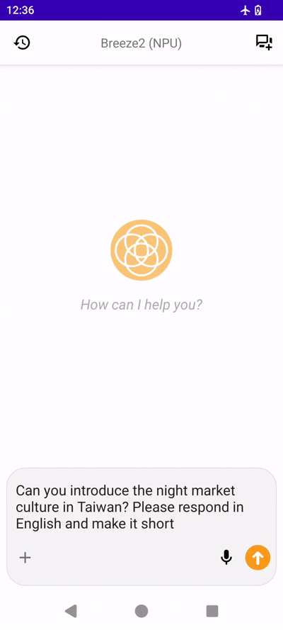
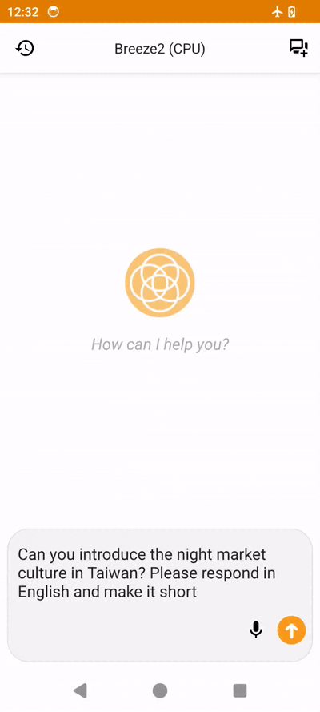

# BreezeApp - AI on phone

[](LICENSE)
[](https://github.com/mtkresearch/BreezeApp/issues)
[](https://play.google.com)
[](https://apps.apple.com)

English | [繁體中文](./docs/i18n/README_zh.md)

## 🔄 BreezeApp v2 Upgrade

We have upgraded to **BreezeApp v2** with a new modular architecture using Git Submodules:

- **[`BreezeApp-engine`](https://github.com/mtkresearch/BreezeApp-engine)** - Core AI engine (inference framework)
- **[`BreezeApp-client`](https://github.com/mtkresearch/BreezeApp-client)** - Engineering app (demo and testing platform)  
- **`BreezeApp`** 🚧 **(Coming Soon)** - Production app (official consumer application)

### ✨ Key v2 Upgrade Features

1. **Modernized Codebase (Java → Kotlin)**
   
   - Migrated the entire codebase from Java to Kotlin for improved readability, safety, and modern Android development practices.

2. **Modular Architecture: Decoupled AI Engine & UI**
   
   - Fully separated the AI inference engine from the user interface, enabling independent development, easier maintenance, and better scalability.

3. **EdgeAI SDK: Unified Developer-Friendly API**
   
   - Introduced the EdgeAI SDK with standardized APIs for integrating AI features (chat, speech, vision) into any application.

> [!IMPORTANT]
> **Migration Notice**: The legacy `breeze-app` directory is deprecated. All new features and development are implemented in the v2 modular architecture.

## Overview

BreezeAPP is a mobile AI application developed for both Android and iOS platforms. Users can download it directly from the App Store and enjoy a variety of features offline, including speech-to-text, text-to-speech, text-based chatbot interactions, and image question-answering. Currently, BreezeApp defaults to the Breeze 2 series of models developed by MediaTek Research and we provide simple installation instructions for changing your backend to Llama 3.2 See the [Roadmap](/Roadmap.md) for additional planned integrations.

This project aims to create a community-driven platform for running AI capabilities locally on Android devices. Our goal is to provide a privacy-focused solution where all AI features work completely offline (airplane mode supported), ensuring your data never leaves your device.

<p align="center">
      
  
</p>
<p align="center">
  <em>Left: NPU Backend      Right: CPU Backend</em>
</p>

**Speech-to-Text**
(In preparation)

**Text-to-Speech**

<p align="center">
  
</p>

## 🔄 Version Migration

### From v1 to v2

If you're upgrading from BreezeApp v1:

1. **Backup your data** (if any custom configurations exist)
2. **Uninstall the old version**
3. **Download and install** the new v2 APK
4. **Re-download models** through the new in-app downloader

### For Developers

- **Legacy Code**: v1 Java code is archived in `/legacy` directory
- **New Development**: Use the Kotlin-based v2 architecture
- **Migration Help**: See [Migration Guide](/docs/setup/migration.md)

## 📧 Our Purpose of Open-Sourcing

We are [MediaTek Research](https://i.mediatek.com/mediatekresearch), a member of the [AI Alliance](https://thealliance.ai/).

Our main purpose for developing this application is to change the common perception that LLM capabilities can only be used on expensive devices and are limited by device providers. We aim to raise awareness and promote the concept that anyone can freely choose and run different LLMs on their phones.

Another main purpose of developing this application is to eliminate the obstacles developers may face when creating mobile AI applications by open-sourcing our Kotlin source code. We hope to inspire developers to create more innovative mobile applications.

If you are interested in BreezeApp, please contact us via [info@mtkresearch.com](info@mtkresearch.com)

## 🚀 Quick Start

### 📥 Download & Try

- **Latest Release**: [Download APK](https://huggingface.co/MediaTek-Research/BreezeApp/resolve/main/BreezeApp.apk)
- **First Launch**: The app will automatically prompt you to download required AI models

### 👨‍💻 Developer Setup

**Prerequisites**: Git with submodule support

```bash
# Clone with submodules
git clone --recursive https://github.com/mtkresearch/BreezeApp.git

# Or initialize submodules after cloning
git submodule update --init --recursive
```

📖 **Detailed Instructions**: See our [Setup Guide](/docs/setup/installation.md)

### Working with Submodules

This project uses Git Submodules for component management. See [Submodules Guide](/docs/setup/submodules.md) for detailed instructions on:

- Initial setup and cloning
- Updating submodules
- Contributing to components
- Troubleshooting

## ✨ Features

### 🤖 AI Capabilities

- 💬 **Chat**: Text-based conversational AI
- 🗣️ **Voice**: Speech input/output support  
- 👁️ **Vision**: Image understanding and Q&A
- 🔒 **Privacy**: 100% offline operation (airplane mode supported)

### ⚡ Backend Support

| Feature                | CPU Backend | MediaTek NPU | Status  |
| ---------------------- |:-----------:|:------------:|:-------:|
| **LLM Chat**           | ✅ Ready     | ✅ Ready      | Stable  |
| **Vision (VLM)**       | 🚧 Beta     | ❌ Planned    | Testing |
| **Speech Recognition** | 🚧 Beta     | ❌ Planned    | Testing |
| **Text-to-Speech**     | ✅ Ready     | ❌ Planned    | Stable  |

**Legend**: ✅ Production Ready | 🚧 In Development | ❌ Planned

## 🔍 Project Structure

```
BreezeApp/
├── BreezeApp-engine/          # 🔧 Core AI Engine (Git Submodule)
├── BreezeApp-client/          # 📱 Engineering/Demo App (Git Submodule)  
├── BreezeApp/                 # 🚧 Production App (Coming Soon)
├── docs/                      # 📚 Documentation
│   ├── setup/                 # Installation guides
│   ├── architecture/          # System design
│   ├── contributing/          # Contribution guidelines
│   └── i18n/                  # Internationalization
├── assets/                    # 🎨 Static resources
└── legacy/                    # ⚠️ Deprecated v1 code
```

## 🤝 Contributing

Contributions are welcome! See our [Contributing Guide](/docs/contributing/guidelines.md) to get started.

## 📄 License

The license for this project is pending determination - see the [LICENSE](/LICENSE) file for details.

## 🙏 Acknowledgments

- [Executorch](https://github.com/pytorch/executorch) for LLM/VLM framework
- [k2-fsa/sherpa-onnx](https://github.com/k2-fsa/sherpa-onnx) for ASR/TTS capabilities
- MediaTek Research for core AI engines

## 🔗 Links

- [Known Issues](https://github.com/mtkresearch/BreezeApp/issues)

## 📧 We are

[MediaTek Research](https://i.mediatek.com/mediatekresearch), a member of the [AI Alliance](https://thealliance.ai/).

Contact us: [info@mtkresearch.com](info@mtkresearch.com)

---
TWM Open Source Contributions Summary:
- [fix: gradle failed due to ClassNotFoundException: org.gradle.wrapper.GradleWrapperMain](https://github.com/mtkresearch/BreezeApp/pull/89)
- [fix: ClassCastException in MainActivity after closing the SettingsActivity](https://github.com/mtkresearch/BreezeApp/pull/99)
- [Implement Instrumented Tests for LLMEngineService](https://github.com/mtkresearch/BreezeApp/pull/104)
- [Implement Instrumented Tests for TTSEngineService, ASREngineService and VLMEngineService](https://github.com/mtkresearch/BreezeApp/pull/106)
- [Code coverage report by unit test (Robolectric + Mockito) and instrumented test (JaCoCo) 
](https://github.com/mtkresearch/BreezeApp/pull/107)


