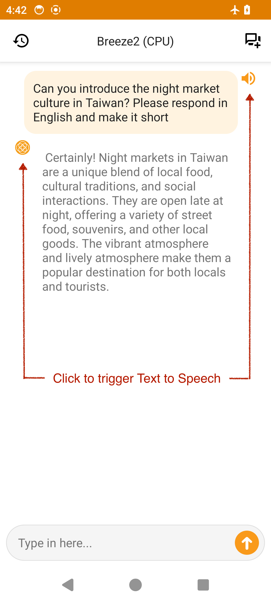

# BreezeApp - AI on phone

[繁體中文](../../README.md) | [English](README_en.md)

## Overview

This project aims to create a community-driven platform for running AI capabilities locally on Android devices. Our goal is to provide a privacy-focused solution where all AI features work completely offline (airplane mode supported), ensuring your data never leaves your device.

  &nbsp;&nbsp;&nbsp;&nbsp;
  

  <em>Left: NPU Backend &nbsp;&nbsp;&nbsp;&nbsp; Right: CPU Backend</em>

Speech-to-Text

(In preparation)

Text-to-Speech

  

Image QA

(In preparation)

BreezeAPP is a mobile AI application developed for both Android and iOS platforms. Users can download it directly from the App Store and enjoy a variety of features offline, including speech-to-text, text-to-speech, text-based chatbot interactions, and image question-answering. Currently, BreezeApp supports the Breeze 2 series of models developed by MediaTek Research. Newer and better models will be supported in future updates.

## 📧 The intention of open source

We are [MediaTek Research](https://i.mediatek.com/mediatekresearch). MediaTek Research is a member of the [AI Alliance](https://thealliance.ai/).

The primary purpose of developing this application is to challenge the common perception about running Large Language Models (LLMs). Currently, many people believe that LLM can only run on super expensive computers, and large cloud service providers dictate what LLM functionalities are offered. We aim to raise public awareness about the capability of a smartphone to run an entire AI suite, LLM included, and to promote the concept that anyone should and indeed can freely choose what AI to run on their mobile devices. 

Another key objective in open sourcing the Kotlin portion of this application is to minimize the entry barriers for app developers in creating mobile AI applications. Through this, we hope to inspire app developers to create more innovative mobile AI applications. We look forward to future collaborations with app developers.

If you are interested in the BreezeApp, please feel free to contact us: [info@mtkresearch.com](info@mtkresearch.com)

## 🚀 Quick Start 

### Download & Try
- [Download the latest APK](https://huggingface.co/MediaTek-Research/BreezeApp/resolve/main/BreezeApp.apk)
- The app includes an in-app model download feature that will automatically prompt you to download required models on first launch.

### Developer Setup
Looking to build and contribute? Check our [Setup Guide](/docs/setup/installation.md) for detailed instructions.

## ✨ Features

- 💬 Text-based chat interface
- 🗣️ Voice input/output support
- 📸 Image understanding capabilities
- 🔄 Multiple backend support:

    | Model Type | Local CPU | MediaTek NPU | Default |
    |:---------:|:---------:|:-------:|:--------:|
    | LLM       |     ✅     |    ✅    |    -    |
    | VLM       |     🚧     |    ❌    |    -    |
    | ASR       |     🚧     |    ❌    |    -    |
    | TTS       |     ✅     |    ❌    |    -    |

## 🔍 Project Structure

- `/app` - Android application source code
- `/docs` - Documentation and guides
  - `/setup` - Installation and configuration guides
  - `/architecture` - System architecture and design
  - `/contributing` - Guidelines for contributors
  - `/i18n` - Internationalized documentation
- `/assets` - Images, videos, and other static resources

## 🆘 Help Wanted

We're looking for contributors to help with the following tasks:

1. **Performance Optimization**
   - Profile the app and enhance memory management
   - Optimize inference speed on various devices
   - Reduce app size and resource consumption

2. **Code Quality**
   - Refactor code to improve maintainability
   - Add unit and integration tests
   - Implement better error handling and logging

3. **Device Compatibility**
   - Test on more Android devices (currently only tested on Pixel 7a (8GB) and Samsung Flip 4)
   - Identify and fix device-specific issues
   - Support for different screen sizes and aspect ratios

4. **User Experience**
   - Improve UI responsiveness during model inference
   - Enhance accessibility features
   - Create more intuitive onboarding process

5. **Documentation**
   - Improve code documentation
   - Create developer tutorials
   - Add screenshots and demos to user guides

If you're interested in working on any of these tasks, please check out our issue tracker or open a new issue to discuss your approach before submitting a PR.

## 🤝 Contributing

Contributions are welcome! See our [Contributing Guide](/docs/contributing/guidelines.md) to get started.

## 📄 License

The license for this project is pending determination - see the [LICENSE](/LICENSE) file for details.

## 🙏 Acknowledgments

- [Executorch](https://github.com/pytorch/executorch) for LLM/VLM framework
- [k2-fsa/sherpa-onnx](https://github.com/k2-fsa/sherpa-onnx) for ASR/TTS capabilities
- MediaTek Research for core AI engines

## 🔗 Links

- [Known Issues](https://github.com/mtkresearch/BreezeApp/issues) 