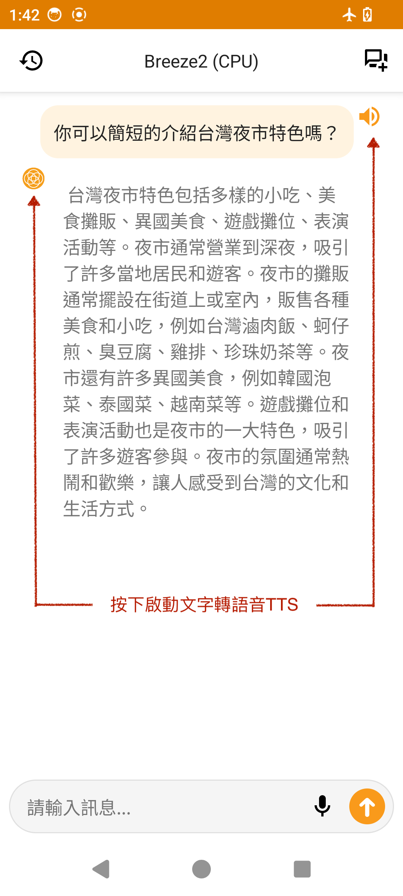

# BreezeApp - 手機上的 AI 助手

[](LICENSE)
[](https://github.com/mtkresearch/BreezeApp/issues)
[](https://play.google.com)
[](https://apps.apple.com)

[English](../../README.md) | 繁體中文

## 🔄 BreezeApp v2 Upgrade

我們已經升級到 **BreezeApp v2**，使用 Git Submodules 的新模組化架構：

- **[`BreezeApp-engine`](https://github.com/mtkresearch/BreezeApp-engine)** - AI 引擎核心 (推理框架)
- **[`BreezeApp-client`](https://github.com/mtkresearch/BreezeApp-client)** - 工程版應用程式 (示範和測試平台)  
- **`BreezeApp`** 🚧 **(即將推出)** - 正式版應用程式 (官方使用者端應用程式)

### ✨ 主要升級特點

1. **現代化程式碼庫 (Java → Kotlin)**
   
   - 將整個程式碼庫從 Java 遷移到 Kotlin，以提高可讀性、安全性和與現代 Android 開發最佳實踐的對齊。

2. **模組化架構：AI 引擎與 UI 解耦**
   
   - 完全將 AI 推理引擎與使用者介面分離，實現獨立開發、更易維護和更好的可擴展性。

3. **EdgeAI SDK：統一且開發者友好的 API**
   
   - 引入 EdgeAI SDK，提供標準化且易於使用的 API，將進階 AI 功能（聊天、語音、視覺）輕鬆整合到任何應用程式中。

> [!IMPORTANT]
> **遷移通知**：舊版的 `breeze-app` 目錄已被棄用。所有新功能和開發都將在 v2 模組化架構中實現。

## Overview

BreezeAPP 是一款專為 Android 和 iOS 平台開發的純手機 AI 應用程式。用戶只需從 App Store 直接下載，即可在不須連網的離線狀態下享受多項功能，包含了語音轉文字、文字轉語音、文字聊天機器人，以及對圖像進行問答。目前，BreezeApp 預設使用聯發創新基地開發的 Breeze 2 系列模型，我們也提供簡單的安裝說明來將您的後端切換到 Llama 3.2。請查看 [Roadmap](/Roadmap.md) 了解其他計劃中的整合。

這個專案旨在創建一個由社群驅動的平台，在 Android 裝置上本地運行 AI 功能。我們的目標是提供一個注重隱私的解決方案，確保所有 AI 功能完全離線運行（支援飛安模式），確保您的資料永遠不會離開您的裝置。

聊天機器人
<p align="center">
      
  
</p>
<p align="center">
  <em>左：NPU 後端      右：CPU 後端</em>
</p>

**語音轉文字**
(準備中)

**文字轉語音**

<p align="center">
  
</p>

語音轉文字

(準備中)

文字轉語音
<table align="center" border="0" cellspacing="0" cellpadding="0" style="border-collapse: collapse;">
<tr style="border: none;">
<td width="300" valign="middle" style="border: none;">

</td>
<td width="350" valign="middle" style="border: none;">
<p>
<strong>範例一</strong><br/>
『你可以簡短的介紹台灣夜市特色嗎？』<br/>
🎧 <a href="../../assets/tts_zh_1.mp3">直接下載</a>
</p>
<p>
<strong>範例二</strong><br/>
『台灣夜市特色包括多樣的小吃、．．．』<br/>
🎧 <a href="../../assets/tts_zh_2.mp3">直接下載</a>
</p>
</td>
</tr>
</table>

對圖詢問

(準備中)

## 📧 開源的用意

我們是[聯發創新基地](https://i.mediatek.com/mediatekresearch) ([MediaTek Research](https://i.mediatek.com/mediatekresearch))，[AI Alliance](https://thealliance.ai/) 的成員。

我們開發這個應用的主要目的，是為了改變大眾對運行大型語言模型(LLM) 的普遍認知。目前，許多人認為LLM的功能只能在昂貴的設備上使用，而且受限於設備提供商的選擇。我們希望提升大眾意識並推廣這樣一個概念：任何人都可以在自己的手機上自由選擇並運行不同的LLM。

我們開發這個應用的另一個主要目的，是通過開源我們的 Kotlin 源代碼，來消除 app 開發者在創建手機 AI 應用時可能遇到的障礙，藉此激發app開發者做出更多有創意的手機應用。我們期待未來能與 app 開發者展開更多合作。

如果您對 BreezeApp 有興趣，歡迎通過以下郵箱與我們聯繫：[info@mtkresearch.com](info@mtkresearch.com)

## 🚀 快速開始

### 📥 下載與試用

- **最新版本**：[下載 APK](https://huggingface.co/MediaTek-Research/BreezeApp/resolve/main/BreezeApp.apk)
- **首次啟動**：應用程式將自動提示您下載所需的 AI 模型

### 👨‍💻 開發者設定

**前置需求**：支援子模組的 Git

```bash
# 使用子模組克隆
git clone --recursive https://github.com/mtkresearch/BreezeApp.git

# 或在克隆後初始化子模組
git submodule update --init --recursive
```

📖 **詳細說明**：請查看我們的[設定指南](/docs/setup/installation.md)

### 使用子模組

本專案使用 Git Submodules 進行元件管理。請查看[子模組指南](/docs/setup/submodules.md)了解詳細說明：

- 初始設定和克隆
- 更新子模組
- 貢獻到元件
- 故障排除

## ✨ 功能特點

### 🤖 AI 功能

- 💬 **聊天**：基於文字的對話式 AI
- 🗣️ **語音**：語音輸入/輸出支援  
- 👁️ **視覺**：圖像理解和問答
- 🔒 **隱私**：100% 離線運行（支援飛安模式）

### ⚡ 後端支援

| 功能                   | CPU 後端 | 聯發科 NPU | 狀態   |
| ---------------------- |:--------:|:----------:|:------:|
| **LLM 聊天**           | ✅ 就緒   | ✅ 就緒     | 穩定   |
| **視覺 (VLM)**         | 🚧 測試版 | ❌ 計劃中   | 測試中 |
| **語音辨識**           | 🚧 測試版 | ❌ 計劃中   | 測試中 |
| **文字轉語音**         | ✅ 就緒   | ❌ 計劃中   | 穩定   |

**圖例**：✅ 生產就緒 | 🚧 開發中 | ❌ 計劃中

## 🔍 專案結構

```
BreezeApp/
├── BreezeApp-engine/          # 🔧 AI 引擎核心 (Git 子模組)
├── BreezeApp-client/          # 📱 工程版/示範應用程式 (Git 子模組)  
├── BreezeApp/                 # 🚧 正式版應用程式 (即將推出)
├── docs/                      # 📚 文件
│   ├── setup/                 # 安裝指南
│   ├── architecture/          # 系統設計
│   ├── contributing/          # 貢獻指南
│   └── i18n/                  # 國際化
├── assets/                    # 🎨 靜態資源
└── legacy/                    # ⚠️ 已棄用的 v1 程式碼
```

## 🤝 參與貢獻

歡迎貢獻！請查看我們的[貢獻指南](/docs/contributing/guidelines.md)開始。

## 📄 授權條款

本專案的授權條款尚未確定 - 詳情請查看 [LICENSE](/LICENSE) 檔案。

## 🙏 致謝

- [Executorch](https://github.com/pytorch/executorch) 提供 LLM/VLM 框架
- [k2-fsa/sherpa-onnx](https://github.com/k2-fsa/sherpa-onnx) 提供 ASR/TTS 功能
- MediaTek Research 提供核心 AI 引擎

## 🔗 相關連結

- [已知問題](https://github.com/mtkresearch/BreezeApp/issues)

## 📧 我們是

[聯發創新基地](https://i.mediatek.com/mediatekresearch)，[AI Alliance](https://thealliance.ai/) 的成員。

聯絡我們：[info@mtkresearch.com](info@mtkresearch.com)