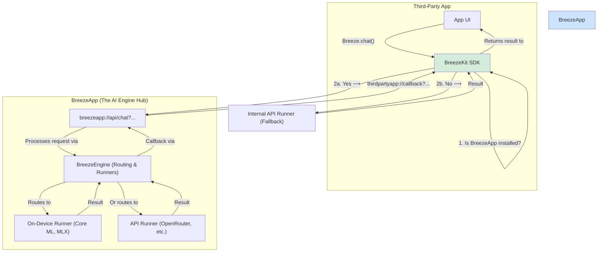

### **File 2: BreezeApp for iOS - Technical Architecture & Development Guide (v2)**

**Version:** 2.0
**Date:** September 11, 2025
**Audience:** iOS Development Team, Software Architects

#### **1.0 Introduction**

This document details the technical architecture to realize the vision of BreezeApp as a central, system-wide AI engine on iOS, as described in the v2 Product Specification. It addresses the platform's constraints on inter-app communication by proposing a hybrid architecture that uses URL schemes for communication and a fallback mechanism for robustness.

#### **2.0 Platform Constraints & Architectural Strategy**

Unlike Android, iOS does not permit an application to expose a continuously running background service that other sandboxed apps can bind to. Our architecture must work around this limitation.

**Strategy: App-to-App Communication + SDK with Fallback**

1.  **`BreezeApp` (The Hub):** The main application, available on the App Store. It contains the full AI engine, model runners, and management UI. It registers a custom URL scheme (e.g., `breezeapp://`) to accept incoming API requests.
2.  **`BreezeKit` (The SDK):** A Swift Package for third-party developers. When an API function is called, it first checks if `BreezeApp` is installed.
    *   **If YES:** It marshals the request data, calls the `breezeapp://` URL, and awaits a callback URL from `BreezeApp` with the result.
    *   **If NO:** It transparently redirects the request to an internal fallback runner (e.g., a cloud API wrapper like OpenRouter).

#### **3.0 System Architecture Diagram**



#### **4.0 Component Deep Dive**

##### **4.1 `BreezeEngine` (Internal to BreezeApp)**

This remains the core logic hub, but it is now exclusively part of the main `BreezeApp`. Its responsibilities are unchanged:
*   **Runner Management:** Manages a collection of objects conforming to the `Runner` protocol.
*   **Routing:** Selects the appropriate runner based on the request and user configuration.
*   **Execution:** Oversees the inference pipeline.
*   **Runners:**
    *   `CoreMLRunner`: For hyper-optimized on-device inference.
    *   `MLXRunner`: (Future) For exploring Apple's MLX framework.
    *   `ExecutorchRunner`: (Future) For compatibility with PyTorch models.
    *   `APIRunner`: For making calls to external services like OpenRouter, configured with user-provided API keys.

##### **4.2 `BreezeApp` URL Scheme Handler**

This is the new public-facing API endpoint of the engine.
*   **Responsibility:** To parse incoming URL requests (e.g., `breezeapp://api/chat?prompt=...&callback=...`), validate them, pass them to the `BreezeEngine` for processing, and return the result using the provided `callback` URL.
*   **Security:** Must implement robust validation of all incoming parameters to prevent misuse.

##### **4.3 `BreezeKit` (The Public SDK)**

This is the Swift Package that third-party developers will use.
*   **Public API:**
    ```swift
    public enum Breeze {
        public static func chat(prompt: String) async throws -> String {
            // 1. Check if BreezeApp is installed (canOpenURL).
            // 2. If yes, construct and open the breezeapp:// URL.
            //    - Listen for the callback via a custom URL handler in the host app.
            // 3. If no, call the internal fallback runner.
            // 4. Return the result from either path.
        }
    }
    ```
*   **Fallback Runner:** The SDK will contain a default, lightweight `APIRunner` that can function independently of the main `BreezeApp`, ensuring functionality is never completely broken.
*   **Configuration:** The developer must register their app's callback URL scheme (e.g., `mycoolapp://`) with the SDK during initialization.

#### **5.0 Development & Implementation Notes**

*   **Inter-App Communication:** This model will cause the user to switch from the third-party app to BreezeApp and back upon the first request in a session to get permissions. Subsequent requests might be handled more smoothly if the engine app can complete its task within the short background execution window granted by iOS. This UX trade-off is a direct consequence of iOS security policies and must be clearly documented for developers using the SDK.
*   **Project Structure:** The primary repository will contain the `BreezeApp` Xcode Workspace, which includes the `BreezeEngine` logic. `BreezeKit` should be developed as a separate repository to mimic its distribution as a third-party package.
